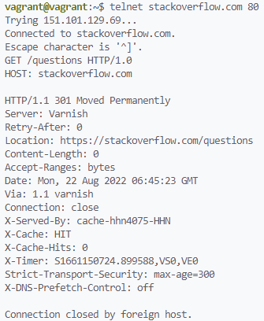
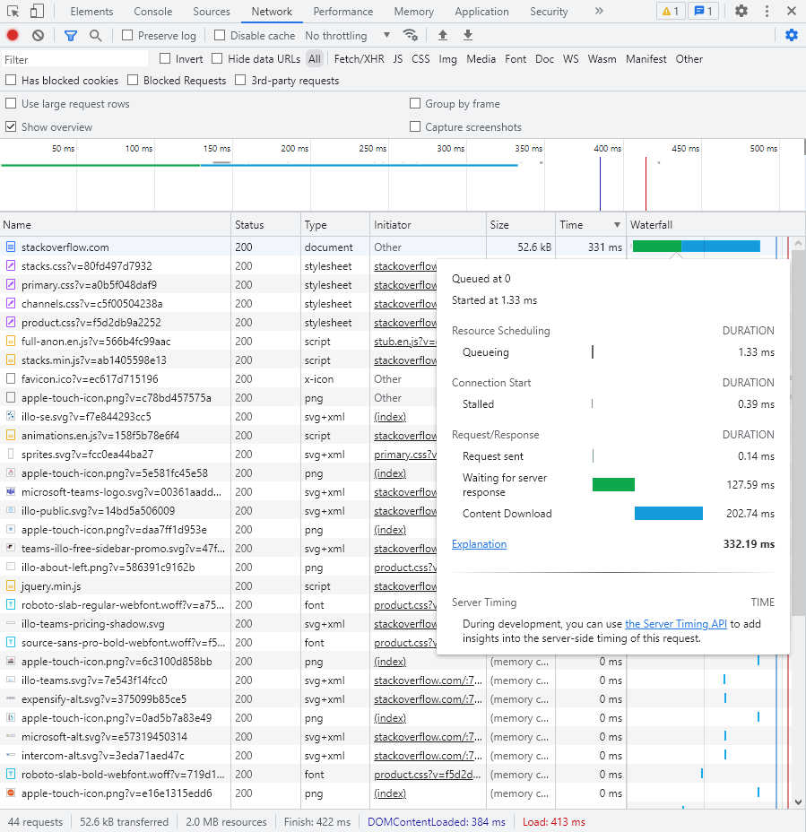
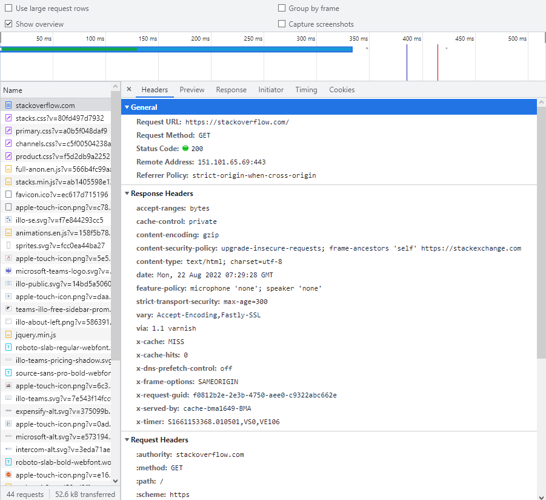
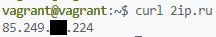
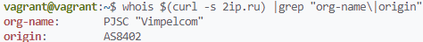
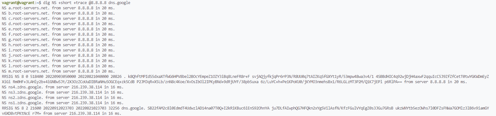
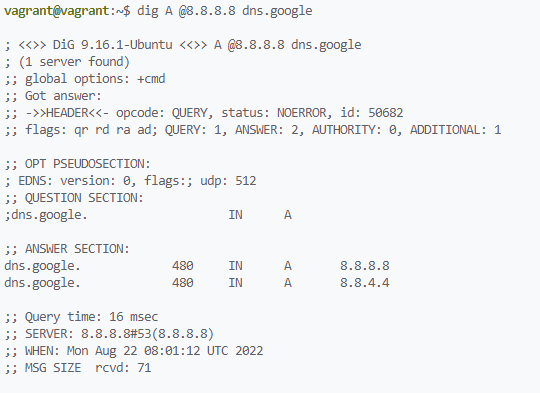
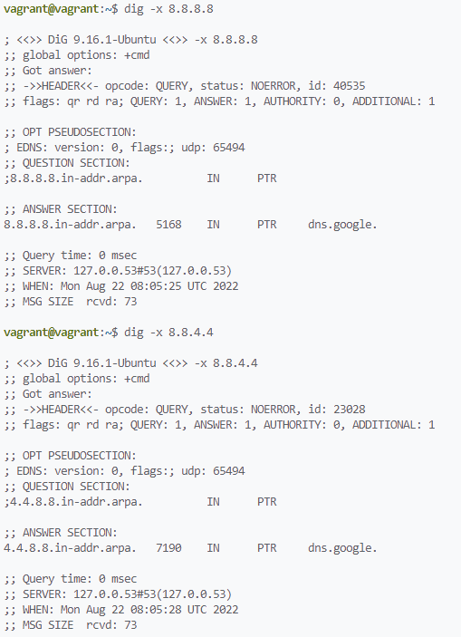

# Домашнее задание по теме "Компьютерные сети (часть 1)"

1. Работа c HTTP через телнет.
- Подключитесь утилитой телнет к сайту stackoverflow.com
`telnet stackoverflow.com 80`
- отправьте HTTP запрос
```bash
GET /questions HTTP/1.0
HOST: stackoverflow.com
[press enter]
[press enter]
```
- В ответе укажите полученный HTTP код, что он означает?  

    **Ответ:**  
      
    HTTP-код 301 означает, что запрашиваемый адрес более не актуален и окончательно перемещён в URL, указанный в заголовке Location.  
2. Повторите задание 1 в браузере, используя консоль разработчика F12.
- откройте вкладку `Network`
- отправьте запрос http://stackoverflow.com
- найдите первый ответ HTTP сервера, откройте вкладку `Headers`
- укажите в ответе полученный HTTP код.
- проверьте время загрузки страницы, какой запрос обрабатывался дольше всего?
- приложите скриншот консоли браузера в ответ.'

    **Ответ:** первый ответ: HTTP-код 200 (успешный запрос)  
    Общее время загрузки страницы: 530ms  
    Дольше всего обрабатывался ответ сервера и загрузка контента с http://stackoverflow.com  
    Скриншоты:  
      
      

3. Какой IP адрес у вас в интернете?

    **Ответ:**  
      

4. Какому провайдеру принадлежит ваш IP адрес? Какой автономной системе AS? Воспользуйтесь утилитой `whois`

    **Ответ:**  
      

5. Через какие сети проходит пакет, отправленный с вашего компьютера на адрес 8.8.8.8? Через какие AS? Воспользуйтесь утилитой `traceroute`

    **Ответ:**  
      

6. Повторите задание 5 в утилите `mtr`. На каком участке наибольшая задержка - delay?

    **Ответ:** на участке между 8 и 9 хопом  
      

7. Какие DNS сервера отвечают за доменное имя dns.google? Какие A записи? воспользуйтесь утилитой `dig`

    **Ответ:**  
    ```
    NS ns4.zdns.google. from server 216.239.38.114 in 16 ms.
    NS ns3.zdns.google. from server 216.239.38.114 in 16 ms.
    NS ns2.zdns.google. from server 216.239.38.114 in 16 ms.
    NS ns1.zdns.google. from server 216.239.38.114 in 16 ms.

    dns.google.             480     IN      A       8.8.8.8
    dns.google.             480     IN      A       8.8.4.4
    ```
      
      

8. Проверьте PTR записи для IP адресов из задания 7. Какое доменное имя привязано к IP? воспользуйтесь утилитой `dig`

    **Ответ:** dns.google.
      