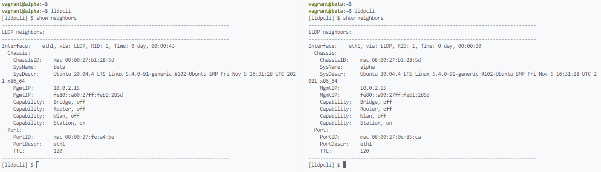
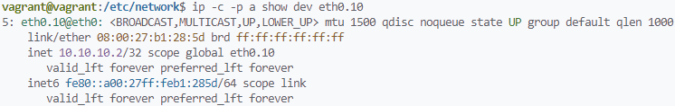

# Домашнее задание по теме "Компьютерные сети (часть 2)"

1. Проверьте список доступных сетевых интерфейсов на вашем компьютере. Какие команды есть для этого в Linux и в Windows?  
**Ответ:**  
Linux: `ip a` *(lo, eth0)*  
Windows: `ipconfig /all` *(их очень много (лупбеки, виртуализация, VPN и прочее, перечислять не буду =))* 

2. Какой протокол используется для распознавания соседа по сетевому интерфейсу? Какой пакет и команды есть в Linux для этого?  
**Ответ:** LLDP (открытый протокол), CDP (вендора Cisco), EDP (вендора Extreme) и проприетарные протоколы других производителей.  
В Linux есть пакет lldpd.
Доступные команды:  
    ```
    show - показать информацию
    watch - мониторинг изменений соседства
    update - обновить информацию и отправить фрейм во все порты
    pause - приостановить LLDP
    resume - возобновить LLDP
    ```
    Проверка соседства:  
    

3. Какая технология используется для разделения L2 коммутатора на несколько виртуальных сетей? Какой пакет и команды есть в Linux для этого? Приведите пример конфига.  
**Ответ:** технология VLAN.  
Для поддержки тегирования фреймов в Linux есть пакет `vlan`, после установки должен активироваться модуль ядра `8021q`. Проверить: `modinfo 8021q`.  
Пример конфигурации через netplan:
    ```
    vagrant@vagrant:/etc/network$ cat /etc/netplan/01-netcfg.yaml 
    network:
      version: 2
      ethernets:
        eth0:
          dhcp4: true
      vlans:
        eth0.10:
          link: eth0
          id: 10
          addresses: [10.10.10.2/32]
    ```
    Применить конфигурацию: `sudo netplan apply`
    

1. Какие типы агрегации интерфейсов есть в Linux? Какие опции есть для балансировки нагрузки? Приведите пример конфига.  
**Ответ:** есть Teaming и Bonding.  
Доступные режимы:  
    ```
    mode=0:
    (balance-rr) Round-robin. Режим по умолчанию.

    mode=1 
    (active-backup) Active-backup
    (balance-xor) XOR (Exclusive OR)

    mode=3
    (broadcast) Broadcast

    mode=4
    (802.3ad) IEEE 802.3ad Dynamic Link Aggregation

    mode=5
    (balance-tlb) Adaptive Transmit Load Balancing (TLB)

    mode=6
    (balance-alb) Adaptive Load Balancing (ALB)
    ```
    Пример конфигурации через netplan:
    ```
    vagrant@vagrant:/etc/network$ cat /etc/netplan/01-netcfg.yaml 
    network:
      version: 2
      renderer: networkd
      ethernets:
        eth1:
          dhcp: no
        eth2:
          dhcp: no
      bonds:
        bond0:
          dhcp4: no
          interfaces: [eth1, eth2]
          parameters:
            mode: active-backup
            primary: eth1
            mii-monitor-interval: 1
          addresses:
            - 10.10.10.1/30
    ```
    Применить конфигурацию: `sudo netplan apply`
2. Сколько IP адресов в сети с маской /29 ? Сколько /29 подсетей можно получить из сети с маской /24. Приведите несколько примеров /29 подсетей внутри сети 10.10.10.0/24.
**Ответ:** адресов с маской /29 - 8. Подсетей /29 из /24 можно получить 32.  
Примеры подсетей:  
    ```
    vagrant@alpha:~$ ipcalc -cb 10.10.10.0/24 -s $(for i in {1..32}; do     echo "6"; done) | grep Network | sed '1d' | head
    Network:   10.10.10.0/29        
    Network:   10.10.10.8/29
    Network:   10.10.10.16/29
    Network:   10.10.10.24/29
    Network:   10.10.10.32/29
    Network:   10.10.10.40/29
    Network:   10.10.10.48/29
    Network:   10.10.10.56/29
    Network:   10.10.10.64/29
    Network:   10.10.10.72/29
    ```
3. Задача: вас попросили организовать стык между 2-мя организациями. Диапазоны 10.0.0.0/8, 172.16.0.0/12, 192.168.0.0/16 уже заняты. Из какой подсети допустимо взять частные IP адреса? Маску выберите из расчета максимум 40-50 хостов внутри подсети.
**Ответ:** из диапазона 100.64.0.0/10. Можно взять подсеть 100.64.0.0/26.  

4. Как проверить ARP таблицу в Linux, Windows? Как очистить ARP кеш полностью? Как из ARP таблицы удалить только один нужный IP?  
**Ответ:**  
Проверить таблицу в Linux: `arp -nv`  
Очистить ARP-кеш в Linux: `sudo ip -s neigh flush all`  
Удалить одну запись в Linux: `sudo arp -dv $IP`  
