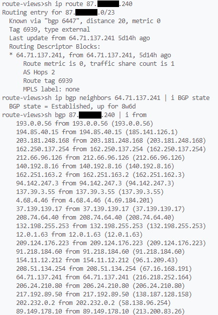
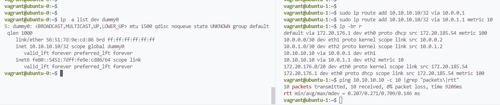
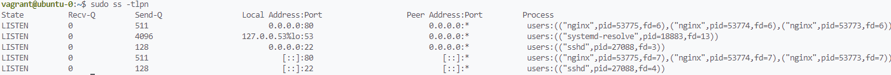
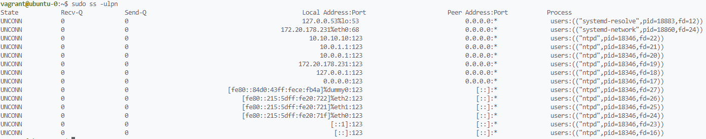
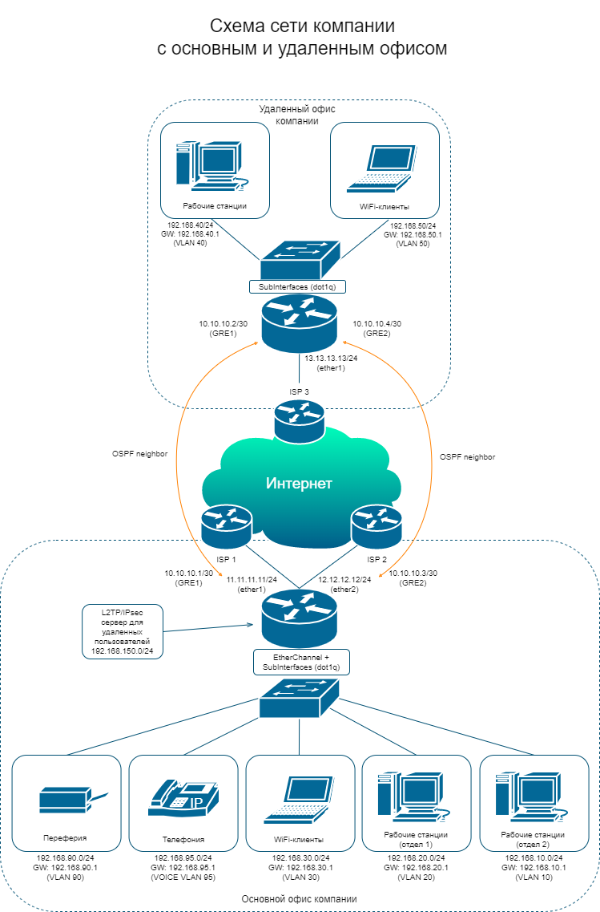

# Домашнее задание по теме: "Компьютерные сети (часть 3)"

1. Подключитесь к публичному маршрутизатору в интернет. Найдите маршрут к вашему публичному IP
    ```
    telnet route-views.routeviews.org
    Username: rviews
    show ip route x.x.x.x/32
    show bgp x.x.x.x/32
    ```
    **Ответ:**  
    

1. Создайте dummy0 интерфейс в Ubuntu. Добавьте несколько статических маршрутов. Проверьте таблицу маршрутизации.  
    **Ответ:**  
    Пример конфигурации через netplan:
    ```
    vagrant@vagrant:/etc/network$ cat /etc/netplan/03-dummy0.yaml
    network:
      version: 2
      renderer: networkd
      bridges:
        dummy0:
          dhcp4: no
          dhcp6: no
          accept-ra: no
          interfaces: [ ]
          addresses: [10.10.10.10/32]
    ```
    Применить конфигурацию: `sudo netplan apply`  
    Добавление временных маршрутов с другой VM до IP-адреса dummy0. Маршруты с разными метриками через разные интерфейсы:
    ```
    vagrant@ubuntu-1:~$ sudo ip route add 10.10.10.10/32 via 10.0.0.1
    vagrant@ubuntu-1:~$ sudo ip route add 10.10.10.10/32 via 10.0.1.1 metric 10
    ```
    

1. Проверьте открытые TCP порты в Ubuntu, какие протоколы и приложения используют эти порты? Приведите несколько примеров.  
    **Ответ:**  
      
    Протоколы использующие порты: (tcp/53), HTTP (tcp/80), SSH (tcp/22)

2. Проверьте используемые UDP сокеты в Ubuntu, какие протоколы и приложения используют эти порты?  
    **Ответ:**  
    Протоколы использующие порты: NTP (udp/123), DNS (udp/53), DHCP-client (udp/68)
    

3. Используя diagrams.net, создайте L3 диаграмму вашей домашней сети или любой другой сети, с которой вы работали.  
    **Ответ:**  
    