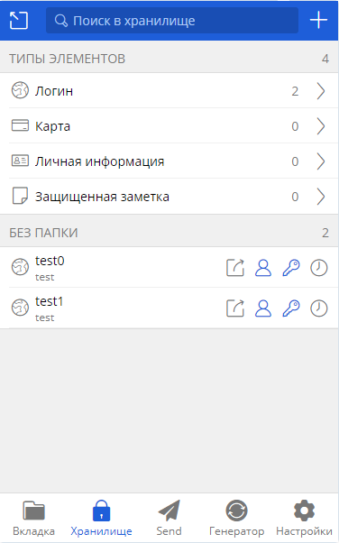
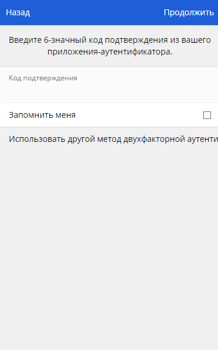
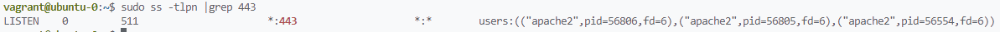
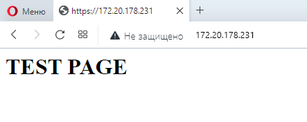
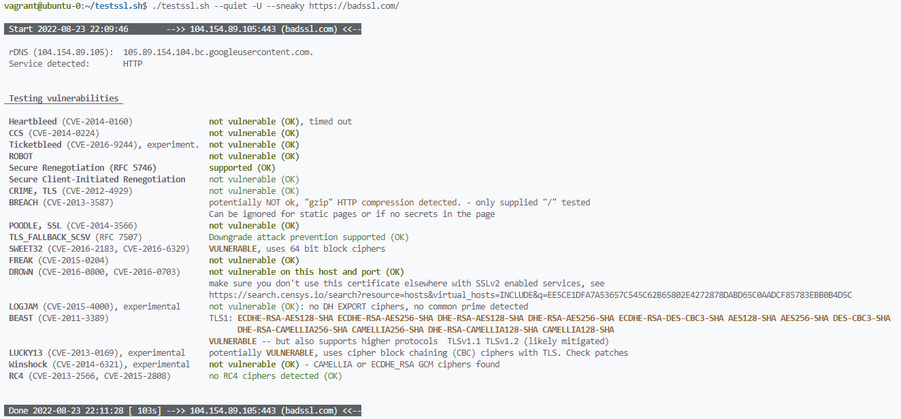
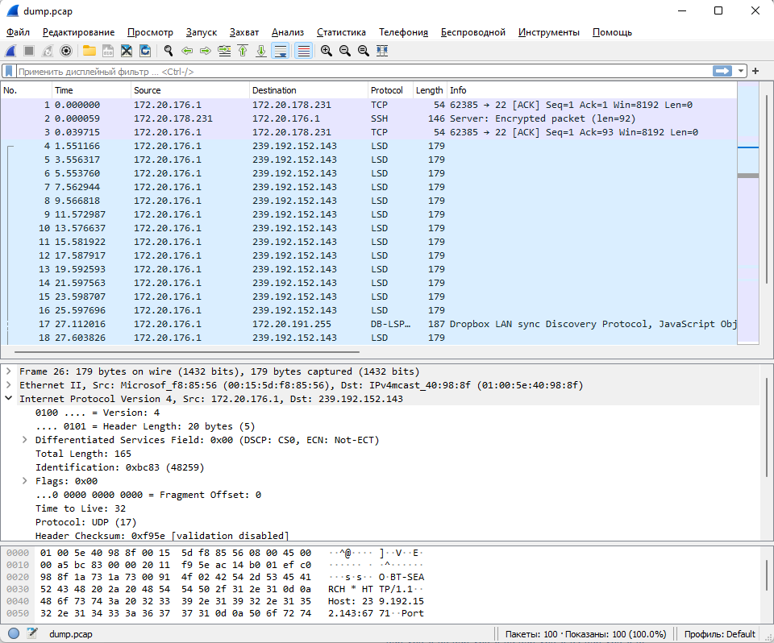

# Домашнее задание по теме: "Элементы безопасности информационных систем"

1. Установите Bitwarden плагин для браузера. Зарегестрируйтесь и сохраните несколько паролей.

    **Ответ:**  
    

2. Установите Google authenticator на мобильный телефон. Настройте вход в Bitwarden акаунт через Google authenticator OTP.

    **Ответ:**  
    

3. Установите apache2, сгенерируйте самоподписанный сертификат, настройте тестовый сайт для работы по HTTPS.

    **Ответ:**  
    ```
    sudo apt install apache2
    sudo a2enmod ssl
    sudo systemctl restart apache2
    ```
    Bash-скрипт для создания сертификата:
    ```
    #!/usr/bin/env bash

    fqdn=$1

    if [ -z "$fqdn" ]
    then
        echo "Argument not present."
        exit 1
    fi

    set -euxo pipefail

    C=RU
    ST=Moscow
    L=Moscow
    O=Self
    OU=IT

    openssl req -x509 -nodes -days 365 -newkey rsa:2048 \
    -keyout /etc/ssl/private/$fqdn.key \
    -out /etc/ssl/certs/$fqdn.crt \
    -subj "/C=$C/ST=$ST/L=$L/O=$O/OU=$OU/CN=$fqdn"
    ```
    Генерация сертификата:
    ```
    vagrant@ubuntu-0:~$ chmod +x ssl-generate.sh
    vagrant@ubuntu-0:~$ sudo ./ssl-generate.sh example.com
    + C=RU
    + ST=Moscow
    + L=Moscow
    + O=Self
    + OU=IT
    + openssl req -x509 -nodes -days 365 -newkey rsa:2048 -keyout /etc/ssl/private/example.com.key -out /etc/ssl/certs/example.com.cert -subj /C=RU/ST=Moscow/L=Moscow/O=Self/OU=IT/CN=example.com
    Generating a RSA private key
    .............................+++++
    ...+++++
    writing new private key to '/etc/ssl/private/example.com.key'
    -----
    ```
    Конфигурация apache2:
    ```
    cat /etc/apache2/sites-enabled/example.com.conf
    <VirtualHost *:443>
       ServerName example.com
       DocumentRoot /var/www/example.com

       SSLEngine on
       SSLCertificateFile /etc/ssl/certs/example.com.crt
       SSLCertificateKeyFile /etc/ssl/private/example.com.key
    </VirtualHost>
    ```
    Создание HTML-страницы:
    ```
    sudo mkdir /var/www/example.com; sudo sh -c "echo '<h1>TEST PAGE</h1>' > /var/www/example.com/index.html"
    ```
    Перезапуск apache2:
    ```
    sudo systemctl reload apache2
    ```
    Проверка 443 TCP-порта:  
    
    Открытие сайта в браузере:  
    

4. Проверьте на TLS уязвимости произвольный сайт в интернете (кроме сайтов МВД, ФСБ, МинОбр, НацБанк, РосКосмос, РосАтом, РосНАНО и любых госкомпаний, объектов КИИ, ВПК ... и тому подобное).

    **Ответ:**  
    


5. Установите на Ubuntu ssh сервер, сгенерируйте новый приватный ключ. Скопируйте свой публичный ключ на другой сервер. Подключитесь к серверу по SSH-ключу.

    **Ответ:**  
    ```
    sudo apt install openssh-server
    ssh-keygen -b 4096 -q -N "" -f $HOME/.ssh/id_rsa
    ssh-copy-id vagrant@10.0.0.2
    ssh vagrant@10.0.0.2
    ```

6. Переименуйте файлы ключей из задания 5. Настройте файл конфигурации SSH клиента, так чтобы вход на удаленный сервер осуществлялся по имени сервера.

    **Ответ:**  
    ```
    sudo apt install rename
    rename -v s/id_rsa/id_vagrant/ id_rsa*

    cat > ~/.ssh/config << EOF 
    Host ubuntu-test-2
        HostName 10.0.0.2
        User vagrant
        Port 22
        IdentityFile ~/.ssh/id_vagrant
    EOF

    ssh ubuntu-test-2
    ```

7. Соберите дамп трафика утилитой tcpdump в формате pcap, 100 пакетов. Откройте файл pcap в Wireshark.

    **Ответ:** `sudo tcpdump -c 100 -w dump.pcap -i eth0`  
    
