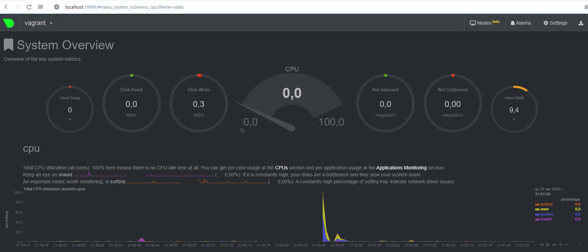
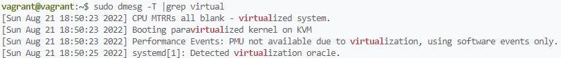
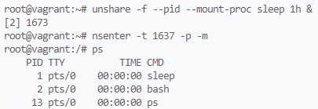

# Домашнее задание по теме "Операционные системы (часть 2)"

1. На лекции мы познакомились с [node_exporter](https://github.com/prometheus/node_exporter/releases). В демонстрации его исполняемый файл запускался в background. Этого достаточно для демо, но не для настоящей production-системы, где процессы должны находиться под внешним управлением. Используя знания из лекции по systemd, создайте самостоятельно простой [unit-файл](https://www.freedesktop.org/software/systemd/man/systemd.service.html) для node_exporter:

    * поместите его в автозагрузку,
    * предусмотрите возможность добавления опций к запускаемому процессу через внешний файл (посмотрите, например, на `systemctl cat cron`),
    * удостоверьтесь, что с помощью systemctl процесс корректно стартует, завершается, а после перезагрузки автоматически поднимается.  

    **Ответ:**  
    ```
    mkdir -p /opt/exporters/; cd /opt/exporters

    sudo wget https://github.com/prometheus/node_exporter/releases/download/v1.3.1/ node_exporter-1.3.1.linux-amd64.tar.gz && sudo tar -xzvf node_exporter-1.3.1.    linux-amd64.tar.gz

    sudo adduser exporters --disabled-password --disabled-login --no-create-home    --quiet
    ```
    Содержимое файла `/etc/systemd/system/node_exporter.service`:  
    ```
    [Unit]
    Description=Node Exporter

    [Service]
    User=exporters
    EnvironmentFile=/opt/exporters/node_exporter_env
    ExecStart=/opt/exporters/node_exporter-1.3.1.linux-amd64/node_exporter  {$ENV_OPTION_1}

    [Install]
    WantedBy=default.target
    ```
    Содержимое файла */opt/exporters/node_exporter_env*:  
    ```
    ENV_OPTION_1='--collector.processes'
    ```
    ```
    sudo systemctl daemon-reload
    sudo systemctl enable --now node_exporter

    ● node_exporter.service - Node Exporter
     Loaded: loaded (/etc/systemd/system/node_exporter.service; enabled; vendor preset: enabled)
     Active: active (running) since Sun 2022-08-21 18:40:34 UTC; 3s ago
   Main PID: 14360 (node_exporter)
      Tasks: 4 (limit: 2279)
     Memory: 2.5M
     CGroup: /system.slice/node_exporter.service
             └─14360 /opt/exporters/node_exporter-1.3.1.linux-amd64/node_exporter --collector.processes
    ```
1. Ознакомьтесь с опциями node_exporter и выводом `/metrics` по-умолчанию. Приведите несколько опций, которые вы бы выбрали для базового мониторинга хоста по CPU, памяти, диску и сети.
    **Ответ:**  
    CPU:  
    ```
    node_cpu_seconds_total
    ```
    Память:  
    ```
    node_memory_MemTotal_bytes
    node_memory_MemFree_bytes
    ```
    Диск:  
    ```
    node_filesystem_avail_bytes
    node_filesystem_size_bytes
    ```
    Сеть:
    ```
    node_network_receive_bytes_total
    node_network_transmit_bytes_total
    ```
2. Установите в свою виртуальную машину [Netdata](https://github.com/netdata/netdata). Воспользуйтесь [готовыми пакетами](https://packagecloud.io/netdata/netdata/install) для установки (`sudo apt install -y netdata`). После успешной установки:
    * в конфигурационном файле `/etc/netdata/netdata.conf` в секции [web] замените значение с localhost на `bind to = 0.0.0.0`,
    * добавьте в Vagrantfile проброс порта Netdata на свой локальный компьютер и сделайте `vagrant reload`:

    ```bash
    config.vm.network "forwarded_port", guest: 19999, host: 19999
    ```

    После успешной перезагрузки в браузере *на своем ПК* (не в виртуальной машине) вы должны суметь зайти на `localhost:19999`. Ознакомьтесь с метриками, которые по умолчанию собираются Netdata и с комментариями, которые даны к этим метрикам.

    **Результат:**  
    
1. Можно ли по выводу `dmesg` понять, осознает ли ОС, что загружена не на настоящем оборудовании, а на системе виртуализации?

    **Ответ:** можно!  
    

2. Как настроен sysctl `fs.nr_open` на системе по-умолчанию? Узнайте, что означает этот параметр. Какой другой существующий лимит не позволит достичь такого числа (`ulimit --help`)?

    **Ответ:** Лимит на количество открытых файлов одним процессом:  
    ```
    vagrant@vagrant:~$ sudo cat /proc/sys/fs/nr_open
    1048576
    ```
    Лимит не позволяющий достичь такого числа: *maximum number of open file descriptors*  
    ```
    vagrant@vagrant:~$ ulimit -n
    1024
    ```

3. Запустите любой долгоживущий процесс (не `ls`, который отработает мгновенно, а, например, `sleep 1h`) в отдельном неймспейсе процессов; покажите, что ваш процесс работает под PID 1 через `nsenter`. Для простоты работайте в данном задании под root (`sudo -i`). Под обычным пользователем требуются дополнительные опции (`--map-root-user`) и т.д.

    **Результат:**  
    

4. Найдите информацию о том, что такое `:(){ :|:& };:`. Запустите эту команду в своей виртуальной машине Vagrant с Ubuntu 20.04 (**это важно, поведение в других ОС не проверялось**). Некоторое время все будет "плохо", после чего (минуты) – ОС должна стабилизироваться. Вызов `dmesg` расскажет, какой механизм помог автоматической стабилизации. Как настроен этот механизм по-умолчанию, и как изменить число процессов, которое можно создать в сессии?

    **Ответ:** Функция, которая рекурсивно запускает процессы (сначала два, в каждом еще 2 и т.д.)  
    В логах: `cgroup: fork rejected by pids controller in /user.slice/user-1000.slice/session-3.scope`  
    Механизм: Process Number Controller -  позволить cgroup остановить создание новых процессов fork() или clone() после достижения предела.
    Проверить текущее количество процессов на пользователя: `ulimit -u`  
    ```
    root@vagrant:~# ulimit -u
    7597
    ```
    Изменить: `ulimit -u 16000`  
