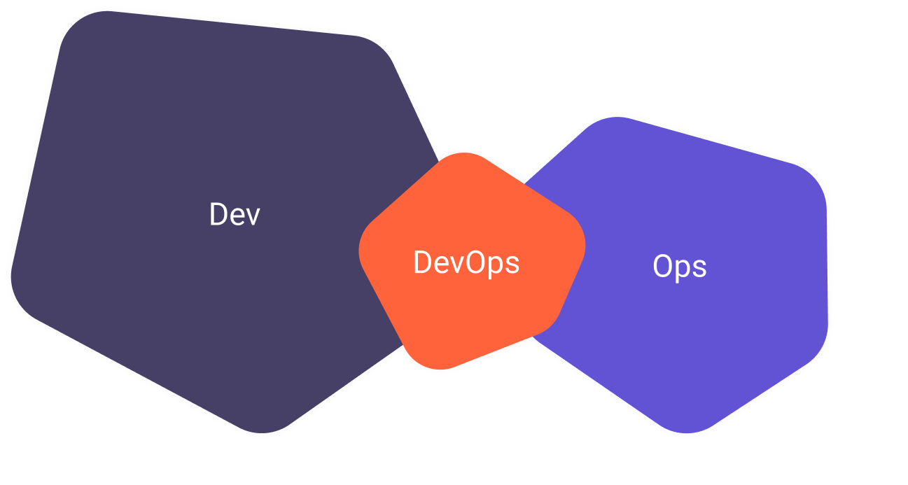

# Курс "DevOps-инженер"

---
### Содержание  
- [Домашние задания по модулям курса:](homework/)  
  - [01. Вводный модуль специализации "DevOps-инженер"](homework/01.%20Вводный%20модуль%20специализации%20DevOps-инженер/)  
  - [02. Основы языка программирования Python](homework/02.%20Основы%20языка%20программирования%20Python/)  
  - [03. DevOps и системное администрирование](homework/03.%20DevOps%20и%20системное%20администрирование/)  
  - [04. Виртуализация, базы данных и Terraform](homework/04.%20Виртуализация,%20базы%20данных%20и%20Terraform/)  
  - [05. CI, мониторинг и управление конфигурациями](homework/05.%20CI,%20мониторинг%20и%20управление%20конфигурациями/)
  - [06. Администрирование и конфигурация Kubernetes](homework/06.%20Администрирование%20и%20конфигурация%20Kubernetes/)
  - [07. Kubernetes и облачные сервисы](homework/07.%20Kubernetes%20и%20облачные%20сервисы/)
  - [08. Дипломная работа](https://gitlab.com/netology-devops-project/description)
