# Домашнее задание по теме: "Файловые системы"

1. Узнайте о [sparse](https://ru.wikipedia.org/wiki/%D0%A0%D0%B0%D0%B7%D1%80%D0%B5%D0%B6%D1%91%D0%BD%D0%BD%D1%8B%D0%B9_%D1%84%D0%B0%D0%B9%D0%BB) (разряженных) файлах.  
**Ответ:**  
Узнал :)  

2. Могут ли файлы, являющиеся жесткой ссылкой на один объект, иметь разные права доступа и владельца? Почему?  
**Ответ:**  
Нет не могут, т.к. это ссылка на индексный дескриптор файла. Права одинаковы/владелец одинаковы, т.к. определяются одним и тем же inode.  

3. Сделайте `vagrant destroy` на имеющийся инстанс Ubuntu. Замените содержимое Vagrantfile следующим:

    ```bash
    Vagrant.configure("2") do |config|
      config.vm.box = "bento/ubuntu-20.04"
      config.vm.provider :virtualbox do |vb|
        lvm_experiments_disk0_path = "/tmp/lvm_experiments_disk0.vmdk"
        lvm_experiments_disk1_path = "/tmp/lvm_experiments_disk1.vmdk"
        vb.customize ['createmedium', '--filename', lvm_experiments_disk0_path, '--size', 2560]
        vb.customize ['createmedium', '--filename', lvm_experiments_disk1_path, '--size', 2560]
        vb.customize ['storageattach', :id, '--storagectl', 'SATA Controller', '--port', 1, '--device', 0, '--type', 'hdd', '--medium', lvm_experiments_disk0_path]
        vb.customize ['storageattach', :id, '--storagectl', 'SATA Controller', '--port', 2, '--device', 0, '--type', 'hdd', '--medium', lvm_experiments_disk1_path]
      end
    end
    ```

    Данная конфигурация создаст новую виртуальную машину с двумя дополнительными неразмеченными дисками по 2.5 Гб.  
**Результат:**  
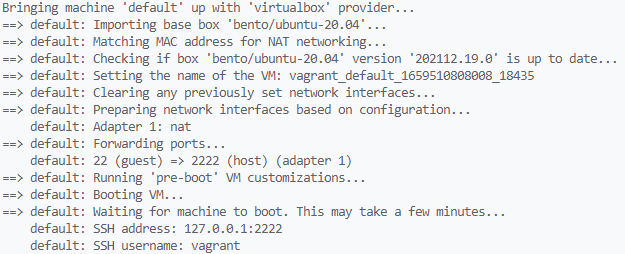  
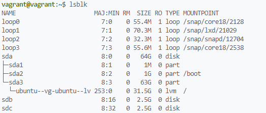  

4. Используя `fdisk`, разбейте первый диск на 2 раздела: 2 Гб, оставшееся пространство.  
**Результат:**  
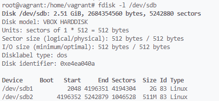  

5. Используя `sfdisk`, перенесите данную таблицу разделов на второй диск.  
**Результат:**  
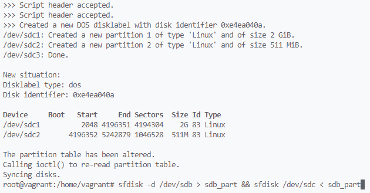  
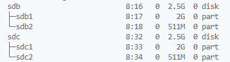  

6. Соберите `mdadm` RAID1 на паре разделов 2 Гб.  
**Результат:**  
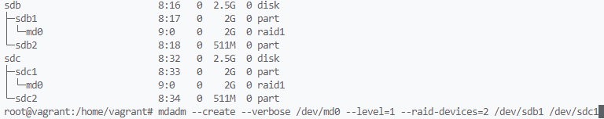  

7. Соберите `mdadm` RAID0 на второй паре маленьких разделов.  
**Результат:**  
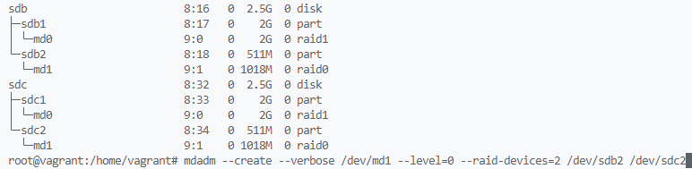  

8. Создайте 2 независимых PV на получившихся md-устройствах.  
**Результат:**  
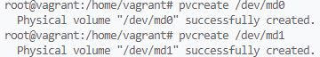  

9. Создайте общую volume-group на этих двух PV.  
**Результат:**  
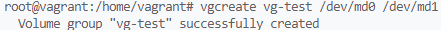  

10. Создайте LV размером 100 Мб, указав его расположение на PV с RAID0.  
**Результат:**  
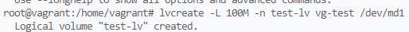  
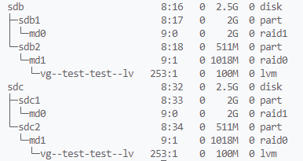  

11. Создайте `mkfs.ext4` ФС на получившемся LV.  
**Результат:**  
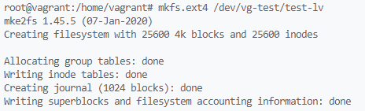  

12. Смонтируйте этот раздел в любую директорию, например, `/tmp/new`.  
**Результат:**  
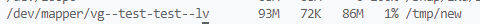  

13.  Поместите туда тестовый файл, например `wget https://mirror.yandex.ru/ubuntu/ls-lR.gz -O /tmp/new/test.gz`.  
**Результат:**  
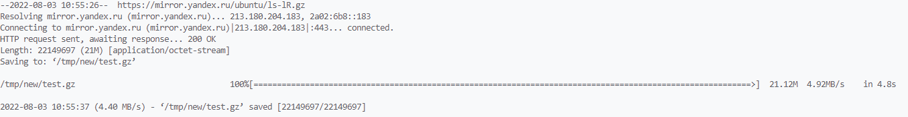  

14. Прикрепите вывод `lsblk`.  
**Результат:**  
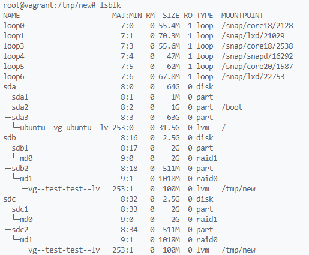  

15. Протестируйте целостность файла:

    ```bash
    root@vagrant:~# gzip -t /tmp/new/test.gz
    root@vagrant:~# echo $?
    0
    ```
    **Результат:**  
    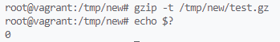  

16. Используя pvmove, переместите содержимое PV с RAID0 на RAID1.  
**Результат:**  
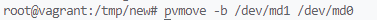  

17. Сделайте `--fail` на устройство в вашем RAID1 md.  
**Результат:**  
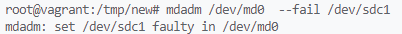  

18. Подтвердите выводом `dmesg`, что RAID1 работает в деградированном состоянии.  
**Результат:**  
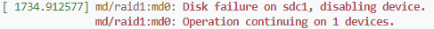  

19. Протестируйте целостность файла, несмотря на "сбойный" диск он должен продолжать быть доступен:

    ```bash
    root@vagrant:~# gzip -t /tmp/new/test.gz
    root@vagrant:~# echo $?
    0
    ```
    **Результат:**  
    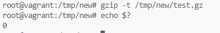  

20. Погасите тестовый хост, `vagrant destroy`.  
**Результат:**  
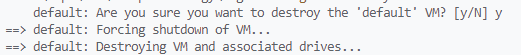  
