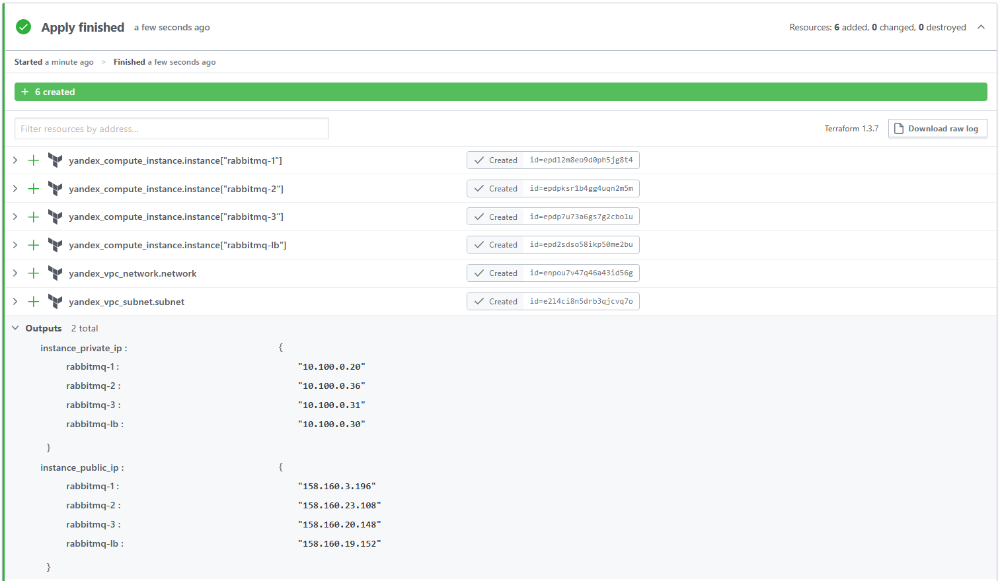
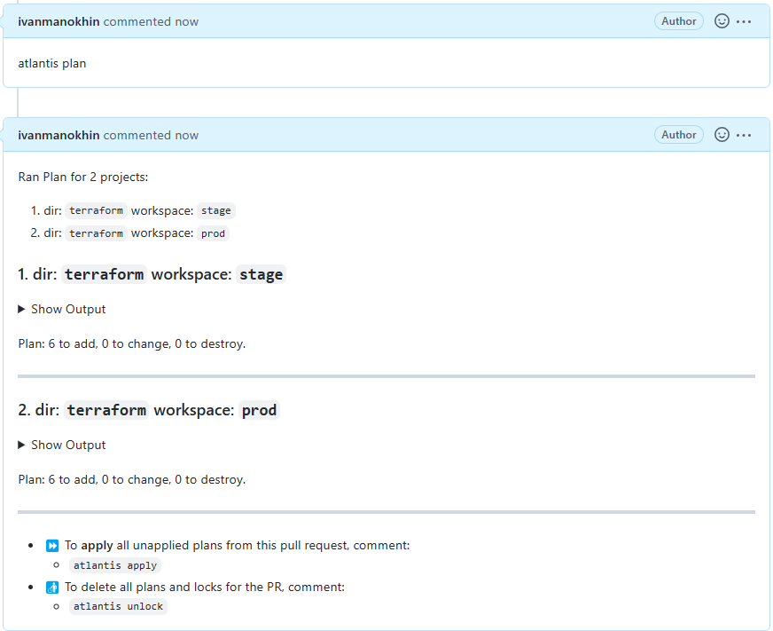

# Домашнее задание по теме: "Средства командной работы"

## Задача 1. Настроить terraform cloud (необязательно, но крайне желательно).

В это задании предлагается познакомиться со средством командой работы над инфраструктурой предоставляемым
разработчиками терраформа. 

1. Зарегистрируйтесь на [https://app.terraform.io/](https://app.terraform.io/).
(регистрация бесплатная и не требует использования платежных инструментов).
1. Создайте в своем github аккаунте (или другом хранилище репозиториев) отдельный репозиторий с
 конфигурационными файлами прошлых занятий (или воспользуйтесь любым простым конфигом).
1. Зарегистрируйте этот репозиторий в [https://app.terraform.io/](https://app.terraform.io/).
1. Выполните plan и apply. 

В качестве результата задания приложите снимок экрана с успешным применением конфигурации.

### Результат:



## Задача 2. Написать серверный конфиг для атлантиса. 

Смысл задания – познакомиться с документацией 
о [серверной](https://www.runatlantis.io/docs/server-side-repo-config.html) конфигурации и конфигурации уровня 
 [репозитория](https://www.runatlantis.io/docs/repo-level-atlantis-yaml.html).

Создай `server.yaml` который скажет атлантису:
1. Укажите, что атлантис должен работать только для репозиториев в вашем github (или любом другом) аккаунте.
1. На стороне клиентского конфига разрешите изменять `workflow`, то есть для каждого репозитория можно 
будет указать свои дополнительные команды. 
1. В `workflow` используемом по-умолчанию сделайте так, что бы во время планирования не происходил `lock` состояния.

Создай `atlantis.yaml` который, если поместить в корень terraform проекта, скажет атлантису:
1. Надо запускать планирование и аплай для двух воркспейсов `stage` и `prod`.
1. Необходимо включить автопланирование при изменении любых файлов `*.tf`.

В качестве результата приложите ссылку на файлы `server.yaml` и `atlantis.yaml`.

### Результат:

* [server.yaml](./atlantis/server.yaml)
* [atlantis.yaml](./atlantis/atlantis.yaml)

#### GitHub:



## Задача 3. Знакомство с каталогом модулей. 

1. В [каталоге модулей](https://registry.terraform.io/browse/modules) найдите официальный модуль от aws для создания
`ec2` инстансов. 
2. Изучите как устроен модуль. Задумайтесь, будете ли в своем проекте использовать этот модуль или непосредственно 
ресурс `aws_instance` без помощи модуля?
3. В рамках предпоследнего задания был создан ec2 при помощи ресурса `aws_instance`. 
Создайте аналогичный инстанс при помощи найденного модуля.   

В качестве результата задания приложите ссылку на созданный блок конфигураций. 

### Ответ:

Для решения задачи доработал код из прошлого ДЗ сделав из него [модуль для Яндекс.Облака](./yandex/terraform/modules/cci/).

Ответ на 2 вопрос задания: в большинстве случаем удобнее использовать модули, они нагляднее, мх можно многократно переиспользовать и с ними сложнее совершить ошибки при конфигурации.  
Использование ресурсов напрямую предпочтительней только тогда, когда готового модуля (или на 100% подходящего) еще нет и для его написания необходимо сформировать базу и протестировать ее.

Перед использованием модуля необходимо определить переменные оболочки:

```
export YC_TOKEN={your_token}
export YC_TOKEN={your_cloud_id}
export YC_TOKEN={your_folder_id}
```

---

Переменные модуля:

| Name | Type | Default | Required |
|------|------|---------|:--------:|
| zone | string | ru-central1-a | no |
| image | string | ubuntu-2204-lts | no |
| subnet | string | n/a | **yes** |
| instance_name | sting | n/a | **yes** |
| hostname | sting | n/a | **yes** |
| cores | number | 2 | no |
| memory | number | 2 | no |
| nat | bool | true | no |
| ssh_user | string | ubuntu | no |
| ssh_key | string | ~/.ssh/id_rsa.pub | no |

---

Пример использования (main.tf):

```
module "cci" {
  source        = "./modules/cci"

  subnet        = "default-ru-central1-a"
  instance_name = "cci-module-test"
  hostname      = "cci-module-test"

  cores         = 4
  memory        = 4

  nat           = true
}

output "cci" {
  value         = module.cci
}
```