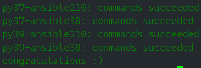
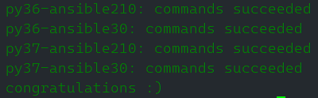

# Домашнее задание по теме: "Тестирование roles"

## Подготовка к выполнению

1. Установите molecule: `pip3 install "molecule==3.5.2"`.
2. Выполните `docker pull aragast/netology:latest` —  это образ с podman, tox и несколькими пайтонами (3.7 и 3.9) внутри.

## Основная часть

Ваша цель — настроить тестирование ваших ролей. 

Задача — сделать сценарии тестирования для vector. 

Ожидаемый результат — все сценарии успешно проходят тестирование ролей.

### Molecule

1. Запустите  `molecule test -s centos_7` внутри корневой директории clickhouse-role, посмотрите на вывод команды. Данная команда может отработать с ошибками, это нормально. Наша цель - посмотреть как другие в реальном мире используют молекулу.

    #### Результат:

    <details>
        <summary>Показать</summary>
    
      ```bash
      > molecule test -s centos_7
      INFO     centos_7 scenario test matrix: dependency, lint, cleanup, destroy, syntax, create, prepare, converge, idempotence, side_effect, verify, cleanup, destroy
      INFO     Performing prerun...
      INFO     Set ANSIBLE_LIBRARY=/home/ivanm/.cache/ansible-compat/7e099f/modules:/home/ivanm/.ansible/plugins/modules:/usr/share/ansible/plugins/modules
      INFO     Set ANSIBLE_COLLECTIONS_PATH=/home/ivanm/.cache/ansible-compat/7e099f/collections:/home/ivanm/.ansible/collections:/usr/share/ansible/collections
      INFO     Set ANSIBLE_ROLES_PATH=/home/ivanm/.cache/ansible-compat/7e099f/roles:/home/ivanm/.ansible/roles:/usr/share/ansible/roles:/etc/ansible/roles
      INFO     Inventory /mnt/z/edu/repo/cvl-stack/roles/clickhouse/molecule/centos_7/../resources/inventory/hosts.yml linked to /home/ivanm/.cache/molecule/clickhouse/centos_7/inventory/hosts
      INFO     Inventory /mnt/z/edu/repo/cvl-stack/roles/clickhouse/molecule/centos_7/../resources/inventory/group_vars/ linked to /home/ivanm/.cache/molecule/clickhouse/centos_7/inventory/group_vars
      INFO     Inventory /mnt/z/edu/repo/cvl-stack/roles/clickhouse/molecule/centos_7/../resources/inventory/host_vars/ linked to /home/ivanm/.cache/molecule/clickhouse/centos_7/inventory/host_vars
      INFO     Running centos_7 > dependency
      WARNING  Skipping, missing the requirements file.
      WARNING  Skipping, missing the requirements file.
      INFO     Inventory /mnt/z/edu/repo/cvl-stack/roles/clickhouse/molecule/centos_7/../resources/inventory/hosts.yml linked to /home/ivanm/.cache/molecule/clickhouse/centos_7/inventory/hosts
      INFO     Inventory /mnt/z/edu/repo/cvl-stack/roles/clickhouse/molecule/centos_7/../resources/inventory/group_vars/ linked to /home/ivanm/.cache/molecule/clickhouse/centos_7/inventory/group_vars
      INFO     Inventory /mnt/z/edu/repo/cvl-stack/roles/clickhouse/molecule/centos_7/../resources/inventory/host_vars/ linked to /home/ivanm/.cache/molecule/clickhouse/centos_7/inventory/host_vars
      INFO     Running centos_7 > lint
      COMMAND: yamllint .
      ansible-lint
      flake8
      
      WARNING  Listing 81 violation(s) that are fatal
      fqcn[action-core]: Use FQCN for builtin module actions (set_fact).
      handlers/main.yml:3 Use `ansible.builtin.set_fact` or `ansible.legacy.set_fact` instead.
      
      schema[meta]: 2.8 is not of type 'string'
      meta/main.yml:1  Returned errors will not include exact line numbers, but they will mention
      the schema name being used as a tag, like ``schema[playbook]``,
      ``schema[tasks]``.
      
      This rule is not skippable and stops further processing of the file.
      
      If incorrect schema was picked, you might want to either:
      
      * move the file to standard location, so its file is detected correctly.
      * use ``kinds:`` option in linter config to help it pick correct file type.
      
      
      fqcn[action-core]: Use FQCN for builtin module actions (include_role).
      molecule/centos_7/converge.yml:5 Use `ansible.builtin.include_role` or `ansible.legacy.include_role` instead.
      
      fqcn[action-core]: Use FQCN for builtin module actions (assert).
      molecule/centos_7/verify.yml:8 Use `ansible.builtin.assert` or `ansible.legacy.assert` instead.
      
      fqcn[action-core]: Use FQCN for builtin module actions (include_role).
      molecule/centos_8/converge.yml:5 Use `ansible.builtin.include_role` or `ansible.legacy.include_role` instead.
      
      fqcn[action-core]: Use FQCN for builtin module actions (assert).
      molecule/centos_8/verify.yml:8 Use `ansible.builtin.assert` or `ansible.legacy.assert` instead.
      
      schema[inventory]: None is not of type 'object'
      molecule/resources/inventory/hosts.yml:1  Returned errors will not include exact line numbers, but they will mention
      the schema name being used as a tag, like ``schema[playbook]``,
      ``schema[tasks]``.
      
      This rule is not skippable and stops further processing of the file.
      
      If incorrect schema was picked, you might want to either:
      
      * move the file to standard location, so its file is detected correctly.
      * use ``kinds:`` option in linter config to help it pick correct file type.
      
      
      fqcn[action-core]: Use FQCN for builtin module actions (include_role).
      molecule/resources/playbooks/converge.yml:5 Use `ansible.builtin.include_role` or `ansible.legacy.include_role` instead.
      
      fqcn[action-core]: Use FQCN for builtin module actions (include_role).
      molecule/ubuntu_focal/converge.yml:5 Use `ansible.builtin.include_role` or `ansible.legacy.include_role` instead.
      
      fqcn[action-core]: Use FQCN for builtin module actions (assert).
      molecule/ubuntu_focal/verify.yml:8 Use `ansible.builtin.assert` or `ansible.legacy.assert` instead.
      
      fqcn[action-core]: Use FQCN for builtin module actions (set_fact).
      tasks/configure/db.yml:2 Use `ansible.builtin.set_fact` or `ansible.legacy.set_fact` instead.
      
      jinja[spacing]: Jinja2 spacing could be improved: clickhouse-client -h 127.0.0.1 --port {{ clickhouse_tcp_secure_port | default(clickhouse_tcp_port) }}{{' --secure' if clickhouse_tcp_secure_port is defined else '' }} -> clickhouse-client -h 127.0.0.1 --port {{ clickhouse_tcp_secure_port | default(clickhouse_tcp_port) }}{{ ' --secure' if clickhouse_tcp_secure_port is defined else '' }} (warning)
      tasks/configure/db.yml:2 Jinja2 template rewrite recommendation: `clickhouse-client -h 127.0.0.1 --port {{ clickhouse_tcp_secure_port | default(clickhouse_tcp_port) }}{{ ' --secure' if clickhouse_tcp_secure_port is defined else '' }}`.
      
      no-free-form: Avoid using free-form when calling module actions. (set_fact)
      tasks/configure/db.yml:2 Task/Handler: Set ClickHose Connection String
      
      fqcn[action-core]: Use FQCN for builtin module actions (command).
      tasks/configure/db.yml:5 Use `ansible.builtin.command` or `ansible.legacy.command` instead.
      
      fqcn[action-core]: Use FQCN for builtin module actions (command).
      tasks/configure/db.yml:11 Use `ansible.builtin.command` or `ansible.legacy.command` instead.
      
      no-changed-when: Commands should not change things if nothing needs doing.
      tasks/configure/db.yml:11 Task/Handler: Config | Delete database config
      
      fqcn[action-core]: Use FQCN for builtin module actions (command).
      tasks/configure/db.yml:20 Use `ansible.builtin.command` or `ansible.legacy.command` instead.
      
      no-changed-when: Commands should not change things if nothing needs doing.
      tasks/configure/db.yml:20 Task/Handler: Config | Create database config
      
      fqcn[action-core]: Use FQCN for builtin module actions (template).
      tasks/configure/dict.yml:2 Use `ansible.builtin.template` or `ansible.legacy.template` instead.
      
      fqcn[action-core]: Use FQCN for builtin module actions (file).
      tasks/configure/sys.yml:2 Use `ansible.builtin.file` or `ansible.legacy.file` instead.
      
      fqcn[action-core]: Use FQCN for builtin module actions (file).
      tasks/configure/sys.yml:17 Use `ansible.builtin.file` or `ansible.legacy.file` instead.
      
      fqcn[action-core]: Use FQCN for builtin module actions (file).
      tasks/configure/sys.yml:26 Use `ansible.builtin.file` or `ansible.legacy.file` instead.
      
      fqcn[action-core]: Use FQCN for builtin module actions (template).
      tasks/configure/sys.yml:35 Use `ansible.builtin.template` or `ansible.legacy.template` instead.
      
      fqcn[action-core]: Use FQCN for builtin module actions (template).
      tasks/configure/sys.yml:45 Use `ansible.builtin.template` or `ansible.legacy.template` instead.
      
      fqcn[action-core]: Use FQCN for builtin module actions (template).
      tasks/configure/sys.yml:54 Use `ansible.builtin.template` or `ansible.legacy.template` instead.
      
      fqcn[action-core]: Use FQCN for builtin module actions (template).
      tasks/configure/sys.yml:65 Use `ansible.builtin.template` or `ansible.legacy.template` instead.
      
      fqcn[action-core]: Use FQCN for builtin module actions (template).
      tasks/configure/sys.yml:76 Use `ansible.builtin.template` or `ansible.legacy.template` instead.
      
      fqcn[action-core]: Use FQCN for builtin module actions (lineinfile).
      tasks/configure/sys.yml:87 Use `ansible.builtin.lineinfile` or `ansible.legacy.lineinfile` instead.
      
      fqcn[action-core]: Use FQCN for builtin module actions (apt_key).
      tasks/install/apt.yml:5 Use `ansible.builtin.apt_key` or `ansible.legacy.apt_key` instead.
      
      fqcn[action-core]: Use FQCN for builtin module actions (apt_repository).
      tasks/install/apt.yml:12 Use `ansible.builtin.apt_repository` or `ansible.legacy.apt_repository` instead.
      
      fqcn[action-core]: Use FQCN for builtin module actions (apt_repository).
      tasks/install/apt.yml:20 Use `ansible.builtin.apt_repository` or `ansible.legacy.apt_repository` instead.
      
      fqcn[action-core]: Use FQCN for builtin module actions (apt).
      tasks/install/apt.yml:27 Use `ansible.builtin.apt` or `ansible.legacy.apt` instead.
      
      fqcn[action-core]: Use FQCN for builtin module actions (apt).
      tasks/install/apt.yml:36 Use `ansible.builtin.apt` or `ansible.legacy.apt` instead.
      
      fqcn[action-core]: Use FQCN for builtin module actions (copy).
      tasks/install/apt.yml:45 Use `ansible.builtin.copy` or `ansible.legacy.copy` instead.
      
      risky-file-permissions: File permissions unset or incorrect.
      tasks/install/apt.yml:45 Task/Handler: Hold specified version during APT upgrade | Package installation
      
      fqcn[action-core]: Use FQCN for builtin module actions (rpm_key).
      tasks/install/dnf.yml:5 Use `ansible.builtin.rpm_key` or `ansible.legacy.rpm_key` instead.
      
      fqcn[action-core]: Use FQCN for builtin module actions (yum_repository).
      tasks/install/dnf.yml:12 Use `ansible.builtin.yum_repository` or `ansible.legacy.yum_repository` instead.
      
      fqcn[action-core]: Use FQCN for builtin module actions (dnf).
      tasks/install/dnf.yml:24 Use `ansible.builtin.dnf` or `ansible.legacy.dnf` instead.
      
      fqcn[action-core]: Use FQCN for builtin module actions (dnf).
      tasks/install/dnf.yml:32 Use `ansible.builtin.dnf` or `ansible.legacy.dnf` instead.
      
      fqcn[action-core]: Use FQCN for builtin module actions (rpm_key).
      tasks/install/yum.yml:5 Use `ansible.builtin.rpm_key` or `ansible.legacy.rpm_key` instead.
      
      fqcn[action-core]: Use FQCN for builtin module actions (yum_repository).
      tasks/install/yum.yml:12 Use `ansible.builtin.yum_repository` or `ansible.legacy.yum_repository` instead.
      
      fqcn[action-core]: Use FQCN for builtin module actions (yum).
      tasks/install/yum.yml:24 Use `ansible.builtin.yum` or `ansible.legacy.yum` instead.
      
      fqcn[action-core]: Use FQCN for builtin module actions (yum).
      tasks/install/yum.yml:32 Use `ansible.builtin.yum` or `ansible.legacy.yum` instead.
      
      fqcn[action-core]: Use FQCN for builtin module actions (include_vars).
      tasks/main.yml:3 Use `ansible.builtin.include_vars` or `ansible.legacy.include_vars` instead.
      
      fqcn[action-core]: Use FQCN for builtin module actions (include_tasks).
      tasks/main.yml:14 Use `ansible.builtin.include_tasks` or `ansible.legacy.include_tasks` instead.
      
      name[missing]: All tasks should be named.
      tasks/main.yml:14 Task/Handler: include_tasks precheck.yml
      
      fqcn[action-core]: Use FQCN for builtin module actions (include_tasks).
      tasks/main.yml:17 Use `ansible.builtin.include_tasks` or `ansible.legacy.include_tasks` instead.
      
      name[missing]: All tasks should be named.
      tasks/main.yml:17 Task/Handler: include_tasks params.yml
      
      fqcn[action-core]: Use FQCN for builtin module actions (include_tasks).
      tasks/main.yml:20 Use `ansible.builtin.include_tasks` or `ansible.legacy.include_tasks` instead.
      
      name[missing]: All tasks should be named.
      tasks/main.yml:20 Task/Handler: include_tasks file={{ lookup('first_found', params) }} apply={'tags': ['install'], '__line__': 22, '__file__': PosixPath('tasks/main.yml')}
      
      fqcn[action-core]: Use FQCN for builtin module actions (include_tasks).
      tasks/main.yml:32 Use `ansible.builtin.include_tasks` or `ansible.legacy.include_tasks` instead.
      
      name[missing]: All tasks should be named.
      tasks/main.yml:32 Task/Handler: include_tasks file=configure/sys.yml apply={'tags': ['config', 'config_sys'], '__line__': 34, '__file__': PosixPath('tasks/main.yml')}
      
      fqcn[action-core]: Use FQCN for builtin module actions (meta).
      tasks/main.yml:39 Use `ansible.builtin.meta` or `ansible.legacy.meta` instead.
      
      fqcn[action-core]: Use FQCN for builtin module actions (include_tasks).
      tasks/main.yml:42 Use `ansible.builtin.include_tasks` or `ansible.legacy.include_tasks` instead.
      
      name[missing]: All tasks should be named.
      tasks/main.yml:42 Task/Handler: include_tasks service.yml
      
      fqcn[action-core]: Use FQCN for builtin module actions (wait_for).
      tasks/main.yml:45 Use `ansible.builtin.wait_for` or `ansible.legacy.wait_for` instead.
      
      fqcn[action-core]: Use FQCN for builtin module actions (include_tasks).
      tasks/main.yml:51 Use `ansible.builtin.include_tasks` or `ansible.legacy.include_tasks` instead.
      
      name[missing]: All tasks should be named.
      tasks/main.yml:51 Task/Handler: include_tasks file=configure/db.yml apply={'tags': ['config', 'config_db'], '__line__': 53, '__file__': PosixPath('tasks/main.yml')}
      
      fqcn[action-core]: Use FQCN for builtin module actions (include_tasks).
      tasks/main.yml:58 Use `ansible.builtin.include_tasks` or `ansible.legacy.include_tasks` instead.
      
      name[missing]: All tasks should be named.
      tasks/main.yml:58 Task/Handler: include_tasks file=configure/dict.yml apply={'tags': ['config', 'config_dict'], '__line__': 60, '__file__': PosixPath('tasks/main.yml')}
      
      fqcn[action-core]: Use FQCN for builtin module actions (include_tasks).
      tasks/main.yml:65 Use `ansible.builtin.include_tasks` or `ansible.legacy.include_tasks` instead.
      
      name[missing]: All tasks should be named.
      tasks/main.yml:65 Task/Handler: include_tasks file=remove.yml apply={'tags': ['remove'], '__line__': 67, '__file__': PosixPath('tasks/main.yml')}
      
      fqcn[action-core]: Use FQCN for builtin module actions (set_fact).
      tasks/params.yml:3 Use `ansible.builtin.set_fact` or `ansible.legacy.set_fact` instead.
      
      fqcn[action-core]: Use FQCN for builtin module actions (set_fact).
      tasks/params.yml:7 Use `ansible.builtin.set_fact` or `ansible.legacy.set_fact` instead.
      
      fqcn[action-core]: Use FQCN for builtin module actions (command).
      tasks/precheck.yml:1 Use `ansible.builtin.command` or `ansible.legacy.command` instead.
      
      fqcn[action-core]: Use FQCN for builtin module actions (fail).
      tasks/precheck.yml:5 Use `ansible.builtin.fail` or `ansible.legacy.fail` instead.
      
      fqcn[action-core]: Use FQCN for builtin module actions (file).
      tasks/remove.yml:3 Use `ansible.builtin.file` or `ansible.legacy.file` instead.
      
      fqcn[action-core]: Use FQCN for builtin module actions (include_tasks).
      tasks/remove.yml:15 Use `ansible.builtin.include_tasks` or `ansible.legacy.include_tasks` instead.
      
      name[missing]: All tasks should be named.
      tasks/remove.yml:15 Task/Handler: include_tasks remove/{{ ansible_pkg_mgr }}.yml
      
      fqcn[action-core]: Use FQCN for builtin module actions (apt).
      tasks/remove/apt.yml:5 Use `ansible.builtin.apt` or `ansible.legacy.apt` instead.
      
      fqcn[action-core]: Use FQCN for builtin module actions (apt_repository).
      tasks/remove/apt.yml:12 Use `ansible.builtin.apt_repository` or `ansible.legacy.apt_repository` instead.
      
      fqcn[action-core]: Use FQCN for builtin module actions (apt_key).
      tasks/remove/apt.yml:18 Use `ansible.builtin.apt_key` or `ansible.legacy.apt_key` instead.
      
      fqcn[action-core]: Use FQCN for builtin module actions (dnf).
      tasks/remove/dnf.yml:5 Use `ansible.builtin.dnf` or `ansible.legacy.dnf` instead.
      
      fqcn[action-core]: Use FQCN for builtin module actions (yum_repository).
      tasks/remove/dnf.yml:12 Use `ansible.builtin.yum_repository` or `ansible.legacy.yum_repository` instead.
      
      fqcn[action-core]: Use FQCN for builtin module actions (rpm_key).
      tasks/remove/dnf.yml:19 Use `ansible.builtin.rpm_key` or `ansible.legacy.rpm_key` instead.
      
      fqcn[action-core]: Use FQCN for builtin module actions (yum).
      tasks/remove/yum.yml:5 Use `ansible.builtin.yum` or `ansible.legacy.yum` instead.
      
      fqcn[action-core]: Use FQCN for builtin module actions (yum_repository).
      tasks/remove/yum.yml:12 Use `ansible.builtin.yum_repository` or `ansible.legacy.yum_repository` instead.
      
      fqcn[action-core]: Use FQCN for builtin module actions (rpm_key).
      tasks/remove/yum.yml:19 Use `ansible.builtin.rpm_key` or `ansible.legacy.rpm_key` instead.
      
      fqcn[action-core]: Use FQCN for builtin module actions (service).
      tasks/service.yml:3 Use `ansible.builtin.service` or `ansible.legacy.service` instead.
      
      name[template]: Jinja templates should only be at the end of 'name'
      tasks/service.yml:3 Task/Handler: Ensure {{ clickhouse_service }} is enabled: {{ clickhouse_service_enable }} and state: {{ clickhouse_service_ensure }}
      
      jinja[spacing]: Jinja2 spacing could be improved: deb http://repo.yandex.ru/clickhouse/{{ansible_distribution_release}} stable main -> deb http://repo.yandex.ru/clickhouse/{{ ansible_distribution_release }} stable main (warning)
      vars/debian.yml:4 Jinja2 template rewrite recommendation: `deb http://repo.yandex.ru/clickhouse/{{ ansible_distribution_release }} stable main`.
      
      Read documentation for instructions on how to ignore specific rule violations.
      
                             Rule Violation Summary                       
       count tag                    profile    rule associated tags       
           2 jinja[spacing]         basic      formatting (warning)       
           1 schema[inventory]      basic      core                       
           1 schema[meta]           basic      core                       
           9 name[missing]          basic      idiom                      
           1 name[template]         moderate   idiom                      
           1 no-free-form           moderate   syntax, risk               
           1 risky-file-permissions safety     unpredictability           
           2 no-changed-when        shared     command-shell, idempotency 
          63 fqcn[action-core]      production formatting                 
      
      Failed after min profile: 79 failure(s), 2 warning(s) on 57 files.
      A new release of ansible-lint is available: 6.13.1 > 6.14.2 Upgrade by running: pip install --upgrade ansible-lint
      /bin/bash: line 3: flake8: command not found
      CRITICAL Lint failed with error code 127
      WARNING  An error occurred during the test sequence action: 'lint'. Cleaning up.
      INFO     Inventory /mnt/z/edu/repo/cvl-stack/roles/clickhouse/molecule/centos_7/../resources/inventory/hosts.yml linked to /home/ivanm/.cache/molecule/clickhouse/centos_7/inventory/hosts
      INFO     Inventory /mnt/z/edu/repo/cvl-stack/roles/clickhouse/molecule/centos_7/../resources/inventory/group_vars/ linked to /home/ivanm/.cache/molecule/clickhouse/centos_7/inventory/group_vars
      INFO     Inventory /mnt/z/edu/repo/cvl-stack/roles/clickhouse/molecule/centos_7/../resources/inventory/host_vars/ linked to /home/ivanm/.cache/molecule/clickhouse/centos_7/inventory/host_vars
      INFO     Running centos_7 > cleanup
      WARNING  Skipping, cleanup playbook not configured.
      INFO     Inventory /mnt/z/edu/repo/cvl-stack/roles/clickhouse/molecule/centos_7/../resources/inventory/hosts.yml linked to /home/ivanm/.cache/molecule/clickhouse/centos_7/inventory/hosts
      INFO     Inventory /mnt/z/edu/repo/cvl-stack/roles/clickhouse/molecule/centos_7/../resources/inventory/group_vars/ linked to /home/ivanm/.cache/molecule/clickhouse/centos_7/inventory/group_vars
      INFO     Inventory /mnt/z/edu/repo/cvl-stack/roles/clickhouse/molecule/centos_7/../resources/inventory/host_vars/ linked to /home/ivanm/.cache/molecule/clickhouse/centos_7/inventory/host_vars
      INFO     Running centos_7 > destroy
      INFO     Sanity checks: 'docker'
      
      PLAY [Destroy] *****************************************************************
      
      TASK [Destroy molecule instance(s)] ********************************************
      changed: [localhost] => (item=centos_7)
      
      TASK [Wait for instance(s) deletion to complete] *******************************
      FAILED - RETRYING: [localhost]: Wait for instance(s) deletion to complete (300 retries left).
      ok: [localhost] => (item=centos_7)
      
      TASK [Delete docker networks(s)] ***********************************************
      skipping: [localhost]
      
      PLAY RECAP *********************************************************************
      localhost                  : ok=2    changed=1    unreachable=0    failed=0    skipped=1    rescued=0    ignored=0
      
      INFO     Pruning extra files from scenario ephemeral directory
      ```
    
    </details>

2. Перейдите в каталог с ролью vector-role и создайте сценарий тестирования по умолчанию при помощи `molecule init scenario --driver-name docker`.

    #### Результат:

    ```bash
    > molecule init scenario --driver-name docker
    INFO     Initializing new scenario default...
    INFO     Initialized scenario in /mnt/z/edu/repo/vector-role/molecule/default successfully.
    ```

3. Добавьте несколько разных дистрибутивов (centos:8, ubuntu:latest) для инстансов и протестируйте роль, исправьте найденные ошибки, если они есть.

    #### Результат:

    <details>
        <summary>Показать</summary>

      ```bash
      > molecule test
      INFO     default scenario test matrix: dependency, lint, cleanup, destroy, syntax, create, prepare, converge, idempotence, side_effect, verify, cleanup, destroy
      INFO     Performing prerun...
      INFO     Set ANSIBLE_LIBRARY=/home/ivanm/.cache/ansible-compat/f5bcd7/modules:/home/ivanm/.ansible/plugins/modules:/usr/share/ansible/plugins/modules
      INFO     Set ANSIBLE_COLLECTIONS_PATH=/home/ivanm/.cache/ansible-compat/f5bcd7/collections:/home/ivanm/.ansible/collections:/usr/share/ansible/collections
      INFO     Set ANSIBLE_ROLES_PATH=/home/ivanm/.cache/ansible-compat/f5bcd7/roles:/home/ivanm/.ansible/roles:/usr/share/ansible/roles:/etc/ansible/roles
      INFO     Running default > dependency
      WARNING  Skipping, missing the requirements file.
      WARNING  Skipping, missing the requirements file.
      INFO     Running default > lint
      COMMAND: ansible-lint .
      yamllint .
      
      
      Passed with production profile: 0 failure(s), 0 warning(s) on 7 files.
      INFO     Running default > cleanup
      WARNING  Skipping, cleanup playbook not configured.
      INFO     Running default > destroy
      INFO     Sanity checks: 'docker'
      
      PLAY [Destroy] *****************************************************************
      
      TASK [Destroy molecule instance(s)] ********************************************
      changed: [localhost] => (item=centos_8)
      changed: [localhost] => (item=ubuntu_latest)
      
      TASK [Wait for instance(s) deletion to complete] *******************************
      ok: [localhost] => (item=centos_8)
      ok: [localhost] => (item=ubuntu_latest)
      
      TASK [Delete docker networks(s)] ***********************************************
      skipping: [localhost]
      
      PLAY RECAP *********************************************************************
      localhost                  : ok=2    changed=1    unreachable=0    failed=0    skipped=1    rescued=0    ignored=0
      
      INFO     Running default > syntax
      
      playbook: /mnt/z/edu/repo/vector-role/molecule/default/converge.yml
      INFO     Running default > create
      
      PLAY [Create] ******************************************************************
      
      TASK [Log into a Docker registry] **********************************************
      skipping: [localhost] => (item=None) 
      skipping: [localhost] => (item=None) 
      skipping: [localhost]
      
      TASK [Check presence of custom Dockerfiles] ************************************
      ok: [localhost] => (item={'image': 'docker.io/pycontribs/centos:8', 'name': 'centos_8', 'pre_build_image': True})
      ok: [localhost] => (item={'image': 'docker.io/pycontribs/ubuntu:latest', 'name': 'ubuntu_latest', 'pre_build_image': True})
      
      TASK [Create Dockerfiles from image names] *************************************
      skipping: [localhost] => (item={'image': 'docker.io/pycontribs/centos:8', 'name': 'centos_8', 'pre_build_image': True}) 
      skipping: [localhost] => (item={'image': 'docker.io/pycontribs/ubuntu:latest', 'name': 'ubuntu_latest', 'pre_build_image': True}) 
      skipping: [localhost]
      
      TASK [Discover local Docker images] ********************************************
      ok: [localhost] => (item={'changed': False, 'skipped': True, 'skip_reason': 'Conditional result was False', 'item': {'image': 'docker.io/pycontribs/centos:8', 'name': 'centos_8', 'pre_build_image': True}, 'ansible_loop_var': 'item', 'i': 0, 'ansible_index_var': 'i'})
      ok: [localhost] => (item={'changed': False, 'skipped': True, 'skip_reason': 'Conditional result was False', 'item': {'image': 'docker.io/pycontribs/ubuntu:latest', 'name': 'ubuntu_latest', 'pre_build_image': True}, 'ansible_loop_var': 'item', 'i': 1, 'ansible_index_var': 'i'})
      
      TASK [Build an Ansible compatible image (new)] *********************************
      skipping: [localhost] => (item=molecule_local/docker.io/pycontribs/centos:8) 
      skipping: [localhost] => (item=molecule_local/docker.io/pycontribs/ubuntu:latest) 
      skipping: [localhost]
      
      TASK [Create docker network(s)] ************************************************
      skipping: [localhost]
      
      TASK [Determine the CMD directives] ********************************************
      ok: [localhost] => (item={'image': 'docker.io/pycontribs/centos:8', 'name': 'centos_8', 'pre_build_image': True})
      ok: [localhost] => (item={'image': 'docker.io/pycontribs/ubuntu:latest', 'name': 'ubuntu_latest', 'pre_build_image': True})
      
      TASK [Create molecule instance(s)] *********************************************
      changed: [localhost] => (item=centos_8)
      changed: [localhost] => (item=ubuntu_latest)
      
      TASK [Wait for instance(s) creation to complete] *******************************
      FAILED - RETRYING: [localhost]: Wait for instance(s) creation to complete (300 retries left).
      changed: [localhost] => (item={'failed': 0, 'started': 1, 'finished': 0, 'ansible_job_id': '57369383795.19430', 'results_file': '/home/ivanm/.ansible_async/57369383795.19430', 'changed': True, 'item': {'image': 'docker.io/pycontribs/centos:8', 'name': 'centos_8', 'pre_build_image': True}, 'ansible_loop_var': 'item'})
      changed: [localhost] => (item={'failed': 0, 'started': 1, 'finished': 0, 'ansible_job_id': '966318872710.19456', 'results_file': '/home/ivanm/.ansible_async/966318872710.19456', 'changed': True, 'item': {'image': 'docker.io/pycontribs/ubuntu:latest', 'name': 'ubuntu_latest', 'pre_build_image': True}, 'ansible_loop_var': 'item'})
      
      PLAY RECAP *********************************************************************
      localhost                  : ok=5    changed=2    unreachable=0    failed=0    skipped=4    rescued=0    ignored=0
      
      INFO     Running default > prepare
      WARNING  Skipping, prepare playbook not configured.
      INFO     Running default > converge
      
      PLAY [Converge] ****************************************************************
      
      TASK [Gathering Facts] *********************************************************
      ok: [ubuntu_latest]
      ok: [centos_8]
      
      TASK [Include vector-role] *****************************************************
      
      TASK [vector-role : Create user for vector] ************************************
      changed: [ubuntu_latest]
      changed: [centos_8]
      
      TASK [vector-role : Get Vector distrib] ****************************************
      changed: [centos_8]
      changed: [ubuntu_latest]
      
      TASK [vector-role : Create directory for Vector] *******************************
      changed: [ubuntu_latest]
      changed: [centos_8]
      
      TASK [vector-role : Create directory for Vector data] **************************
      changed: [ubuntu_latest]
      changed: [centos_8]
      
      TASK [vector-role : Extract Vector] ********************************************
      changed: [ubuntu_latest]
      changed: [centos_8]
      
      TASK [vector-role : Generate systemd unit (Vector)] ****************************
      changed: [centos_8]
      changed: [ubuntu_latest]
      
      TASK [vector-role : Generate Vector config] ************************************
      changed: [ubuntu_latest]
      changed: [centos_8]
      
      RUNNING HANDLER [vector-role : Start Vector service] ***************************
      skipping: [centos_8]
      skipping: [ubuntu_latest]
      
      PLAY RECAP *********************************************************************
      centos_8                   : ok=8    changed=7    unreachable=0    failed=0    skipped=1    rescued=0    ignored=0
      ubuntu_latest              : ok=8    changed=7    unreachable=0    failed=0    skipped=1    rescued=0    ignored=0
      
      INFO     Running default > idempotence
      
      PLAY [Converge] ****************************************************************
      
      TASK [Gathering Facts] *********************************************************
      ok: [ubuntu_latest]
      ok: [centos_8]
      
      TASK [Include vector-role] *****************************************************
      
      TASK [vector-role : Create user for vector] ************************************
      ok: [ubuntu_latest]
      ok: [centos_8]
      
      TASK [vector-role : Get Vector distrib] ****************************************
      ok: [ubuntu_latest]
      ok: [centos_8]
      
      TASK [vector-role : Create directory for Vector] *******************************
      ok: [centos_8]
      ok: [ubuntu_latest]
      
      TASK [vector-role : Create directory for Vector data] **************************
      ok: [centos_8]
      ok: [ubuntu_latest]
      
      TASK [vector-role : Extract Vector] ********************************************
      ok: [centos_8]
      ok: [ubuntu_latest]
      
      TASK [vector-role : Generate systemd unit (Vector)] ****************************
      ok: [centos_8]
      ok: [ubuntu_latest]
      
      TASK [vector-role : Generate Vector config] ************************************
      ok: [ubuntu_latest]
      ok: [centos_8]
      
      PLAY RECAP *********************************************************************
      centos_8                   : ok=8    changed=0    unreachable=0    failed=0    skipped=0    rescued=0    ignored=0
      ubuntu_latest              : ok=8    changed=0    unreachable=0    failed=0    skipped=0    rescued=0    ignored=0
      
      INFO     Idempotence completed successfully.
      INFO     Running default > side_effect
      WARNING  Skipping, side effect playbook not configured.
      INFO     Running default > verify
      INFO     Running Ansible Verifier
      
      PLAY [Verify] ******************************************************************
      
      TASK [Example assertion] *******************************************************
      ok: [centos_8] => {
          "changed": false,
          "msg": "All assertions passed"
      }
      ok: [ubuntu_latest] => {
          "changed": false,
          "msg": "All assertions passed"
      }
      
      PLAY RECAP *********************************************************************
      centos_8                   : ok=1    changed=0    unreachable=0    failed=0    skipped=0    rescued=0    ignored=0
      ubuntu_latest              : ok=1    changed=0    unreachable=0    failed=0    skipped=0    rescued=0    ignored=0
      
      INFO     Verifier completed successfully.
      INFO     Running default > cleanup
      WARNING  Skipping, cleanup playbook not configured.
      INFO     Running default > destroy
      
      PLAY [Destroy] *****************************************************************
      
      TASK [Destroy molecule instance(s)] ********************************************
      changed: [localhost] => (item=centos_8)
      changed: [localhost] => (item=ubuntu_latest)
      
      TASK [Wait for instance(s) deletion to complete] *******************************
      FAILED - RETRYING: [localhost]: Wait for instance(s) deletion to complete (300 retries left).
      changed: [localhost] => (item=centos_8)
      changed: [localhost] => (item=ubuntu_latest)
      
      TASK [Delete docker networks(s)] ***********************************************
      skipping: [localhost]
      
      PLAY RECAP *********************************************************************
      localhost                  : ok=2    changed=2    unreachable=0    failed=0    skipped=1    rescued=0    ignored=0
      
      INFO     Pruning extra files from scenario ephemeral directory
      ```

    </details>

    Все тесты прошли успешно.

4. Добавьте несколько assert в verify.yml-файл для  проверки работоспособности vector-role (проверка, что конфиг валидный, проверка успешности запуска и др.). 

    #### Результат:

    Проверка на валидность конфига и версии Vector (проверка успешности запуска не выполняется, т.к. для нее требуется systemd, а не initd).

    `verify.yaml`:
    ```yaml
    ---
    - name: Verify
      hosts: all
      gather_facts: false
      tasks:
      - name: Vector check version
        ansible.builtin.command:
          cmd: "/opt/vector/bin/vector --version"
        changed_when: false
        failed_when: false
        register: vector_version
      - name: Assert Vector version
        ansible.builtin.assert:
          that:
            - "{{ vector_version.rc }} == 0"
          success_msg: "{{ vector_version.stdout }}"
          fail_msg: "Failed to get Vector version. Exit code: {{ vector_version.rc }}"
    
      - name: Validate Vector config
        ansible.builtin.command:
          cmd: "/opt/vector/bin/vector validate --no-environment --config-yaml /opt/vector/config/vector.yml"
        changed_when: false
        failed_when: false
        register: vector_config
      - name: Assert Vector config
        ansible.builtin.assert:
          that:
            - "{{ vector_config.rc }} == 0"
          success_msg: "Vector configuration is valid"
          fail_msg: "{{ vector_config.stdout }}"
    ```

5. Запустите тестирование роли повторно и проверьте, что оно прошло успешно.

    #### Результат:

    <details>
        <summary>Показать</summary>

    ```bash
    > molecule test
    INFO     default scenario test matrix: dependency, lint, cleanup, destroy, syntax, create, prepare, converge, idempotence, side_effect, verify, cleanup, destroy
    INFO     Performing prerun...
    INFO     Set ANSIBLE_LIBRARY=/home/ivanm/.cache/ansible-compat/f5bcd7/modules:/home/ivanm/.ansible/plugins/modules:/usr/share/ansible/plugins/modules
    INFO     Set ANSIBLE_COLLECTIONS_PATH=/home/ivanm/.cache/ansible-compat/f5bcd7/collections:/home/ivanm/.ansible/collections:/usr/share/ansible/collections
    INFO     Set ANSIBLE_ROLES_PATH=/home/ivanm/.cache/ansible-compat/f5bcd7/roles:/home/ivanm/.ansible/roles:/usr/share/ansible/roles:/etc/ansible/roles
    INFO     Running default > dependency
    WARNING  Skipping, missing the requirements file.
    WARNING  Skipping, missing the requirements file.
    INFO     Running default > lint
    COMMAND: ansible-lint .
    yamllint .
    
    
    Passed with production profile: 0 failure(s), 0 warning(s) on 7 files.
    INFO     Running default > cleanup
    WARNING  Skipping, cleanup playbook not configured.
    INFO     Running default > destroy
    INFO     Sanity checks: 'docker'
    
    PLAY [Destroy] *****************************************************************
    
    TASK [Destroy molecule instance(s)] ********************************************
    changed: [localhost] => (item=centos_8)
    changed: [localhost] => (item=ubuntu_latest)
    
    TASK [Wait for instance(s) deletion to complete] *******************************
    FAILED - RETRYING: [localhost]: Wait for instance(s) deletion to complete (300 retries left).
    changed: [localhost] => (item=centos_8)
    changed: [localhost] => (item=ubuntu_latest)
    
    TASK [Delete docker networks(s)] ***********************************************
    skipping: [localhost]
    
    PLAY RECAP *********************************************************************
    localhost                  : ok=2    changed=2    unreachable=0    failed=0    skipped=1    rescued=0    ignored=0
    
    INFO     Running default > syntax
    
    playbook: /mnt/z/edu/repo/vector-role/molecule/default/converge.yml
    INFO     Running default > create
    
    PLAY [Create] ******************************************************************
    
    TASK [Log into a Docker registry] **********************************************
    skipping: [localhost] => (item=None) 
    skipping: [localhost] => (item=None) 
    skipping: [localhost]
    
    TASK [Check presence of custom Dockerfiles] ************************************
    ok: [localhost] => (item={'image': 'docker.io/pycontribs/centos:8', 'name': 'centos_8', 'pre_build_image': True})
    ok: [localhost] => (item={'image': 'docker.io/pycontribs/ubuntu:latest', 'name': 'ubuntu_latest', 'pre_build_image': True})
    
    TASK [Create Dockerfiles from image names] *************************************
    skipping: [localhost] => (item={'image': 'docker.io/pycontribs/centos:8', 'name': 'centos_8', 'pre_build_image': True}) 
    skipping: [localhost] => (item={'image': 'docker.io/pycontribs/ubuntu:latest', 'name': 'ubuntu_latest', 'pre_build_image': True}) 
    skipping: [localhost]
    
    TASK [Discover local Docker images] ********************************************
    ok: [localhost] => (item={'changed': False, 'skipped': True, 'skip_reason': 'Conditional result was False', 'item': {'image': 'docker.io/pycontribs/centos:8', 'name': 'centos_8', 'pre_build_image': True}, 'ansible_loop_var': 'item', 'i': 0, 'ansible_index_var': 'i'})
    ok: [localhost] => (item={'changed': False, 'skipped': True, 'skip_reason': 'Conditional result was False', 'item': {'image': 'docker.io/pycontribs/ubuntu:latest', 'name': 'ubuntu_latest', 'pre_build_image': True}, 'ansible_loop_var': 'item', 'i': 1, 'ansible_index_var': 'i'})
    
    TASK [Build an Ansible compatible image (new)] *********************************
    skipping: [localhost] => (item=molecule_local/docker.io/pycontribs/centos:8) 
    skipping: [localhost] => (item=molecule_local/docker.io/pycontribs/ubuntu:latest) 
    skipping: [localhost]
    
    TASK [Create docker network(s)] ************************************************
    skipping: [localhost]
    
    TASK [Determine the CMD directives] ********************************************
    ok: [localhost] => (item={'image': 'docker.io/pycontribs/centos:8', 'name': 'centos_8', 'pre_build_image': True})
    ok: [localhost] => (item={'image': 'docker.io/pycontribs/ubuntu:latest', 'name': 'ubuntu_latest', 'pre_build_image': True})
    
    TASK [Create molecule instance(s)] *********************************************
    changed: [localhost] => (item=centos_8)
    changed: [localhost] => (item=ubuntu_latest)
    
    TASK [Wait for instance(s) creation to complete] *******************************
    FAILED - RETRYING: [localhost]: Wait for instance(s) creation to complete (300 retries left).
    changed: [localhost] => (item={'failed': 0, 'started': 1, 'finished': 0, 'ansible_job_id': '273003425006.542', 'results_file': '/home/ivanm/.ansible_async/273003425006.542', 'changed': True, 'item': {'image': 'docker.io/pycontribs/centos:8', 'name': 'centos_8', 'pre_build_image': True}, 'ansible_loop_var': 'item'})
    changed: [localhost] => (item={'failed': 0, 'started': 1, 'finished': 0, 'ansible_job_id': '401334468509.568', 'results_file': '/home/ivanm/.ansible_async/401334468509.568', 'changed': True, 'item': {'image': 'docker.io/pycontribs/ubuntu:latest', 'name': 'ubuntu_latest', 'pre_build_image': True}, 'ansible_loop_var': 'item'})
    
    PLAY RECAP *********************************************************************
    localhost                  : ok=5    changed=2    unreachable=0    failed=0    skipped=4    rescued=0    ignored=0
    
    INFO     Running default > prepare
    WARNING  Skipping, prepare playbook not configured.
    INFO     Running default > converge
    
    PLAY [Converge] ****************************************************************
    
    TASK [Gathering Facts] *********************************************************
    ok: [centos_8]
    ok: [ubuntu_latest]
    
    TASK [Include vector-role] *****************************************************
    
    TASK [vector-role : Create user for vector] ************************************
    changed: [centos_8]
    changed: [ubuntu_latest]
    
    TASK [vector-role : Get Vector distrib] ****************************************
    changed: [ubuntu_latest]
    changed: [centos_8]
    
    TASK [vector-role : Create directory for Vector] *******************************
    changed: [ubuntu_latest]
    changed: [centos_8]
    
    TASK [vector-role : Create directory for Vector data] **************************
    changed: [ubuntu_latest]
    changed: [centos_8]
    
    TASK [vector-role : Extract Vector] ********************************************
    changed: [centos_8]
    changed: [ubuntu_latest]
    
    TASK [vector-role : Generate systemd unit Vector] ******************************
    changed: [centos_8]
    changed: [ubuntu_latest]
    
    TASK [vector-role : Generate Vector config] ************************************
    changed: [ubuntu_latest]
    changed: [centos_8]
    
    RUNNING HANDLER [vector-role : Start Vector service] ***************************
    skipping: [ubuntu_latest]
    skipping: [centos_8]
    
    PLAY RECAP *********************************************************************
    centos_8                   : ok=8    changed=7    unreachable=0    failed=0    skipped=1    rescued=0    ignored=0
    ubuntu_latest              : ok=8    changed=7    unreachable=0    failed=0    skipped=1    rescued=0    ignored=0
    
    INFO     Running default > idempotence
    
    PLAY [Converge] ****************************************************************
    
    TASK [Gathering Facts] *********************************************************
    ok: [centos_8]
    ok: [ubuntu_latest]
    
    TASK [Include vector-role] *****************************************************
    
    TASK [vector-role : Create user for vector] ************************************
    ok: [ubuntu_latest]
    ok: [centos_8]
    
    TASK [vector-role : Get Vector distrib] ****************************************
    ok: [ubuntu_latest]
    ok: [centos_8]
    
    TASK [vector-role : Create directory for Vector] *******************************
    ok: [ubuntu_latest]
    ok: [centos_8]
    
    TASK [vector-role : Create directory for Vector data] **************************
    ok: [centos_8]
    ok: [ubuntu_latest]
    
    TASK [vector-role : Extract Vector] ********************************************
    ok: [centos_8]
    ok: [ubuntu_latest]
    
    TASK [vector-role : Generate systemd unit Vector] ******************************
    ok: [centos_8]
    ok: [ubuntu_latest]
    
    TASK [vector-role : Generate Vector config] ************************************
    ok: [ubuntu_latest]
    ok: [centos_8]
    
    PLAY RECAP *********************************************************************
    centos_8                   : ok=8    changed=0    unreachable=0    failed=0    skipped=0    rescued=0    ignored=0
    ubuntu_latest              : ok=8    changed=0    unreachable=0    failed=0    skipped=0    rescued=0    ignored=0
    
    INFO     Idempotence completed successfully.
    INFO     Running default > side_effect
    WARNING  Skipping, side effect playbook not configured.
    INFO     Running default > verify
    INFO     Running Ansible Verifier
    
    PLAY [Verify] ******************************************************************
    
    TASK [Vector check version] ****************************************************
    ok: [centos_8]
    ok: [ubuntu_latest]
    
    TASK [Assert Vector version] ***************************************************
    ok: [ubuntu_latest] => {
        "changed": false,
        "msg": "vector 0.27.0 (x86_64-unknown-linux-musl 5623d1e 2023-01-18)"
    }
    ok: [centos_8] => {
        "changed": false,
        "msg": "vector 0.27.0 (x86_64-unknown-linux-musl 5623d1e 2023-01-18)"
    }
    
    TASK [Validate Vector config] **************************************************
    ok: [ubuntu_latest]
    ok: [centos_8]
    
    TASK [Assert Vector config] ****************************************************
    ok: [ubuntu_latest] => {
        "changed": false,
        "msg": "Vector configuration is valid"
    }
    ok: [centos_8] => {
        "changed": false,
        "msg": "Vector configuration is valid"
    }
    
    PLAY RECAP *********************************************************************
    centos_8                   : ok=4    changed=0    unreachable=0    failed=0    skipped=0    rescued=0    ignored=0
    ubuntu_latest              : ok=4    changed=0    unreachable=0    failed=0    skipped=0    rescued=0    ignored=0
    
    INFO     Verifier completed successfully.
    INFO     Running default > cleanup
    WARNING  Skipping, cleanup playbook not configured.
    INFO     Running default > destroy
    
    PLAY [Destroy] *****************************************************************
    
    TASK [Destroy molecule instance(s)] ********************************************
    changed: [localhost] => (item=centos_8)
    changed: [localhost] => (item=ubuntu_latest)
    
    TASK [Wait for instance(s) deletion to complete] *******************************
    changed: [localhost] => (item=centos_8)
    changed: [localhost] => (item=ubuntu_latest)
    
    TASK [Delete docker networks(s)] ***********************************************
    skipping: [localhost]
    
    PLAY RECAP *********************************************************************
    localhost                  : ok=2    changed=2    unreachable=0    failed=0    skipped=1    rescued=0    ignored=0
    
    INFO     Pruning extra files from scenario ephemeral directory
    ```
    </details>

    Тестирование прошло успешно.

5. Добавьте новый тег на коммит с рабочим сценарием в соответствии с семантическим версионированием.

    #### Результат:
    
    [vector-role 1.1.0](https://github.com/ivanmanokhin/vector-role/tree/1.1.0)

### Tox

1. Добавьте в директорию с vector-role файлы из [директории](./example).
2. Запустите `docker run --privileged=True -v <path_to_repo>:/opt/vector-role -w /opt/vector-role -it aragast/netology:latest /bin/bash`, где path_to_repo — путь до корня репозитория с vector-role на вашей файловой системе.
3. Внутри контейнера выполните команду `tox`, посмотрите на вывод.

    #### Результат:

    Для запуска использовал команду: `sudo docker run --privileged=True -v /home/ubuntu/vector-role:/opt/vector-role -v /var/run/docker.sock:/var/run/docker.sock -w /opt/vector-role -it aragast/netology:latest`

    Дополнительно в *tox-requirements.txt* добавил `docker` и `molecule_docker`, без этого не работало.

    <details>
        <summary>Показать</summary>

    ```bash
    [root@6cad02e85a57 vector-role]# tox
    py37-ansible210 create: /opt/vector-role/.tox/py37-ansible210
    py37-ansible210 installdeps: -rtox-requirements.txt, ansible<3.0
    py37-ansible210 installed: ansible==2.10.7,ansible-base==2.10.17,ansible-compat==1.0.0,ansible-lint==5.1.3,arrow==1.2.3,bcrypt==4.0.1,binaryornot==0.4.4,bracex==2.3.post1,cached-property==1.5.2,Cerberus==1.3.2,certifi==2022.12.7,cffi==1.15.1,chardet==5.1.0,charset-normalizer==3.1.0,click==8.1.3,click-help-colors==0.9.1,cookiecutter==2.1.1,cryptography==39.0.2,distro==1.8.0,docker==6.0.1,enrich==1.2.7,idna==3.4,importlib-metadata==6.0.0,Jinja2==3.1.2,jinja2-time==0.2.0,jmespath==1.0.1,lxml==4.9.2,markdown-it-py==2.2.0,MarkupSafe==2.1.2,mdurl==0.1.2,molecule==3.4.0,molecule-docker==1.1.0,molecule-podman==1.0.1,packaging==23.0,paramiko==2.12.0,pathspec==0.11.0,pluggy==0.13.1,pycparser==2.21,Pygments==2.14.0,PyNaCl==1.5.0,python-dateutil==2.8.2,python-slugify==8.0.1,PyYAML==5.4.1,requests==2.28.2,rich==13.3.2,ruamel.yaml==0.17.21,ruamel.yaml.clib==0.2.7,selinux==0.2.1,six==1.16.0,subprocess-tee==0.3.5,tenacity==8.2.2,text-unidecode==1.3,typing_extensions==4.5.0,urllib3==1.26.15,wcmatch==8.4.1,websocket-client==1.5.1,yamllint==1.26.3,zipp==3.15.0
    py37-ansible210 run-test-pre: PYTHONHASHSEED='1471557305'
    py37-ansible210 run-test: commands[0] | molecule test -s compatibility --destroy always
    INFO     compatibility scenario test matrix: dependency, lint, cleanup, destroy, syntax, create, prepare, converge, idempotence, side_effect, verify, cleanup, destroy
    INFO     Performing prerun...
    WARNING  Failed to locate command: [Errno 2] No such file or directory: 'git': 'git'
    INFO     Guessed /opt/vector-role as project root directory
    INFO     Using /root/.cache/ansible-lint/b984a4/roles/ivanmanokhin.vector_role symlink to current repository in order to enable Ansible to find the role using its expected full name.
    INFO     Added ANSIBLE_ROLES_PATH=~/.ansible/roles:/usr/share/ansible/roles:/etc/ansible/roles:/root/.cache/ansible-lint/b984a4/roles
    INFO     Running compatibility > dependency
    INFO     Running ansible-galaxy collection install --force -v community.docker:>=1.9.1
    WARNING  Skipping, missing the requirements file.
    WARNING  Skipping, missing the requirements file.
    INFO     Running compatibility > lint
    INFO     Lint is disabled.
    INFO     Running compatibility > cleanup
    WARNING  Skipping, cleanup playbook not configured.
    INFO     Running compatibility > destroy
    INFO     Sanity checks: 'docker'
    [WARNING]: Collection community.docker does not support Ansible version 2.10.17
    
    PLAY [Destroy] *****************************************************************
    
    TASK [Destroy molecule instance(s)] ********************************************
    changed: [localhost] => (item=ubuntu_latest)
    
    TASK [Wait for instance(s) deletion to complete] *******************************
    FAILED - RETRYING: Wait for instance(s) deletion to complete (300 retries left).
    ok: [localhost] => (item=ubuntu_latest)
    
    TASK [Delete docker networks(s)] ***********************************************
    
    PLAY RECAP *********************************************************************
    localhost                  : ok=2    changed=1    unreachable=0    failed=0    skipped=1    rescued=0    ignored=0
    
    INFO     Running compatibility > syntax
    
    playbook: /opt/vector-role/molecule/compatibility/converge.yml
    INFO     Running compatibility > create
    [WARNING]: Collection community.docker does not support Ansible version 2.10.17
    
    PLAY [Create] ******************************************************************
    
    TASK [Log into a Docker registry] **********************************************
    skipping: [localhost] => (item=None) 
    skipping: [localhost]
    
    TASK [Check presence of custom Dockerfiles] ************************************
    ok: [localhost] => (item={'image': 'docker.io/pycontribs/ubuntu:latest', 'name': 'ubuntu_latest', 'pre_build_image': True})
    
    TASK [Create Dockerfiles from image names] *************************************
    skipping: [localhost] => (item={'image': 'docker.io/pycontribs/ubuntu:latest', 'name': 'ubuntu_latest', 'pre_build_image': True}) 
    
    TASK [Discover local Docker images] ********************************************
    ok: [localhost] => (item={'changed': False, 'skipped': True, 'skip_reason': 'Conditional result was False', 'item': {'image': 'docker.io/pycontribs/ubuntu:latest', 'name': 'ubuntu_latest', 'pre_build_image': True}, 'ansible_loop_var': 'item', 'i': 0, 'ansible_index_var': 'i'})
    
    TASK [Build an Ansible compatible image (new)] *********************************
    skipping: [localhost] => (item=molecule_local/docker.io/pycontribs/ubuntu:latest) 
    
    TASK [Create docker network(s)] ************************************************
    
    TASK [Determine the CMD directives] ********************************************
    ok: [localhost] => (item={'image': 'docker.io/pycontribs/ubuntu:latest', 'name': 'ubuntu_latest', 'pre_build_image': True})
    
    TASK [Create molecule instance(s)] *********************************************
    changed: [localhost] => (item=ubuntu_latest)
    
    TASK [Wait for instance(s) creation to complete] *******************************
    FAILED - RETRYING: Wait for instance(s) creation to complete (300 retries left).
    changed: [localhost] => (item={'started': 1, 'finished': 0, 'ansible_job_id': '332086842846.327', 'results_file': '/root/.ansible_async/332086842846.327', 'changed': True, 'failed': False, 'item': {'image': 'docker.io/pycontribs/ubuntu:latest', 'name': 'ubuntu_latest', 'pre_build_image': True}, 'ansible_loop_var': 'item'})
    
    PLAY RECAP *********************************************************************
    localhost                  : ok=5    changed=2    unreachable=0    failed=0    skipped=4    rescued=0    ignored=0
    
    INFO     Running compatibility > prepare
    WARNING  Skipping, prepare playbook not configured.
    INFO     Running compatibility > converge
    
    PLAY [Converge] ****************************************************************
    
    TASK [Gathering Facts] *********************************************************
    [WARNING]: Collection community.docker does not support Ansible version 2.10.17
    ok: [ubuntu_latest]
    
    TASK [Include vector-role] *****************************************************
    
    TASK [vector-role : Create user for vector] ************************************
    [WARNING]: Collection community.docker does not support Ansible version 2.10.17
    changed: [ubuntu_latest]
    
    TASK [vector-role : Get Vector distrib] ****************************************
    [WARNING]: Collection community.docker does not support Ansible version 2.10.17
    changed: [ubuntu_latest]
    
    TASK [vector-role : Create directory for Vector] *******************************
    [WARNING]: Collection community.docker does not support Ansible version 2.10.17
    changed: [ubuntu_latest]
    
    TASK [vector-role : Create directory for Vector data] **************************
    [WARNING]: Collection community.docker does not support Ansible version 2.10.17
    changed: [ubuntu_latest]
    
    TASK [vector-role : Extract Vector] ********************************************
    [WARNING]: Collection community.docker does not support Ansible version 2.10.17
    changed: [ubuntu_latest]
    
    TASK [vector-role : Generate systemd unit Vector] ******************************
    [WARNING]: Collection community.docker does not support Ansible version 2.10.17
    changed: [ubuntu_latest]
    
    TASK [vector-role : Generate Vector config] ************************************
    [WARNING]: Collection community.docker does not support Ansible version 2.10.17
    changed: [ubuntu_latest]
    
    RUNNING HANDLER [vector-role : Start Vector service] ***************************
    skipping: [ubuntu_latest]
    
    PLAY RECAP *********************************************************************
    ubuntu_latest              : ok=8    changed=7    unreachable=0    failed=0    skipped=1    rescued=0    ignored=0
    
    INFO     Running compatibility > idempotence
    
    PLAY [Converge] ****************************************************************
    
    TASK [Gathering Facts] *********************************************************
    [WARNING]: Collection community.docker does not support Ansible version 2.10.17
    ok: [ubuntu_latest]
    
    TASK [Include vector-role] *****************************************************
    
    TASK [vector-role : Create user for vector] ************************************
    [WARNING]: Collection community.docker does not support Ansible version 2.10.17
    ok: [ubuntu_latest]
    
    TASK [vector-role : Get Vector distrib] ****************************************
    [WARNING]: Collection community.docker does not support Ansible version 2.10.17
    ok: [ubuntu_latest]
    
    TASK [vector-role : Create directory for Vector] *******************************
    [WARNING]: Collection community.docker does not support Ansible version 2.10.17
    ok: [ubuntu_latest]
    
    TASK [vector-role : Create directory for Vector data] **************************
    [WARNING]: Collection community.docker does not support Ansible version 2.10.17
    ok: [ubuntu_latest]
    
    TASK [vector-role : Extract Vector] ********************************************
    [WARNING]: Collection community.docker does not support Ansible version 2.10.17
    ok: [ubuntu_latest]
    
    TASK [vector-role : Generate systemd unit Vector] ******************************
    [WARNING]: Collection community.docker does not support Ansible version 2.10.17
    ok: [ubuntu_latest]
    
    TASK [vector-role : Generate Vector config] ************************************
    [WARNING]: Collection community.docker does not support Ansible version 2.10.17
    ok: [ubuntu_latest]
    
    PLAY RECAP *********************************************************************
    ubuntu_latest              : ok=8    changed=0    unreachable=0    failed=0    skipped=0    rescued=0    ignored=0
    
    INFO     Idempotence completed successfully.
    INFO     Running compatibility > side_effect
    WARNING  Skipping, side effect playbook not configured.
    INFO     Running compatibility > verify
    INFO     Running Ansible Verifier
    WARNING  Skipping, verify playbook not configured.
    INFO     Verifier completed successfully.
    INFO     Running compatibility > cleanup
    WARNING  Skipping, cleanup playbook not configured.
    INFO     Running compatibility > destroy
    [WARNING]: Collection community.docker does not support Ansible version 2.10.17
    
    PLAY [Destroy] *****************************************************************
    
    TASK [Destroy molecule instance(s)] ********************************************
    changed: [localhost] => (item=ubuntu_latest)
    
    TASK [Wait for instance(s) deletion to complete] *******************************
    FAILED - RETRYING: Wait for instance(s) deletion to complete (300 retries left).
    changed: [localhost] => (item=ubuntu_latest)
    
    TASK [Delete docker networks(s)] ***********************************************
    
    PLAY RECAP *********************************************************************
    localhost                  : ok=2    changed=2    unreachable=0    failed=0    skipped=1    rescued=0    ignored=0
    
    INFO     Pruning extra files from scenario ephemeral directory
    py37-ansible30 create: /opt/vector-role/.tox/py37-ansible30
    py37-ansible30 installdeps: -rtox-requirements.txt, ansible<3.1
    py37-ansible30 installed: ansible==3.0.0,ansible-base==2.10.17,ansible-compat==1.0.0,ansible-lint==5.1.3,arrow==1.2.3,bcrypt==4.0.1,binaryornot==0.4.4,bracex==2.3.post1,cached-property==1.5.2,Cerberus==1.3.2,certifi==2022.12.7,cffi==1.15.1,chardet==5.1.0,charset-normalizer==3.1.0,click==8.1.3,click-help-colors==0.9.1,cookiecutter==2.1.1,cryptography==39.0.2,distro==1.8.0,docker==6.0.1,enrich==1.2.7,idna==3.4,importlib-metadata==6.0.0,Jinja2==3.1.2,jinja2-time==0.2.0,jmespath==1.0.1,lxml==4.9.2,markdown-it-py==2.2.0,MarkupSafe==2.1.2,mdurl==0.1.2,molecule==3.4.0,molecule-docker==1.1.0,molecule-podman==1.0.1,packaging==23.0,paramiko==2.12.0,pathspec==0.11.0,pluggy==0.13.1,pycparser==2.21,Pygments==2.14.0,PyNaCl==1.5.0,python-dateutil==2.8.2,python-slugify==8.0.1,PyYAML==5.4.1,requests==2.28.2,rich==13.3.2,ruamel.yaml==0.17.21,ruamel.yaml.clib==0.2.7,selinux==0.2.1,six==1.16.0,subprocess-tee==0.3.5,tenacity==8.2.2,text-unidecode==1.3,typing_extensions==4.5.0,urllib3==1.26.15,wcmatch==8.4.1,websocket-client==1.5.1,yamllint==1.26.3,zipp==3.15.0
    py37-ansible30 run-test-pre: PYTHONHASHSEED='1471557305'
    py37-ansible30 run-test: commands[0] | molecule test -s compatibility --destroy always
    INFO     compatibility scenario test matrix: dependency, lint, cleanup, destroy, syntax, create, prepare, converge, idempotence, side_effect, verify, cleanup, destroy
    INFO     Performing prerun...
    WARNING  Failed to locate command: [Errno 2] No such file or directory: 'git': 'git'
    INFO     Guessed /opt/vector-role as project root directory
    INFO     Using /root/.cache/ansible-lint/b984a4/roles/ivanmanokhin.vector_role symlink to current repository in order to enable Ansible to find the role using its expected full name.
    INFO     Added ANSIBLE_ROLES_PATH=~/.ansible/roles:/usr/share/ansible/roles:/etc/ansible/roles:/root/.cache/ansible-lint/b984a4/roles
    INFO     Running compatibility > dependency
    WARNING  Skipping, missing the requirements file.
    WARNING  Skipping, missing the requirements file.
    INFO     Running compatibility > lint
    INFO     Lint is disabled.
    INFO     Running compatibility > cleanup
    WARNING  Skipping, cleanup playbook not configured.
    INFO     Running compatibility > destroy
    INFO     Sanity checks: 'docker'
    [WARNING]: Collection community.docker does not support Ansible version 2.10.17
    
    PLAY [Destroy] *****************************************************************
    
    TASK [Destroy molecule instance(s)] ********************************************
    changed: [localhost] => (item=ubuntu_latest)
    
    TASK [Wait for instance(s) deletion to complete] *******************************
    FAILED - RETRYING: Wait for instance(s) deletion to complete (300 retries left).
    ok: [localhost] => (item=ubuntu_latest)
    
    TASK [Delete docker networks(s)] ***********************************************
    
    PLAY RECAP *********************************************************************
    localhost                  : ok=2    changed=1    unreachable=0    failed=0    skipped=1    rescued=0    ignored=0
    
    INFO     Running compatibility > syntax
    
    playbook: /opt/vector-role/molecule/compatibility/converge.yml
    INFO     Running compatibility > create
    [WARNING]: Collection community.docker does not support Ansible version 2.10.17
    
    PLAY [Create] ******************************************************************
    
    TASK [Log into a Docker registry] **********************************************
    skipping: [localhost] => (item=None) 
    skipping: [localhost]
    
    TASK [Check presence of custom Dockerfiles] ************************************
    ok: [localhost] => (item={'image': 'docker.io/pycontribs/ubuntu:latest', 'name': 'ubuntu_latest', 'pre_build_image': True})
    
    TASK [Create Dockerfiles from image names] *************************************
    skipping: [localhost] => (item={'image': 'docker.io/pycontribs/ubuntu:latest', 'name': 'ubuntu_latest', 'pre_build_image': True}) 
    
    TASK [Discover local Docker images] ********************************************
    ok: [localhost] => (item={'changed': False, 'skipped': True, 'skip_reason': 'Conditional result was False', 'item': {'image': 'docker.io/pycontribs/ubuntu:latest', 'name': 'ubuntu_latest', 'pre_build_image': True}, 'ansible_loop_var': 'item', 'i': 0, 'ansible_index_var': 'i'})
    
    TASK [Build an Ansible compatible image (new)] *********************************
    skipping: [localhost] => (item=molecule_local/docker.io/pycontribs/ubuntu:latest) 
    
    TASK [Create docker network(s)] ************************************************
    
    TASK [Determine the CMD directives] ********************************************
    ok: [localhost] => (item={'image': 'docker.io/pycontribs/ubuntu:latest', 'name': 'ubuntu_latest', 'pre_build_image': True})
    
    TASK [Create molecule instance(s)] *********************************************
    changed: [localhost] => (item=ubuntu_latest)
    
    TASK [Wait for instance(s) creation to complete] *******************************
    FAILED - RETRYING: Wait for instance(s) creation to complete (300 retries left).
    changed: [localhost] => (item={'started': 1, 'finished': 0, 'ansible_job_id': '571664382406.665', 'results_file': '/root/.ansible_async/571664382406.665', 'changed': True, 'failed': False, 'item': {'image': 'docker.io/pycontribs/ubuntu:latest', 'name': 'ubuntu_latest', 'pre_build_image': True}, 'ansible_loop_var': 'item'})
    
    PLAY RECAP *********************************************************************
    localhost                  : ok=5    changed=2    unreachable=0    failed=0    skipped=4    rescued=0    ignored=0
    
    INFO     Running compatibility > prepare
    WARNING  Skipping, prepare playbook not configured.
    INFO     Running compatibility > converge
    
    PLAY [Converge] ****************************************************************
    
    TASK [Gathering Facts] *********************************************************
    [WARNING]: Collection community.docker does not support Ansible version 2.10.17
    ok: [ubuntu_latest]
    
    TASK [Include vector-role] *****************************************************
    
    TASK [vector-role : Create user for vector] ************************************
    [WARNING]: Collection community.docker does not support Ansible version 2.10.17
    changed: [ubuntu_latest]
    
    TASK [vector-role : Get Vector distrib] ****************************************
    [WARNING]: Collection community.docker does not support Ansible version 2.10.17
    changed: [ubuntu_latest]
    
    TASK [vector-role : Create directory for Vector] *******************************
    [WARNING]: Collection community.docker does not support Ansible version 2.10.17
    changed: [ubuntu_latest]
    
    TASK [vector-role : Create directory for Vector data] **************************
    [WARNING]: Collection community.docker does not support Ansible version 2.10.17
    changed: [ubuntu_latest]
    
    TASK [vector-role : Extract Vector] ********************************************
    [WARNING]: Collection community.docker does not support Ansible version 2.10.17
    changed: [ubuntu_latest]
    
    TASK [vector-role : Generate systemd unit Vector] ******************************
    [WARNING]: Collection community.docker does not support Ansible version 2.10.17
    changed: [ubuntu_latest]
    
    TASK [vector-role : Generate Vector config] ************************************
    [WARNING]: Collection community.docker does not support Ansible version 2.10.17
    changed: [ubuntu_latest]
    
    RUNNING HANDLER [vector-role : Start Vector service] ***************************
    skipping: [ubuntu_latest]
    
    PLAY RECAP *********************************************************************
    ubuntu_latest              : ok=8    changed=7    unreachable=0    failed=0    skipped=1    rescued=0    ignored=0
    
    INFO     Running compatibility > idempotence
    
    PLAY [Converge] ****************************************************************
    
    TASK [Gathering Facts] *********************************************************
    [WARNING]: Collection community.docker does not support Ansible version 2.10.17
    ok: [ubuntu_latest]
    
    TASK [Include vector-role] *****************************************************
    
    TASK [vector-role : Create user for vector] ************************************
    [WARNING]: Collection community.docker does not support Ansible version 2.10.17
    ok: [ubuntu_latest]
    
    TASK [vector-role : Get Vector distrib] ****************************************
    [WARNING]: Collection community.docker does not support Ansible version 2.10.17
    ok: [ubuntu_latest]
    
    TASK [vector-role : Create directory for Vector] *******************************
    [WARNING]: Collection community.docker does not support Ansible version 2.10.17
    ok: [ubuntu_latest]
    
    TASK [vector-role : Create directory for Vector data] **************************
    [WARNING]: Collection community.docker does not support Ansible version 2.10.17
    ok: [ubuntu_latest]
    
    TASK [vector-role : Extract Vector] ********************************************
    [WARNING]: Collection community.docker does not support Ansible version 2.10.17
    ok: [ubuntu_latest]
    
    TASK [vector-role : Generate systemd unit Vector] ******************************
    [WARNING]: Collection community.docker does not support Ansible version 2.10.17
    ok: [ubuntu_latest]
    
    TASK [vector-role : Generate Vector config] ************************************
    [WARNING]: Collection community.docker does not support Ansible version 2.10.17
    ok: [ubuntu_latest]
    
    PLAY RECAP *********************************************************************
    ubuntu_latest              : ok=8    changed=0    unreachable=0    failed=0    skipped=0    rescued=0    ignored=0
    
    INFO     Idempotence completed successfully.
    INFO     Running compatibility > side_effect
    WARNING  Skipping, side effect playbook not configured.
    INFO     Running compatibility > verify
    INFO     Running Ansible Verifier
    WARNING  Skipping, verify playbook not configured.
    INFO     Verifier completed successfully.
    INFO     Running compatibility > cleanup
    WARNING  Skipping, cleanup playbook not configured.
    INFO     Running compatibility > destroy
    [WARNING]: Collection community.docker does not support Ansible version 2.10.17
    
    PLAY [Destroy] *****************************************************************
    
    TASK [Destroy molecule instance(s)] ********************************************
    changed: [localhost] => (item=ubuntu_latest)
    
    TASK [Wait for instance(s) deletion to complete] *******************************
    FAILED - RETRYING: Wait for instance(s) deletion to complete (300 retries left).
    changed: [localhost] => (item=ubuntu_latest)
    
    TASK [Delete docker networks(s)] ***********************************************
    
    PLAY RECAP *********************************************************************
    localhost                  : ok=2    changed=2    unreachable=0    failed=0    skipped=1    rescued=0    ignored=0
    
    INFO     Pruning extra files from scenario ephemeral directory
    py39-ansible210 create: /opt/vector-role/.tox/py39-ansible210
    py39-ansible210 installdeps: -rtox-requirements.txt, ansible<3.0
    py39-ansible210 installed: ansible==2.10.7,ansible-base==2.10.17,ansible-compat==3.0.1,ansible-core==2.14.3,ansible-lint==5.1.3,arrow==1.2.3,attrs==22.2.0,bcrypt==4.0.1,binaryornot==0.4.4,bracex==2.3.post1,Cerberus==1.3.2,certifi==2022.12.7,cffi==1.15.1,chardet==5.1.0,charset-normalizer==3.1.0,click==8.1.3,click-help-colors==0.9.1,cookiecutter==2.1.1,cryptography==39.0.2,distro==1.8.0,docker==6.0.1,enrich==1.2.7,idna==3.4,Jinja2==3.1.2,jinja2-time==0.2.0,jmespath==1.0.1,jsonschema==4.17.3,lxml==4.9.2,markdown-it-py==2.2.0,MarkupSafe==2.1.2,mdurl==0.1.2,molecule==3.4.0,molecule-docker==1.1.0,molecule-podman==1.0.1,packaging==23.0,paramiko==2.12.0,pathspec==0.11.0,pluggy==0.13.1,pycparser==2.21,Pygments==2.14.0,PyNaCl==1.5.0,pyrsistent==0.19.3,python-dateutil==2.8.2,python-slugify==8.0.1,PyYAML==5.4.1,requests==2.28.2,resolvelib==0.8.1,rich==13.3.2,ruamel.yaml==0.17.21,ruamel.yaml.clib==0.2.7,selinux==0.3.0,six==1.16.0,subprocess-tee==0.4.1,tenacity==8.2.2,text-unidecode==1.3,urllib3==1.26.15,wcmatch==8.4.1,websocket-client==1.5.1,yamllint==1.26.3
    py39-ansible210 run-test-pre: PYTHONHASHSEED='1471557305'
    py39-ansible210 run-test: commands[0] | molecule test -s compatibility --destroy always
    INFO     compatibility scenario test matrix: dependency, lint, cleanup, destroy, syntax, create, prepare, converge, idempotence, side_effect, verify, cleanup, destroy
    INFO     Performing prerun...
    WARNING  Failed to locate command: [Errno 2] No such file or directory: 'git'
    INFO     Guessed /opt/vector-role as project root directory
    INFO     Using /root/.cache/ansible-lint/b984a4/roles/ivanmanokhin.vector_role symlink to current repository in order to enable Ansible to find the role using its expected full name.
    INFO     Added ANSIBLE_ROLES_PATH=~/.ansible/roles:/usr/share/ansible/roles:/etc/ansible/roles:/root/.cache/ansible-lint/b984a4/roles
    INFO     Running compatibility > dependency
    WARNING  Skipping, missing the requirements file.
    WARNING  Skipping, missing the requirements file.
    INFO     Running compatibility > lint
    INFO     Lint is disabled.
    INFO     Running compatibility > cleanup
    WARNING  Skipping, cleanup playbook not configured.
    INFO     Running compatibility > destroy
    INFO     Sanity checks: 'docker'
    [WARNING]: Collection community.docker does not support Ansible version 2.10.17
    
    PLAY [Destroy] *****************************************************************
    
    TASK [Destroy molecule instance(s)] ********************************************
    changed: [localhost] => (item=ubuntu_latest)
    
    TASK [Wait for instance(s) deletion to complete] *******************************
    FAILED - RETRYING: Wait for instance(s) deletion to complete (300 retries left).
    ok: [localhost] => (item=ubuntu_latest)
    
    TASK [Delete docker networks(s)] ***********************************************
    
    PLAY RECAP *********************************************************************
    localhost                  : ok=2    changed=1    unreachable=0    failed=0    skipped=1    rescued=0    ignored=0
    
    INFO     Running compatibility > syntax
    
    playbook: /opt/vector-role/molecule/compatibility/converge.yml
    INFO     Running compatibility > create
    [WARNING]: Collection community.docker does not support Ansible version 2.10.17
    
    PLAY [Create] ******************************************************************
    
    TASK [Log into a Docker registry] **********************************************
    skipping: [localhost] => (item=None) 
    skipping: [localhost]
    
    TASK [Check presence of custom Dockerfiles] ************************************
    ok: [localhost] => (item={'image': 'docker.io/pycontribs/ubuntu:latest', 'name': 'ubuntu_latest', 'pre_build_image': True})
    
    TASK [Create Dockerfiles from image names] *************************************
    skipping: [localhost] => (item={'image': 'docker.io/pycontribs/ubuntu:latest', 'name': 'ubuntu_latest', 'pre_build_image': True}) 
    
    TASK [Discover local Docker images] ********************************************
    ok: [localhost] => (item={'changed': False, 'skipped': True, 'skip_reason': 'Conditional result was False', 'item': {'image': 'docker.io/pycontribs/ubuntu:latest', 'name': 'ubuntu_latest', 'pre_build_image': True}, 'ansible_loop_var': 'item', 'i': 0, 'ansible_index_var': 'i'})
    
    TASK [Build an Ansible compatible image (new)] *********************************
    skipping: [localhost] => (item=molecule_local/docker.io/pycontribs/ubuntu:latest) 
    
    TASK [Create docker network(s)] ************************************************
    
    TASK [Determine the CMD directives] ********************************************
    ok: [localhost] => (item={'image': 'docker.io/pycontribs/ubuntu:latest', 'name': 'ubuntu_latest', 'pre_build_image': True})
    
    TASK [Create molecule instance(s)] *********************************************
    changed: [localhost] => (item=ubuntu_latest)
    
    TASK [Wait for instance(s) creation to complete] *******************************
    FAILED - RETRYING: Wait for instance(s) creation to complete (300 retries left).
    changed: [localhost] => (item={'started': 1, 'finished': 0, 'ansible_job_id': '187812665969.1052', 'results_file': '/root/.ansible_async/187812665969.1052', 'changed': True, 'failed': False, 'item': {'image': 'docker.io/pycontribs/ubuntu:latest', 'name': 'ubuntu_latest', 'pre_build_image': True}, 'ansible_loop_var': 'item'})
    
    PLAY RECAP *********************************************************************
    localhost                  : ok=5    changed=2    unreachable=0    failed=0    skipped=4    rescued=0    ignored=0
    
    INFO     Running compatibility > prepare
    WARNING  Skipping, prepare playbook not configured.
    INFO     Running compatibility > converge
    
    PLAY [Converge] ****************************************************************
    
    TASK [Gathering Facts] *********************************************************
    [WARNING]: Collection community.docker does not support Ansible version 2.10.17
    ok: [ubuntu_latest]
    
    TASK [Include vector-role] *****************************************************
    
    TASK [vector-role : Create user for vector] ************************************
    [WARNING]: Collection community.docker does not support Ansible version 2.10.17
    changed: [ubuntu_latest]
    
    TASK [vector-role : Get Vector distrib] ****************************************
    [WARNING]: Collection community.docker does not support Ansible version 2.10.17
    changed: [ubuntu_latest]
    
    TASK [vector-role : Create directory for Vector] *******************************
    [WARNING]: Collection community.docker does not support Ansible version 2.10.17
    changed: [ubuntu_latest]
    
    TASK [vector-role : Create directory for Vector data] **************************
    [WARNING]: Collection community.docker does not support Ansible version 2.10.17
    changed: [ubuntu_latest]
    
    TASK [vector-role : Extract Vector] ********************************************
    [WARNING]: Collection community.docker does not support Ansible version 2.10.17
    changed: [ubuntu_latest]
    
    TASK [vector-role : Generate systemd unit Vector] ******************************
    [WARNING]: Collection community.docker does not support Ansible version 2.10.17
    changed: [ubuntu_latest]
    
    TASK [vector-role : Generate Vector config] ************************************
    [WARNING]: Collection community.docker does not support Ansible version 2.10.17
    changed: [ubuntu_latest]
    
    RUNNING HANDLER [vector-role : Start Vector service] ***************************
    skipping: [ubuntu_latest]
    
    PLAY RECAP *********************************************************************
    ubuntu_latest              : ok=8    changed=7    unreachable=0    failed=0    skipped=1    rescued=0    ignored=0
    
    INFO     Running compatibility > idempotence
    
    PLAY [Converge] ****************************************************************
    
    TASK [Gathering Facts] *********************************************************
    [WARNING]: Collection community.docker does not support Ansible version 2.10.17
    ok: [ubuntu_latest]
    
    TASK [Include vector-role] *****************************************************
    
    TASK [vector-role : Create user for vector] ************************************
    [WARNING]: Collection community.docker does not support Ansible version 2.10.17
    ok: [ubuntu_latest]
    
    TASK [vector-role : Get Vector distrib] ****************************************
    [WARNING]: Collection community.docker does not support Ansible version 2.10.17
    ok: [ubuntu_latest]
    
    TASK [vector-role : Create directory for Vector] *******************************
    [WARNING]: Collection community.docker does not support Ansible version 2.10.17
    ok: [ubuntu_latest]
    
    TASK [vector-role : Create directory for Vector data] **************************
    [WARNING]: Collection community.docker does not support Ansible version 2.10.17
    ok: [ubuntu_latest]
    
    TASK [vector-role : Extract Vector] ********************************************
    [WARNING]: Collection community.docker does not support Ansible version 2.10.17
    ok: [ubuntu_latest]
    
    TASK [vector-role : Generate systemd unit Vector] ******************************
    [WARNING]: Collection community.docker does not support Ansible version 2.10.17
    ok: [ubuntu_latest]
    
    TASK [vector-role : Generate Vector config] ************************************
    [WARNING]: Collection community.docker does not support Ansible version 2.10.17
    ok: [ubuntu_latest]
    
    PLAY RECAP *********************************************************************
    ubuntu_latest              : ok=8    changed=0    unreachable=0    failed=0    skipped=0    rescued=0    ignored=0
    
    INFO     Idempotence completed successfully.
    INFO     Running compatibility > side_effect
    WARNING  Skipping, side effect playbook not configured.
    INFO     Running compatibility > verify
    INFO     Running Ansible Verifier
    WARNING  Skipping, verify playbook not configured.
    INFO     Verifier completed successfully.
    INFO     Running compatibility > cleanup
    WARNING  Skipping, cleanup playbook not configured.
    INFO     Running compatibility > destroy
    [WARNING]: Collection community.docker does not support Ansible version 2.10.17
    
    PLAY [Destroy] *****************************************************************
    
    TASK [Destroy molecule instance(s)] ********************************************
    changed: [localhost] => (item=ubuntu_latest)
    
    TASK [Wait for instance(s) deletion to complete] *******************************
    FAILED - RETRYING: Wait for instance(s) deletion to complete (300 retries left).
    changed: [localhost] => (item=ubuntu_latest)
    
    TASK [Delete docker networks(s)] ***********************************************
    
    PLAY RECAP *********************************************************************
    localhost                  : ok=2    changed=2    unreachable=0    failed=0    skipped=1    rescued=0    ignored=0
    
    INFO     Pruning extra files from scenario ephemeral directory
    py39-ansible30 create: /opt/vector-role/.tox/py39-ansible30
    py39-ansible30 installdeps: -rtox-requirements.txt, ansible<3.1
    py39-ansible30 installed: ansible==3.0.0,ansible-base==2.10.17,ansible-compat==3.0.1,ansible-core==2.14.3,ansible-lint==5.1.3,arrow==1.2.3,attrs==22.2.0,bcrypt==4.0.1,binaryornot==0.4.4,bracex==2.3.post1,Cerberus==1.3.2,certifi==2022.12.7,cffi==1.15.1,chardet==5.1.0,charset-normalizer==3.1.0,click==8.1.3,click-help-colors==0.9.1,cookiecutter==2.1.1,cryptography==39.0.2,distro==1.8.0,docker==6.0.1,enrich==1.2.7,idna==3.4,Jinja2==3.1.2,jinja2-time==0.2.0,jmespath==1.0.1,jsonschema==4.17.3,lxml==4.9.2,markdown-it-py==2.2.0,MarkupSafe==2.1.2,mdurl==0.1.2,molecule==3.4.0,molecule-docker==1.1.0,molecule-podman==1.0.1,packaging==23.0,paramiko==2.12.0,pathspec==0.11.0,pluggy==0.13.1,pycparser==2.21,Pygments==2.14.0,PyNaCl==1.5.0,pyrsistent==0.19.3,python-dateutil==2.8.2,python-slugify==8.0.1,PyYAML==5.4.1,requests==2.28.2,resolvelib==0.8.1,rich==13.3.2,ruamel.yaml==0.17.21,ruamel.yaml.clib==0.2.7,selinux==0.3.0,six==1.16.0,subprocess-tee==0.4.1,tenacity==8.2.2,text-unidecode==1.3,urllib3==1.26.15,wcmatch==8.4.1,websocket-client==1.5.1,yamllint==1.26.3
    py39-ansible30 run-test-pre: PYTHONHASHSEED='1471557305'
    py39-ansible30 run-test: commands[0] | molecule test -s compatibility --destroy always
    INFO     compatibility scenario test matrix: dependency, lint, cleanup, destroy, syntax, create, prepare, converge, idempotence, side_effect, verify, cleanup, destroy
    INFO     Performing prerun...
    WARNING  Failed to locate command: [Errno 2] No such file or directory: 'git'
    INFO     Guessed /opt/vector-role as project root directory
    INFO     Using /root/.cache/ansible-lint/b984a4/roles/ivanmanokhin.vector_role symlink to current repository in order to enable Ansible to find the role using its expected full name.
    INFO     Added ANSIBLE_ROLES_PATH=~/.ansible/roles:/usr/share/ansible/roles:/etc/ansible/roles:/root/.cache/ansible-lint/b984a4/roles
    INFO     Running compatibility > dependency
    WARNING  Skipping, missing the requirements file.
    WARNING  Skipping, missing the requirements file.
    INFO     Running compatibility > lint
    INFO     Lint is disabled.
    INFO     Running compatibility > cleanup
    WARNING  Skipping, cleanup playbook not configured.
    INFO     Running compatibility > destroy
    INFO     Sanity checks: 'docker'
    [WARNING]: Collection community.docker does not support Ansible version 2.10.17
    
    PLAY [Destroy] *****************************************************************
    
    TASK [Destroy molecule instance(s)] ********************************************
    changed: [localhost] => (item=ubuntu_latest)
    
    TASK [Wait for instance(s) deletion to complete] *******************************
    FAILED - RETRYING: Wait for instance(s) deletion to complete (300 retries left).
    ok: [localhost] => (item=ubuntu_latest)
    
    TASK [Delete docker networks(s)] ***********************************************
    
    PLAY RECAP *********************************************************************
    localhost                  : ok=2    changed=1    unreachable=0    failed=0    skipped=1    rescued=0    ignored=0
    
    INFO     Running compatibility > syntax
    
    playbook: /opt/vector-role/molecule/compatibility/converge.yml
    INFO     Running compatibility > create
    [WARNING]: Collection community.docker does not support Ansible version 2.10.17
    
    PLAY [Create] ******************************************************************
    
    TASK [Log into a Docker registry] **********************************************
    skipping: [localhost] => (item=None) 
    skipping: [localhost]
    
    TASK [Check presence of custom Dockerfiles] ************************************
    ok: [localhost] => (item={'image': 'docker.io/pycontribs/ubuntu:latest', 'name': 'ubuntu_latest', 'pre_build_image': True})
    
    TASK [Create Dockerfiles from image names] *************************************
    skipping: [localhost] => (item={'image': 'docker.io/pycontribs/ubuntu:latest', 'name': 'ubuntu_latest', 'pre_build_image': True}) 
    
    TASK [Discover local Docker images] ********************************************
    ok: [localhost] => (item={'changed': False, 'skipped': True, 'skip_reason': 'Conditional result was False', 'item': {'image': 'docker.io/pycontribs/ubuntu:latest', 'name': 'ubuntu_latest', 'pre_build_image': True}, 'ansible_loop_var': 'item', 'i': 0, 'ansible_index_var': 'i'})
    
    TASK [Build an Ansible compatible image (new)] *********************************
    skipping: [localhost] => (item=molecule_local/docker.io/pycontribs/ubuntu:latest) 
    
    TASK [Create docker network(s)] ************************************************
    
    TASK [Determine the CMD directives] ********************************************
    ok: [localhost] => (item={'image': 'docker.io/pycontribs/ubuntu:latest', 'name': 'ubuntu_latest', 'pre_build_image': True})
    
    TASK [Create molecule instance(s)] *********************************************
    changed: [localhost] => (item=ubuntu_latest)
    
    TASK [Wait for instance(s) creation to complete] *******************************
    FAILED - RETRYING: Wait for instance(s) creation to complete (300 retries left).
    changed: [localhost] => (item={'started': 1, 'finished': 0, 'ansible_job_id': '207916199430.1330', 'results_file': '/root/.ansible_async/207916199430.1330', 'changed': True, 'failed': False, 'item': {'image': 'docker.io/pycontribs/ubuntu:latest', 'name': 'ubuntu_latest', 'pre_build_image': True}, 'ansible_loop_var': 'item'})
    
    PLAY RECAP *********************************************************************
    localhost                  : ok=5    changed=2    unreachable=0    failed=0    skipped=4    rescued=0    ignored=0
    
    INFO     Running compatibility > prepare
    WARNING  Skipping, prepare playbook not configured.
    INFO     Running compatibility > converge
    
    PLAY [Converge] ****************************************************************
    
    TASK [Gathering Facts] *********************************************************
    [WARNING]: Collection community.docker does not support Ansible version 2.10.17
    ok: [ubuntu_latest]
    
    TASK [Include vector-role] *****************************************************
    
    TASK [vector-role : Create user for vector] ************************************
    [WARNING]: Collection community.docker does not support Ansible version 2.10.17
    changed: [ubuntu_latest]
    
    TASK [vector-role : Get Vector distrib] ****************************************
    [WARNING]: Collection community.docker does not support Ansible version 2.10.17
    changed: [ubuntu_latest]
    
    TASK [vector-role : Create directory for Vector] *******************************
    [WARNING]: Collection community.docker does not support Ansible version 2.10.17
    changed: [ubuntu_latest]
    
    TASK [vector-role : Create directory for Vector data] **************************
    [WARNING]: Collection community.docker does not support Ansible version 2.10.17
    changed: [ubuntu_latest]
    
    TASK [vector-role : Extract Vector] ********************************************
    [WARNING]: Collection community.docker does not support Ansible version 2.10.17
    changed: [ubuntu_latest]
    
    TASK [vector-role : Generate systemd unit Vector] ******************************
    [WARNING]: Collection community.docker does not support Ansible version 2.10.17
    changed: [ubuntu_latest]
    
    TASK [vector-role : Generate Vector config] ************************************
    [WARNING]: Collection community.docker does not support Ansible version 2.10.17
    changed: [ubuntu_latest]
    
    RUNNING HANDLER [vector-role : Start Vector service] ***************************
    skipping: [ubuntu_latest]
    
    PLAY RECAP *********************************************************************
    ubuntu_latest              : ok=8    changed=7    unreachable=0    failed=0    skipped=1    rescued=0    ignored=0
    
    INFO     Running compatibility > idempotence
    
    PLAY [Converge] ****************************************************************
    
    TASK [Gathering Facts] *********************************************************
    [WARNING]: Collection community.docker does not support Ansible version 2.10.17
    ok: [ubuntu_latest]
    
    TASK [Include vector-role] *****************************************************
    
    TASK [vector-role : Create user for vector] ************************************
    [WARNING]: Collection community.docker does not support Ansible version 2.10.17
    ok: [ubuntu_latest]
    
    TASK [vector-role : Get Vector distrib] ****************************************
    [WARNING]: Collection community.docker does not support Ansible version 2.10.17
    ok: [ubuntu_latest]
    
    TASK [vector-role : Create directory for Vector] *******************************
    [WARNING]: Collection community.docker does not support Ansible version 2.10.17
    ok: [ubuntu_latest]
    
    TASK [vector-role : Create directory for Vector data] **************************
    [WARNING]: Collection community.docker does not support Ansible version 2.10.17
    ok: [ubuntu_latest]
    
    TASK [vector-role : Extract Vector] ********************************************
    [WARNING]: Collection community.docker does not support Ansible version 2.10.17
    ok: [ubuntu_latest]
    
    TASK [vector-role : Generate systemd unit Vector] ******************************
    [WARNING]: Collection community.docker does not support Ansible version 2.10.17
    ok: [ubuntu_latest]
    
    TASK [vector-role : Generate Vector config] ************************************
    [WARNING]: Collection community.docker does not support Ansible version 2.10.17
    ok: [ubuntu_latest]
    
    PLAY RECAP *********************************************************************
    ubuntu_latest              : ok=8    changed=0    unreachable=0    failed=0    skipped=0    rescued=0    ignored=0
    
    INFO     Idempotence completed successfully.
    INFO     Running compatibility > side_effect
    WARNING  Skipping, side effect playbook not configured.
    INFO     Running compatibility > verify
    INFO     Running Ansible Verifier
    WARNING  Skipping, verify playbook not configured.
    INFO     Verifier completed successfully.
    INFO     Running compatibility > cleanup
    WARNING  Skipping, cleanup playbook not configured.
    INFO     Running compatibility > destroy
    [WARNING]: Collection community.docker does not support Ansible version 2.10.17
    
    PLAY [Destroy] *****************************************************************
    
    TASK [Destroy molecule instance(s)] ********************************************
    changed: [localhost] => (item=ubuntu_latest)
    
    TASK [Wait for instance(s) deletion to complete] *******************************
    FAILED - RETRYING: Wait for instance(s) deletion to complete (300 retries left).
    changed: [localhost] => (item=ubuntu_latest)
    
    TASK [Delete docker networks(s)] ***********************************************
    
    PLAY RECAP *********************************************************************
    localhost                  : ok=2    changed=2    unreachable=0    failed=0    skipped=1    rescued=0    ignored=0
    
    INFO     Pruning extra files from scenario ephemeral directory
    _________________________________________________________________________ summary _________________________________________________________________________
      py37-ansible210: commands succeeded
      py37-ansible30: commands succeeded
      py39-ansible210: commands succeeded
      py39-ansible30: commands succeeded
      congratulations :)
    ```
    </details>

    

    [vector-role 1.2.0](https://github.com/ivanmanokhin/vector-role/tree/1.2.0)

5. Создайте облегчённый сценарий для `molecule` с драйвером `molecule_podman`. Проверьте его на исполнимость.

    #### Результат:

    Создал сценарий `compatibility-lite`.

    *molecule.yml*:

    ```yaml
    ---
    dependency:
      name: galaxy
    driver:
      name: podman
    platforms:
      - name: centos_8
        image: docker.io/pycontribs/centos:8
        pre_build_image: true
    provisioner:
      name: ansible
    scenario:
      test_sequence:
        - create
        - converge
        - destroy
    ```

6. Пропишите правильную команду в `tox.ini`, чтобы запускался облегчённый сценарий.

    #### Результат:
    
    *tox.ini*
    ```
    ...
    commands =
        {posargs:molecule test -s compatibility-lite --destroy always}
    ```

8. Запустите команду `tox`. Убедитесь, что всё отработало успешно.

    #### Результат:

    <details>
        <summary>Показать</summary>

    ```bash
    [root@9e02b217569c vector-role]# tox
    py36-ansible210 create: /opt/vector-role/.tox/py36-ansible210
    py36-ansible210 installdeps: -rtox-requirements.txt, ansible<3.0
    py36-ansible210 installed: ansible==2.10.7,ansible-base==2.10.17,ansible-compat==1.0.0,ansible-lint==5.1.3,arrow==1.2.3,bcrypt==4.0.1,binaryornot==0.4.4,bracex==2.2.1,cached-property==1.5.2,Cerberus==1.3.2,certifi==2022.12.7,cffi==1.15.1,chardet==5.0.0,charset-normalizer==2.0.12,click==8.0.4,click-help-colors==0.9.1,commonmark==0.9.1,cookiecutter==1.7.3,cryptography==39.0.2,dataclasses==0.8,distro==1.8.0,docker==5.0.3,enrich==1.2.7,idna==3.4,importlib-metadata==4.8.3,Jinja2==3.0.3,jinja2-time==0.2.0,jmespath==0.10.0,lxml==4.9.2,MarkupSafe==2.0.1,molecule==3.4.0,molecule-docker==1.1.0,molecule-podman==1.0.1,packaging==21.3,paramiko==2.12.0,pathspec==0.9.0,pluggy==0.13.1,poyo==0.5.0,pycparser==2.21,Pygments==2.14.0,PyNaCl==1.5.0,pyparsing==3.0.9,python-dateutil==2.8.2,python-slugify==6.1.2,PyYAML==5.4.1,requests==2.27.1,rich==12.6.0,ruamel.yaml==0.17.21,ruamel.yaml.clib==0.2.7,selinux==0.2.1,six==1.16.0,subprocess-tee==0.3.5,tenacity==8.2.2,text-unidecode==1.3,typing_extensions==4.1.1,urllib3==1.26.15,wcmatch==8.3,websocket-client==1.3.1,yamllint==1.26.3,zipp==3.6.0
    py36-ansible210 run-test-pre: PYTHONHASHSEED='3818448558'
    py36-ansible210 run-test: commands[0] | molecule test -s compatibility-lite --destroy always
    /opt/vector-role/.tox/py36-ansible210/lib/python3.6/site-packages/requests/__init__.py:104: RequestsDependencyWarning: urllib3 (1.26.15) or chardet (5.0.0)/charset_normalizer (2.0.12) doesn't match a supported version!
      RequestsDependencyWarning)
    INFO     compatibility-lite scenario test matrix: create, converge, destroy
    INFO     Performing prerun...
    WARNING  Failed to locate command: [Errno 2] No such file or directory: 'git': 'git'
    INFO     Guessed /opt/vector-role as project root directory
    INFO     Using /root/.cache/ansible-lint/b984a4/roles/ivanmanokhin.vector_role symlink to current repository in order to enable Ansible to find the role using its expected full name.
    INFO     Added ANSIBLE_ROLES_PATH=~/.ansible/roles:/usr/share/ansible/roles:/etc/ansible/roles:/root/.cache/ansible-lint/b984a4/roles
    INFO     Running compatibility-lite > create
    INFO     Sanity checks: 'podman'
    /opt/vector-role/.tox/py36-ansible210/lib/python3.6/site-packages/ansible/parsing/vault/__init__.py:44: CryptographyDeprecationWarning: Python 3.6 is no longer supported by the Python core team. Therefore, support for it is deprecated in cryptography. The next release of cryptography (40.0) will be the last to support Python 3.6.
      from cryptography.exceptions import InvalidSignature
    
    PLAY [Create] ******************************************************************
    
    TASK [get podman executable path] **********************************************
    /opt/vector-role/.tox/py36-ansible210/lib/python3.6/site-packages/ansible/parsing/vault/__init__.py:44: CryptographyDeprecationWarning: Python 3.6 is no longer supported by the Python core team. Therefore, support for it is deprecated in cryptography. The next release of cryptography (40.0) will be the last to support Python 3.6.
      from cryptography.exceptions import InvalidSignature
    ok: [localhost]
    
    TASK [save path to executable as fact] *****************************************
    ok: [localhost]
    
    TASK [Log into a container registry] *******************************************
    skipping: [localhost] => (item="centos_8 registry username: None specified") 
    
    TASK [Check presence of custom Dockerfiles] ************************************
    ok: [localhost] => (item=Dockerfile: None specified)
    
    TASK [Create Dockerfiles from image names] *************************************
    skipping: [localhost] => (item="Dockerfile: None specified; Image: docker.io/pycontribs/centos:8") 
    
    TASK [Discover local Podman images] ********************************************
    ok: [localhost] => (item=centos_8)
    
    TASK [Build an Ansible compatible image] ***************************************
    skipping: [localhost] => (item=docker.io/pycontribs/centos:8) 
    
    TASK [Determine the CMD directives] ********************************************
    ok: [localhost] => (item="centos_8 command: None specified")
    
    TASK [Remove possible pre-existing containers] *********************************
    changed: [localhost]
    
    TASK [Discover local podman networks] ******************************************
    skipping: [localhost] => (item=centos_8: None specified) 
    
    TASK [Create podman network dedicated to this scenario] ************************
    skipping: [localhost]
    
    TASK [Create molecule instance(s)] *********************************************
    changed: [localhost] => (item=centos_8)
    
    TASK [Wait for instance(s) creation to complete] *******************************
    FAILED - RETRYING: Wait for instance(s) creation to complete (300 retries left).
    FAILED - RETRYING: Wait for instance(s) creation to complete (299 retries left).
    FAILED - RETRYING: Wait for instance(s) creation to complete (298 retries left).
    changed: [localhost] => (item=centos_8)
    
    PLAY RECAP *********************************************************************
    localhost                  : ok=8    changed=3    unreachable=0    failed=0    skipped=5    rescued=0    ignored=0
    
    INFO     Running compatibility-lite > converge
    
    PLAY [Converge] ****************************************************************
    
    TASK [Gathering Facts] *********************************************************
    /opt/vector-role/.tox/py36-ansible210/lib/python3.6/site-packages/ansible/parsing/vault/__init__.py:44: CryptographyDeprecationWarning: Python 3.6 is no longer supported by the Python core team. Therefore, support for it is deprecated in cryptography. The next release of cryptography (40.0) will be the last to support Python 3.6.
      from cryptography.exceptions import InvalidSignature
    ok: [centos_8]
    
    TASK [Include vector-role] *****************************************************
    
    TASK [vector-role : Create user for vector] ************************************
    changed: [centos_8]
    
    TASK [vector-role : Get Vector distrib] ****************************************
    changed: [centos_8]
    
    TASK [vector-role : Create directory for Vector] *******************************
    changed: [centos_8]
    
    TASK [vector-role : Create directory for Vector data] **************************
    changed: [centos_8]
    
    TASK [vector-role : Extract Vector] ********************************************
    changed: [centos_8]
    
    TASK [vector-role : Generate systemd unit Vector] ******************************
    changed: [centos_8]
    
    TASK [vector-role : Generate Vector config] ************************************
    changed: [centos_8]
    
    RUNNING HANDLER [vector-role : Start Vector service] ***************************
    skipping: [centos_8]
    
    PLAY RECAP *********************************************************************
    centos_8                   : ok=8    changed=7    unreachable=0    failed=0    skipped=1    rescued=0    ignored=0
    
    INFO     Running compatibility-lite > destroy
    
    PLAY [Destroy] *****************************************************************
    
    TASK [Destroy molecule instance(s)] ********************************************
    /opt/vector-role/.tox/py36-ansible210/lib/python3.6/site-packages/ansible/parsing/vault/__init__.py:44: CryptographyDeprecationWarning: Python 3.6 is no longer supported by the Python core team. Therefore, support for it is deprecated in cryptography. The next release of cryptography (40.0) will be the last to support Python 3.6.
      from cryptography.exceptions import InvalidSignature
    changed: [localhost] => (item={'image': 'docker.io/pycontribs/centos:8', 'name': 'centos_8', 'pre_build_image': True})
    
    TASK [Wait for instance(s) deletion to complete] *******************************
    FAILED - RETRYING: Wait for instance(s) deletion to complete (300 retries left).
    FAILED - RETRYING: Wait for instance(s) deletion to complete (299 retries left).
    FAILED - RETRYING: Wait for instance(s) deletion to complete (298 retries left).
    changed: [localhost] => (item={'started': 1, 'finished': 0, 'ansible_job_id': '394550103918.2366', 'results_file': '/root/.ansible_async/394550103918.2366', 'changed': True, 'failed': False, 'item': {'image': 'docker.io/pycontribs/centos:8', 'name': 'centos_8', 'pre_build_image': True}, 'ansible_loop_var': 'item'})
    
    PLAY RECAP *********************************************************************
    localhost                  : ok=2    changed=2    unreachable=0    failed=0    skipped=0    rescued=0    ignored=0
    
    INFO     Pruning extra files from scenario ephemeral directory
    py36-ansible30 create: /opt/vector-role/.tox/py36-ansible30
    py36-ansible30 installdeps: -rtox-requirements.txt, ansible<3.1
    py36-ansible30 installed: ansible==3.0.0,ansible-base==2.10.17,ansible-compat==1.0.0,ansible-lint==5.1.3,arrow==1.2.3,bcrypt==4.0.1,binaryornot==0.4.4,bracex==2.2.1,cached-property==1.5.2,Cerberus==1.3.2,certifi==2022.12.7,cffi==1.15.1,chardet==5.0.0,charset-normalizer==2.0.12,click==8.0.4,click-help-colors==0.9.1,commonmark==0.9.1,cookiecutter==1.7.3,cryptography==39.0.2,dataclasses==0.8,distro==1.8.0,docker==5.0.3,enrich==1.2.7,idna==3.4,importlib-metadata==4.8.3,Jinja2==3.0.3,jinja2-time==0.2.0,jmespath==0.10.0,lxml==4.9.2,MarkupSafe==2.0.1,molecule==3.4.0,molecule-docker==1.1.0,molecule-podman==1.0.1,packaging==21.3,paramiko==2.12.0,pathspec==0.9.0,pluggy==0.13.1,poyo==0.5.0,pycparser==2.21,Pygments==2.14.0,PyNaCl==1.5.0,pyparsing==3.0.9,python-dateutil==2.8.2,python-slugify==6.1.2,PyYAML==5.4.1,requests==2.27.1,rich==12.6.0,ruamel.yaml==0.17.21,ruamel.yaml.clib==0.2.7,selinux==0.2.1,six==1.16.0,subprocess-tee==0.3.5,tenacity==8.2.2,text-unidecode==1.3,typing_extensions==4.1.1,urllib3==1.26.15,wcmatch==8.3,websocket-client==1.3.1,yamllint==1.26.3,zipp==3.6.0
    py36-ansible30 run-test-pre: PYTHONHASHSEED='3818448558'
    py36-ansible30 run-test: commands[0] | molecule test -s compatibility-lite --destroy always
    /opt/vector-role/.tox/py36-ansible30/lib/python3.6/site-packages/requests/__init__.py:104: RequestsDependencyWarning: urllib3 (1.26.15) or chardet (5.0.0)/charset_normalizer (2.0.12) doesn't match a supported version!
      RequestsDependencyWarning)
    INFO     compatibility-lite scenario test matrix: create, converge, destroy
    INFO     Performing prerun...
    WARNING  Failed to locate command: [Errno 2] No such file or directory: 'git': 'git'
    INFO     Guessed /opt/vector-role as project root directory
    INFO     Using /root/.cache/ansible-lint/b984a4/roles/ivanmanokhin.vector_role symlink to current repository in order to enable Ansible to find the role using its expected full name.
    INFO     Added ANSIBLE_ROLES_PATH=~/.ansible/roles:/usr/share/ansible/roles:/etc/ansible/roles:/root/.cache/ansible-lint/b984a4/roles
    INFO     Running compatibility-lite > create
    INFO     Sanity checks: 'podman'
    /opt/vector-role/.tox/py36-ansible30/lib/python3.6/site-packages/ansible/parsing/vault/__init__.py:44: CryptographyDeprecationWarning: Python 3.6 is no longer supported by the Python core team. Therefore, support for it is deprecated in cryptography. The next release of cryptography (40.0) will be the last to support Python 3.6.
      from cryptography.exceptions import InvalidSignature
    
    PLAY [Create] ******************************************************************
    
    TASK [get podman executable path] **********************************************
    /opt/vector-role/.tox/py36-ansible30/lib/python3.6/site-packages/ansible/parsing/vault/__init__.py:44: CryptographyDeprecationWarning: Python 3.6 is no longer supported by the Python core team. Therefore, support for it is deprecated in cryptography. The next release of cryptography (40.0) will be the last to support Python 3.6.
      from cryptography.exceptions import InvalidSignature
    ok: [localhost]
    
    TASK [save path to executable as fact] *****************************************
    ok: [localhost]
    
    TASK [Log into a container registry] *******************************************
    skipping: [localhost] => (item="centos_8 registry username: None specified") 
    
    TASK [Check presence of custom Dockerfiles] ************************************
    ok: [localhost] => (item=Dockerfile: None specified)
    
    TASK [Create Dockerfiles from image names] *************************************
    skipping: [localhost] => (item="Dockerfile: None specified; Image: docker.io/pycontribs/centos:8") 
    
    TASK [Discover local Podman images] ********************************************
    ok: [localhost] => (item=centos_8)
    
    TASK [Build an Ansible compatible image] ***************************************
    skipping: [localhost] => (item=docker.io/pycontribs/centos:8) 
    
    TASK [Determine the CMD directives] ********************************************
    ok: [localhost] => (item="centos_8 command: None specified")
    
    TASK [Remove possible pre-existing containers] *********************************
    changed: [localhost]
    
    TASK [Discover local podman networks] ******************************************
    skipping: [localhost] => (item=centos_8: None specified) 
    
    TASK [Create podman network dedicated to this scenario] ************************
    skipping: [localhost]
    
    TASK [Create molecule instance(s)] *********************************************
    changed: [localhost] => (item=centos_8)
    
    TASK [Wait for instance(s) creation to complete] *******************************
    changed: [localhost] => (item=centos_8)
    
    PLAY RECAP *********************************************************************
    localhost                  : ok=8    changed=3    unreachable=0    failed=0    skipped=5    rescued=0    ignored=0
    
    INFO     Running compatibility-lite > converge
    
    PLAY [Converge] ****************************************************************
    
    TASK [Gathering Facts] *********************************************************
    /opt/vector-role/.tox/py36-ansible30/lib/python3.6/site-packages/ansible/parsing/vault/__init__.py:44: CryptographyDeprecationWarning: Python 3.6 is no longer supported by the Python core team. Therefore, support for it is deprecated in cryptography. The next release of cryptography (40.0) will be the last to support Python 3.6.
      from cryptography.exceptions import InvalidSignature
    ok: [centos_8]
    
    TASK [Include vector-role] *****************************************************
    
    TASK [vector-role : Create user for vector] ************************************
    changed: [centos_8]
    
    TASK [vector-role : Get Vector distrib] ****************************************
    changed: [centos_8]
    
    TASK [vector-role : Create directory for Vector] *******************************
    changed: [centos_8]
    
    TASK [vector-role : Create directory for Vector data] **************************
    changed: [centos_8]
    
    TASK [vector-role : Extract Vector] ********************************************
    changed: [centos_8]
    
    TASK [vector-role : Generate systemd unit Vector] ******************************
    changed: [centos_8]
    
    TASK [vector-role : Generate Vector config] ************************************
    changed: [centos_8]
    
    RUNNING HANDLER [vector-role : Start Vector service] ***************************
    skipping: [centos_8]
    
    PLAY RECAP *********************************************************************
    centos_8                   : ok=8    changed=7    unreachable=0    failed=0    skipped=1    rescued=0    ignored=0
    
    INFO     Running compatibility-lite > destroy
    
    PLAY [Destroy] *****************************************************************
    
    TASK [Destroy molecule instance(s)] ********************************************
    /opt/vector-role/.tox/py36-ansible30/lib/python3.6/site-packages/ansible/parsing/vault/__init__.py:44: CryptographyDeprecationWarning: Python 3.6 is no longer supported by the Python core team. Therefore, support for it is deprecated in cryptography. The next release of cryptography (40.0) will be the last to support Python 3.6.
      from cryptography.exceptions import InvalidSignature
    changed: [localhost] => (item={'image': 'docker.io/pycontribs/centos:8', 'name': 'centos_8', 'pre_build_image': True})
    
    TASK [Wait for instance(s) deletion to complete] *******************************
    FAILED - RETRYING: Wait for instance(s) deletion to complete (300 retries left).
    FAILED - RETRYING: Wait for instance(s) deletion to complete (299 retries left).
    changed: [localhost] => (item={'started': 1, 'finished': 0, 'ansible_job_id': '215291670144.4702', 'results_file': '/root/.ansible_async/215291670144.4702', 'changed': True, 'failed': False, 'item': {'image': 'docker.io/pycontribs/centos:8', 'name': 'centos_8', 'pre_build_image': True}, 'ansible_loop_var': 'item'})
    
    PLAY RECAP *********************************************************************
    localhost                  : ok=2    changed=2    unreachable=0    failed=0    skipped=0    rescued=0    ignored=0
    
    INFO     Pruning extra files from scenario ephemeral directory
    py37-ansible210 create: /opt/vector-role/.tox/py37-ansible210
    py37-ansible210 installdeps: -rtox-requirements.txt, ansible<3.0
    py37-ansible210 installed: ansible==2.10.7,ansible-base==2.10.17,ansible-compat==1.0.0,ansible-lint==5.1.3,arrow==1.2.3,bcrypt==4.0.1,binaryornot==0.4.4,bracex==2.3.post1,cached-property==1.5.2,Cerberus==1.3.2,certifi==2022.12.7,cffi==1.15.1,chardet==5.1.0,charset-normalizer==3.1.0,click==8.1.3,click-help-colors==0.9.1,cookiecutter==2.1.1,cryptography==39.0.2,distro==1.8.0,docker==6.0.1,enrich==1.2.7,idna==3.4,importlib-metadata==6.0.0,Jinja2==3.1.2,jinja2-time==0.2.0,jmespath==1.0.1,lxml==4.9.2,markdown-it-py==2.2.0,MarkupSafe==2.1.2,mdurl==0.1.2,molecule==3.4.0,molecule-docker==1.1.0,molecule-podman==1.0.1,packaging==23.0,paramiko==2.12.0,pathspec==0.11.0,pluggy==0.13.1,pycparser==2.21,Pygments==2.14.0,PyNaCl==1.5.0,python-dateutil==2.8.2,python-slugify==8.0.1,PyYAML==5.4.1,requests==2.28.2,rich==13.3.2,ruamel.yaml==0.17.21,ruamel.yaml.clib==0.2.7,selinux==0.2.1,six==1.16.0,subprocess-tee==0.3.5,tenacity==8.2.2,text-unidecode==1.3,typing_extensions==4.5.0,urllib3==1.26.15,wcmatch==8.4.1,websocket-client==1.5.1,yamllint==1.26.3,zipp==3.15.0
    py37-ansible210 run-test-pre: PYTHONHASHSEED='3818448558'
    py37-ansible210 run-test: commands[0] | molecule test -s compatibility-lite --destroy always
    INFO     compatibility-lite scenario test matrix: create, converge, destroy
    INFO     Performing prerun...
    WARNING  Failed to locate command: [Errno 2] No such file or directory: 'git': 'git'
    INFO     Guessed /opt/vector-role as project root directory
    INFO     Using /root/.cache/ansible-lint/b984a4/roles/ivanmanokhin.vector_role symlink to current repository in order to enable Ansible to find the role using its expected full name.
    INFO     Added ANSIBLE_ROLES_PATH=~/.ansible/roles:/usr/share/ansible/roles:/etc/ansible/roles:/root/.cache/ansible-lint/b984a4/roles
    INFO     Running compatibility-lite > create
    INFO     Sanity checks: 'podman'
    
    PLAY [Create] ******************************************************************
    
    TASK [get podman executable path] **********************************************
    ok: [localhost]
    
    TASK [save path to executable as fact] *****************************************
    ok: [localhost]
    
    TASK [Log into a container registry] *******************************************
    skipping: [localhost] => (item="centos_8 registry username: None specified") 
    
    TASK [Check presence of custom Dockerfiles] ************************************
    ok: [localhost] => (item=Dockerfile: None specified)
    
    TASK [Create Dockerfiles from image names] *************************************
    skipping: [localhost] => (item="Dockerfile: None specified; Image: docker.io/pycontribs/centos:8") 
    
    TASK [Discover local Podman images] ********************************************
    ok: [localhost] => (item=centos_8)
    
    TASK [Build an Ansible compatible image] ***************************************
    skipping: [localhost] => (item=docker.io/pycontribs/centos:8) 
    
    TASK [Determine the CMD directives] ********************************************
    ok: [localhost] => (item="centos_8 command: None specified")
    
    TASK [Remove possible pre-existing containers] *********************************
    changed: [localhost]
    
    TASK [Discover local podman networks] ******************************************
    skipping: [localhost] => (item=centos_8: None specified) 
    
    TASK [Create podman network dedicated to this scenario] ************************
    skipping: [localhost]
    
    TASK [Create molecule instance(s)] *********************************************
    changed: [localhost] => (item=centos_8)
    
    TASK [Wait for instance(s) creation to complete] *******************************
    changed: [localhost] => (item=centos_8)
    
    PLAY RECAP *********************************************************************
    localhost                  : ok=8    changed=3    unreachable=0    failed=0    skipped=5    rescued=0    ignored=0
    
    INFO     Running compatibility-lite > converge
    
    PLAY [Converge] ****************************************************************
    
    TASK [Gathering Facts] *********************************************************
    ok: [centos_8]
    
    TASK [Include vector-role] *****************************************************
    
    TASK [vector-role : Create user for vector] ************************************
    changed: [centos_8]
    
    TASK [vector-role : Get Vector distrib] ****************************************
    changed: [centos_8]
    
    TASK [vector-role : Create directory for Vector] *******************************
    changed: [centos_8]
    
    TASK [vector-role : Create directory for Vector data] **************************
    changed: [centos_8]
    
    TASK [vector-role : Extract Vector] ********************************************
    changed: [centos_8]
    
    TASK [vector-role : Generate systemd unit Vector] ******************************
    changed: [centos_8]
    
    TASK [vector-role : Generate Vector config] ************************************
    changed: [centos_8]
    
    RUNNING HANDLER [vector-role : Start Vector service] ***************************
    skipping: [centos_8]
    
    PLAY RECAP *********************************************************************
    centos_8                   : ok=8    changed=7    unreachable=0    failed=0    skipped=1    rescued=0    ignored=0
    
    INFO     Running compatibility-lite > destroy
    
    PLAY [Destroy] *****************************************************************
    
    TASK [Destroy molecule instance(s)] ********************************************
    changed: [localhost] => (item={'image': 'docker.io/pycontribs/centos:8', 'name': 'centos_8', 'pre_build_image': True})
    
    TASK [Wait for instance(s) deletion to complete] *******************************
    FAILED - RETRYING: Wait for instance(s) deletion to complete (300 retries left).
    FAILED - RETRYING: Wait for instance(s) deletion to complete (299 retries left).
    changed: [localhost] => (item={'started': 1, 'finished': 0, 'ansible_job_id': '876490791545.7118', 'results_file': '/root/.ansible_async/876490791545.7118', 'changed': True, 'failed': False, 'item': {'image': 'docker.io/pycontribs/centos:8', 'name': 'centos_8', 'pre_build_image': True}, 'ansible_loop_var': 'item'})
    
    PLAY RECAP *********************************************************************
    localhost                  : ok=2    changed=2    unreachable=0    failed=0    skipped=0    rescued=0    ignored=0
    
    INFO     Pruning extra files from scenario ephemeral directory
    py37-ansible30 create: /opt/vector-role/.tox/py37-ansible30
    py37-ansible30 installdeps: -rtox-requirements.txt, ansible<3.1
    py37-ansible30 installed: ansible==3.0.0,ansible-base==2.10.17,ansible-compat==1.0.0,ansible-lint==5.1.3,arrow==1.2.3,bcrypt==4.0.1,binaryornot==0.4.4,bracex==2.3.post1,cached-property==1.5.2,Cerberus==1.3.2,certifi==2022.12.7,cffi==1.15.1,chardet==5.1.0,charset-normalizer==3.1.0,click==8.1.3,click-help-colors==0.9.1,cookiecutter==2.1.1,cryptography==39.0.2,distro==1.8.0,docker==6.0.1,enrich==1.2.7,idna==3.4,importlib-metadata==6.0.0,Jinja2==3.1.2,jinja2-time==0.2.0,jmespath==1.0.1,lxml==4.9.2,markdown-it-py==2.2.0,MarkupSafe==2.1.2,mdurl==0.1.2,molecule==3.4.0,molecule-docker==1.1.0,molecule-podman==1.0.1,packaging==23.0,paramiko==2.12.0,pathspec==0.11.0,pluggy==0.13.1,pycparser==2.21,Pygments==2.14.0,PyNaCl==1.5.0,python-dateutil==2.8.2,python-slugify==8.0.1,PyYAML==5.4.1,requests==2.28.2,rich==13.3.2,ruamel.yaml==0.17.21,ruamel.yaml.clib==0.2.7,selinux==0.2.1,six==1.16.0,subprocess-tee==0.3.5,tenacity==8.2.2,text-unidecode==1.3,typing_extensions==4.5.0,urllib3==1.26.15,wcmatch==8.4.1,websocket-client==1.5.1,yamllint==1.26.3,zipp==3.15.0
    py37-ansible30 run-test-pre: PYTHONHASHSEED='3818448558'
    py37-ansible30 run-test: commands[0] | molecule test -s compatibility-lite --destroy always
    INFO     compatibility-lite scenario test matrix: create, converge, destroy
    INFO     Performing prerun...
    WARNING  Failed to locate command: [Errno 2] No such file or directory: 'git': 'git'
    INFO     Guessed /opt/vector-role as project root directory
    INFO     Using /root/.cache/ansible-lint/b984a4/roles/ivanmanokhin.vector_role symlink to current repository in order to enable Ansible to find the role using its expected full name.
    INFO     Added ANSIBLE_ROLES_PATH=~/.ansible/roles:/usr/share/ansible/roles:/etc/ansible/roles:/root/.cache/ansible-lint/b984a4/roles
    INFO     Running compatibility-lite > create
    INFO     Sanity checks: 'podman'
    
    PLAY [Create] ******************************************************************
    
    TASK [get podman executable path] **********************************************
    ok: [localhost]
    
    TASK [save path to executable as fact] *****************************************
    ok: [localhost]
    
    TASK [Log into a container registry] *******************************************
    skipping: [localhost] => (item="centos_8 registry username: None specified") 
    
    TASK [Check presence of custom Dockerfiles] ************************************
    ok: [localhost] => (item=Dockerfile: None specified)
    
    TASK [Create Dockerfiles from image names] *************************************
    skipping: [localhost] => (item="Dockerfile: None specified; Image: docker.io/pycontribs/centos:8") 
    
    TASK [Discover local Podman images] ********************************************
    ok: [localhost] => (item=centos_8)
    
    TASK [Build an Ansible compatible image] ***************************************
    skipping: [localhost] => (item=docker.io/pycontribs/centos:8) 
    
    TASK [Determine the CMD directives] ********************************************
    ok: [localhost] => (item="centos_8 command: None specified")
    
    TASK [Remove possible pre-existing containers] *********************************
    changed: [localhost]
    
    TASK [Discover local podman networks] ******************************************
    skipping: [localhost] => (item=centos_8: None specified) 
    
    TASK [Create podman network dedicated to this scenario] ************************
    skipping: [localhost]
    
    TASK [Create molecule instance(s)] *********************************************
    changed: [localhost] => (item=centos_8)
    
    TASK [Wait for instance(s) creation to complete] *******************************
    changed: [localhost] => (item=centos_8)
    
    PLAY RECAP *********************************************************************
    localhost                  : ok=8    changed=3    unreachable=0    failed=0    skipped=5    rescued=0    ignored=0
    
    INFO     Running compatibility-lite > converge
    
    PLAY [Converge] ****************************************************************
    
    TASK [Gathering Facts] *********************************************************
    ok: [centos_8]
    
    TASK [Include vector-role] *****************************************************
    
    TASK [vector-role : Create user for vector] ************************************
    changed: [centos_8]
    
    TASK [vector-role : Get Vector distrib] ****************************************
    changed: [centos_8]
    
    TASK [vector-role : Create directory for Vector] *******************************
    changed: [centos_8]
    
    TASK [vector-role : Create directory for Vector data] **************************
    changed: [centos_8]
    
    TASK [vector-role : Extract Vector] ********************************************
    changed: [centos_8]
    
    TASK [vector-role : Generate systemd unit Vector] ******************************
    changed: [centos_8]
    
    TASK [vector-role : Generate Vector config] ************************************
    changed: [centos_8]
    
    RUNNING HANDLER [vector-role : Start Vector service] ***************************
    skipping: [centos_8]
    
    PLAY RECAP *********************************************************************
    centos_8                   : ok=8    changed=7    unreachable=0    failed=0    skipped=1    rescued=0    ignored=0
    
    INFO     Running compatibility-lite > destroy
    
    PLAY [Destroy] *****************************************************************
    
    TASK [Destroy molecule instance(s)] ********************************************
    changed: [localhost] => (item={'image': 'docker.io/pycontribs/centos:8', 'name': 'centos_8', 'pre_build_image': True})
    
    TASK [Wait for instance(s) deletion to complete] *******************************
    FAILED - RETRYING: Wait for instance(s) deletion to complete (300 retries left).
    FAILED - RETRYING: Wait for instance(s) deletion to complete (299 retries left).
    changed: [localhost] => (item={'started': 1, 'finished': 0, 'ansible_job_id': '444441723975.9435', 'results_file': '/root/.ansible_async/444441723975.9435', 'changed': True, 'failed': False, 'item': {'image': 'docker.io/pycontribs/centos:8', 'name': 'centos_8', 'pre_build_image': True}, 'ansible_loop_var': 'item'})
    
    PLAY RECAP *********************************************************************
    localhost                  : ok=2    changed=2    unreachable=0    failed=0    skipped=0    rescued=0    ignored=0
    
    INFO     Pruning extra files from scenario ephemeral directory
    _________________________________________________________________________ summary _________________________________________________________________________
      py36-ansible210: commands succeeded
      py36-ansible30: commands succeeded
      py37-ansible210: commands succeeded
      py37-ansible30: commands succeeded
      congratulations :)
    ```
    </details>

    

9. Добавьте новый тег на коммит с рабочим сценарием в соответствии с семантическим версионированием.

    #### Результат:

    [vector-role 1.3.0](https://github.com/ivanmanokhin/vector-role/tree/1.3.0)

После выполнения у вас должно получится два сценария molecule и один tox.ini файл в репозитории. Не забудьте указать в ответе теги решений Tox и Molecule заданий. В качестве решения пришлите ссылку на  ваш репозиторий и скриншоты этапов выполнения задания. 

#### Результат:

[vector-role 1.1.0](https://github.com/ivanmanokhin/vector-role/tree/1.1.0) - molecule

[vector-role 1.2.0](https://github.com/ivanmanokhin/vector-role/tree/1.2.0) - tox + compatibility

[vector-role 1.3.0](https://github.com/ivanmanokhin/vector-role/tree/1.3.0) - tox + compatibility-lite
