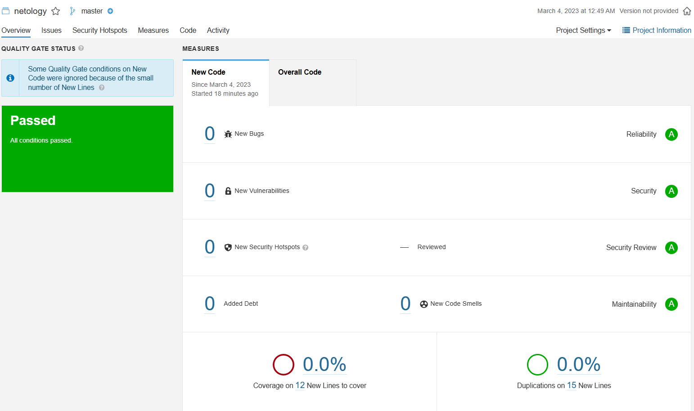

# Домашнее задание по теме: "Жизненный цикл ПО"

## Знакомоство с SonarQube

### Основная часть

1. Создайте новый проект, название произвольное.
2. Скачайте пакет sonar-scanner, который вам предлагает скачать SonarQube.
3. Сделайте так, чтобы binary был доступен через вызов в shell (или поменяйте переменную PATH, или любой другой, удобный вам способ).
4. Проверьте `sonar-scanner --version`.
5. Запустите анализатор против кода из директории [example](./example) с дополнительным ключом `-Dsonar.coverage.exclusions=fail.py`.
6. Посмотрите результат в интерфейсе.
7. Исправьте ошибки, которые он выявил, включая warnings.
8. Запустите анализатор повторно — проверьте, что QG пройдены успешно.
9. Сделайте скриншот успешного прохождения анализа, приложите к решению ДЗ.

#### Результат (после исправления ошибок):

```bash
> sonar-scanner   -Dsonar.projectKey=netology   -Dsonar.sources=.   -Dsonar.host.url=http://51.250.3.176:9000   -Dsonar.login=3bc6[REDACTED] -Dsonar.coverage.exclusions=fail.py -Dsonar.python.version=3
INFO: Scanner configuration file: /mnt/c/sonar-scanner-4.8.0.2856-linux/conf/sonar-scanner.properties
INFO: Project root configuration file: NONE
INFO: SonarScanner 4.8.0.2856
INFO: Java 11.0.17 Eclipse Adoptium (64-bit)
INFO: Linux 5.15.90.1-microsoft-standard-WSL2 amd64
INFO: User cache: /home/ivanm/.sonar/cache
INFO: Analyzing on SonarQube server 9.1.0
INFO: Default locale: "en", source code encoding: "UTF-8" (analysis is platform dependent)
INFO: Load global settings
INFO: Load global settings (done) | time=191ms
INFO: Server id: 9CFC3560-AYapTauoOU08A8dhuAGl
INFO: User cache: /home/ivanm/.sonar/cache
INFO: Load/download plugins
INFO: Load plugins index
INFO: Load plugins index (done) | time=113ms
INFO: Load/download plugins (done) | time=229ms
INFO: Process project properties
INFO: Process project properties (done) | time=15ms
INFO: Execute project builders
INFO: Execute project builders (done) | time=10ms
INFO: Project key: netology
INFO: Base dir: /mnt/x/edu/repo/devops-netology/homework/05. CI, мониторинг и управление конфигурациями/09. Процессы CICD/example
INFO: Working dir: /mnt/x/edu/repo/devops-netology/homework/05. CI, мониторинг и управление конфигурациями/09. Процессы CICD/example/.scannerwork
INFO: Load project settings for component key: 'netology'
INFO: Load project settings for component key: 'netology' (done) | time=78ms
INFO: Load quality profiles
INFO: Load quality profiles (done) | time=454ms
INFO: Load active rules
INFO: Load active rules (done) | time=4534ms
INFO: Indexing files...
INFO: Project configuration:
INFO:   Excluded sources for coverage: fail.py
INFO: 1 file indexed
INFO: 0 files ignored because of scm ignore settings
INFO: Quality profile for py: Sonar way
INFO: ------------- Run sensors on module netology
INFO: Load metrics repository
INFO: Load metrics repository (done) | time=103ms
INFO: Sensor Python Sensor [python]
INFO: Starting global symbols computation
INFO: 1 source file to be analyzed
INFO: Load project repositories
INFO: Load project repositories (done) | time=64ms
INFO: 1/1 source file has been analyzed
INFO: Starting rules execution
INFO: 1 source file to be analyzed
INFO: 1/1 source file has been analyzed
INFO: Sensor Python Sensor [python] (done) | time=1370ms
INFO: Sensor Cobertura Sensor for Python coverage [python]
INFO: Sensor Cobertura Sensor for Python coverage [python] (done) | time=62ms
INFO: Sensor PythonXUnitSensor [python]
INFO: Sensor PythonXUnitSensor [python] (done) | time=56ms
INFO: Sensor CSS Rules [cssfamily]
INFO: No CSS, PHP, HTML or VueJS files are found in the project. CSS analysis is skipped.
INFO: Sensor CSS Rules [cssfamily] (done) | time=1ms
INFO: Sensor JaCoCo XML Report Importer [jacoco]
INFO: 'sonar.coverage.jacoco.xmlReportPaths' is not defined. Using default locations: target/site/jacoco/jacoco.xml,target/site/jacoco-it/jacoco.xml,build/reports/jacoco/test/jacocoTestReport.xml
INFO: No report imported, no coverage information will be imported by JaCoCo XML Report Importer
INFO: Sensor JaCoCo XML Report Importer [jacoco] (done) | time=29ms
INFO: Sensor C# Project Type Information [csharp]
INFO: Sensor C# Project Type Information [csharp] (done) | time=1ms
INFO: Sensor C# Analysis Log [csharp]
INFO: Sensor C# Analysis Log [csharp] (done) | time=42ms
INFO: Sensor C# Properties [csharp]
INFO: Sensor C# Properties [csharp] (done) | time=1ms
INFO: Sensor JavaXmlSensor [java]
INFO: Sensor JavaXmlSensor [java] (done) | time=2ms
INFO: Sensor HTML [web]
INFO: Sensor HTML [web] (done) | time=3ms
INFO: Sensor VB.NET Project Type Information [vbnet]
INFO: Sensor VB.NET Project Type Information [vbnet] (done) | time=3ms
INFO: Sensor VB.NET Analysis Log [vbnet]
INFO: Sensor VB.NET Analysis Log [vbnet] (done) | time=25ms
INFO: Sensor VB.NET Properties [vbnet]
INFO: Sensor VB.NET Properties [vbnet] (done) | time=0ms
INFO: ------------- Run sensors on project
INFO: Sensor Zero Coverage Sensor
INFO: Sensor Zero Coverage Sensor (done) | time=31ms
INFO: SCM Publisher SCM provider for this project is: git
INFO: SCM Publisher 1 source file to be analyzed
INFO: SCM Publisher 1/1 source file have been analyzed (done) | time=956ms
INFO: CPD Executor Calculating CPD for 1 file
INFO: CPD Executor CPD calculation finished (done) | time=13ms
INFO: Analysis report generated in 261ms, dir size=103.0 kB
INFO: Analysis report compressed in 563ms, zip size=14.3 kB
INFO: Analysis report uploaded in 124ms
INFO: ANALYSIS SUCCESSFUL, you can browse http://51.250.3.176:9000/dashboard?id=netology
INFO: Note that you will be able to access the updated dashboard once the server has processed the submitted analysis report
INFO: More about the report processing at http://51.250.3.176:9000/api/ce/task?id=AYapc6jHaX7DiTpX5DFv
INFO: Analysis total time: 12.613 s
INFO: ------------------------------------------------------------------------
INFO: EXECUTION SUCCESS
INFO: ------------------------------------------------------------------------
INFO: Total time: 15.565s
INFO: Final Memory: 8M/48M
INFO: ------------------------------------------------------------------------
```



## Знакомство с Nexus

### Основная часть

1. В репозиторий `maven-public` загрузите артефакт с GAV-параметрами:

 *    groupId: netology;
 *    artifactId: java;
 *    version: 8_282;
 *    classifier: distrib;
 *    type: tar.gz.
   
2. В него же загрузите такой же артефакт, но с version: 8_102.
3. Проверьте, что все файлы загрузились успешно.
4. В ответе пришлите файл `maven-metadata.xml` для этого артефекта.

#### Результат:

maven-metadata.xml:
```xml
<metadata modelVersion="1.1.0">
<groupId>netology</groupId>
<artifactId>java</artifactId>
<versioning>
<latest>8_282</latest>
<release>8_282</release>
<versions>
<version>8_102</version>
<version>8_282</version>
</versions>
<lastUpdated>20230303220736</lastUpdated>
</versioning>
</metadata>
```

### Знакомство с Maven

### Подготовка к выполнению

1. Скачайте дистрибутив с [maven](https://maven.apache.org/download.cgi).
2. Разархивируйте, сделайте так, чтобы binary был доступен через вызов в shell (или поменяйте переменную PATH, или любой другой, удобный вам способ).
3. Удалите из `apache-maven-<version>/conf/settings.xml` упоминание о правиле, отвергающем HTTP- соединение — раздел mirrors —> id: my-repository-http-unblocker.
4. Проверьте `mvn --version`.
5. Заберите директорию [mvn](./mvn) с pom.

### Основная часть

1. Поменяйте в `pom.xml` блок с зависимостями под ваш артефакт из первого пункта задания для Nexus (java с версией 8_282).
2. Запустите команду `mvn package` в директории с `pom.xml`, ожидайте успешного окончания.
3. Проверьте директорию `~/.m2/repository/`, найдите ваш артефакт.
4. В ответе пришлите исправленный файл `pom.xml`.

#### Результат:

pom.xml:
```xml
<project xmlns="http://maven.apache.org/POM/4.0.0" xmlns:xsi="http://www.w3.org/2001/XMLSchema-instance"
  xsi:schemaLocation="http://maven.apache.org/POM/4.0.0 http://maven.apache.org/xsd/maven-4.0.0.xsd">
  <modelVersion>4.0.0</modelVersion>
 
  <groupId>com.netology.app</groupId>
  <artifactId>simple-app</artifactId>
  <version>1.0-SNAPSHOT</version>
   <repositories>
    <repository>
      <id>my-repo</id>
      <name>maven-public</name>
      <url>http://51.250.68.43:8081/repository/maven-public/</url>
    </repository>
  </repositories>
  <dependencies>
    <dependency>
      <groupId>netology</groupId>
      <artifactId>java</artifactId>
      <version>8_282</version>
      <classifier>distrib</classifier>
      <type>tar.gz</type>
    </dependency>
  </dependencies>
</project>
```