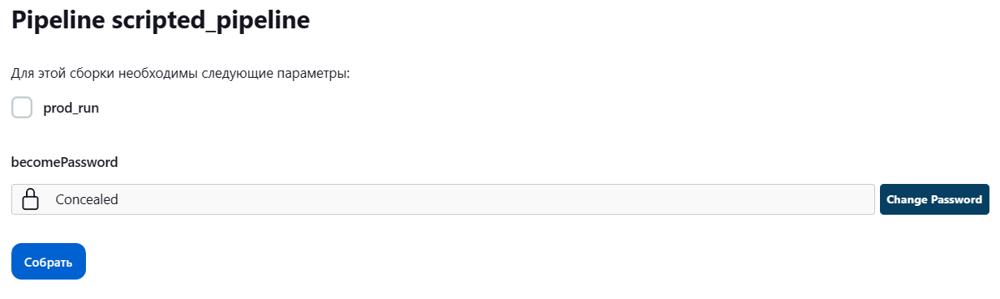

# Домашнее задание по теме: "Jenkins"

## Подготовка к выполнению

1. Создать два VM: для jenkins-master и jenkins-agent.
2. Установить Jenkins при помощи playbook.
3. Запустить и проверить работоспособность.
4. Сделать первоначальную настройку.

	#### Результат:

	

	

## Основная часть

1. Сделать Freestyle Job, который будет запускать `molecule test` из любого вашего репозитория с ролью.

	#### Результат:

	

    <details>
        <summary>Console Output</summary>
    
    ```bash
    Started by user admin
    Running as SYSTEM
    Building remotely on agent in workspace /opt/jenkins_agent/workspace/vector-role_freestyle
    The recommended git tool is: NONE
    using credential 0ed4dcfd-6cd3-47c0-bfcc-b01f0149a411
     > git rev-parse --resolve-git-dir /opt/jenkins_agent/workspace/vector-role_freestyle/vector-role/.git # timeout=10
    Fetching changes from the remote Git repository
     > git config remote.origin.url git@github.com:ivanmanokhin/vector-role.git # timeout=10
    Fetching upstream changes from git@github.com:ivanmanokhin/vector-role.git
     > git --version # timeout=10
     > git --version # 'git version 2.39.1'
    using GIT_SSH to set credentials 
    Verifying host key using known hosts file
     > git fetch --tags --force --progress -- git@github.com:ivanmanokhin/vector-role.git +refs/heads/*:refs/remotes/origin/* # timeout=10
     > git rev-parse refs/remotes/origin/master^{commit} # timeout=10
    Checking out Revision 7e43cd8c002b9b2867a694e6ea1515dd3c7e16f9 (refs/remotes/origin/master)
     > git config core.sparsecheckout # timeout=10
     > git checkout -f 7e43cd8c002b9b2867a694e6ea1515dd3c7e16f9 # timeout=10
    Commit message: "[fixing] tox"
     > git rev-list --no-walk 7e43cd8c002b9b2867a694e6ea1515dd3c7e16f9 # timeout=10
    [vector-role_freestyle] $ /bin/sh -xe /tmp/jenkins4087578189243278038.sh
    + molecule test
    INFO     default scenario test matrix: dependency, lint, cleanup, destroy, syntax, create, prepare, converge, idempotence, side_effect, verify, cleanup, destroy
    INFO     Performing prerun with role_name_check=0...
    INFO     Set ANSIBLE_LIBRARY=/home/jenkins/.cache/ansible-compat/01b036/modules:/home/jenkins/.ansible/plugins/modules:/usr/share/ansible/plugins/modules
    INFO     Set ANSIBLE_COLLECTIONS_PATH=/home/jenkins/.cache/ansible-compat/01b036/collections:/home/jenkins/.ansible/collections:/usr/share/ansible/collections
    INFO     Set ANSIBLE_ROLES_PATH=/home/jenkins/.cache/ansible-compat/01b036/roles:/home/jenkins/.ansible/roles:/usr/share/ansible/roles:/etc/ansible/roles
    INFO     Using /home/jenkins/.cache/ansible-compat/01b036/roles/ivanmanokhin.vector_role symlink to current repository in order to enable Ansible to find the role using its expected full name.
    INFO     Running default > dependency
    INFO     Running from /opt/jenkins_agent/workspace/vector-role_freestyle : ansible-galaxy collection install -vvv community.docker:>=3.0.2
    INFO     Running from /opt/jenkins_agent/workspace/vector-role_freestyle : ansible-galaxy collection install -vvv ansible.posix:>=1.4.0
    WARNING  Skipping, missing the requirements file.
    WARNING  Skipping, missing the requirements file.
    INFO     Running default > lint
    WARNING: PATH altered to include /usr/bin
    ERROR    FATAL: Ansible CLI (2.14.3) and python module (2.11.12) versions do not match. This indicates a broken execution environment.
    INFO     Running default > cleanup
    WARNING  Skipping, cleanup playbook not configured.
    INFO     Running default > destroy
    INFO     Sanity checks: 'docker'
    
    PLAY [Destroy] *****************************************************************
    
    TASK [Set async_dir for HOME env] **********************************************
    ok: [localhost]
    
    TASK [Destroy molecule instance(s)] ********************************************
    changed: [localhost] => (item=centos_8)
    changed: [localhost] => (item=ubuntu_latest)
    
    TASK [Wait for instance(s) deletion to complete] *******************************
    ok: [localhost] => (item=centos_8)
    ok: [localhost] => (item=ubuntu_latest)
    
    TASK [Delete docker networks(s)] ***********************************************
    skipping: [localhost]
    
    PLAY RECAP *********************************************************************
    localhost                  : ok=3    changed=1    unreachable=0    failed=0    skipped=1    rescued=0    ignored=0
    
    INFO     Running default > syntax
    
    playbook: /opt/jenkins_agent/workspace/vector-role_freestyle/molecule/default/converge.yml
    INFO     Running default > create
    
    PLAY [Create] ******************************************************************
    
    TASK [Set async_dir for HOME env] **********************************************
    ok: [localhost]
    
    TASK [Log into a Docker registry] **********************************************
    skipping: [localhost] => (item=None)
    skipping: [localhost] => (item=None)
    skipping: [localhost]
    
    TASK [Check presence of custom Dockerfiles] ************************************
    ok: [localhost] => (item={'image': 'docker.io/pycontribs/centos:8', 'name': 'centos_8', 'pre_build_image': True})
    ok: [localhost] => (item={'image': 'docker.io/pycontribs/ubuntu:latest', 'name': 'ubuntu_latest', 'pre_build_image': True})
    
    TASK [Create Dockerfiles from image names] *************************************
    skipping: [localhost] => (item={'image': 'docker.io/pycontribs/centos:8', 'name': 'centos_8', 'pre_build_image': True})
    skipping: [localhost] => (item={'image': 'docker.io/pycontribs/ubuntu:latest', 'name': 'ubuntu_latest', 'pre_build_image': True})
    skipping: [localhost]
    
    TASK [Synchronization the context] *********************************************
    skipping: [localhost] => (item={'image': 'docker.io/pycontribs/centos:8', 'name': 'centos_8', 'pre_build_image': True})
    skipping: [localhost] => (item={'image': 'docker.io/pycontribs/ubuntu:latest', 'name': 'ubuntu_latest', 'pre_build_image': True})
    skipping: [localhost]
    
    TASK [Discover local Docker images] ********************************************
    ok: [localhost] => (item={'changed': False, 'skipped': True, 'skip_reason': 'Conditional result was False', 'item': {'image': 'docker.io/pycontribs/centos:8', 'name': 'centos_8', 'pre_build_image': True}, 'ansible_loop_var': 'item', 'i': 0, 'ansible_index_var': 'i'})
    ok: [localhost] => (item={'changed': False, 'skipped': True, 'skip_reason': 'Conditional result was False', 'item': {'image': 'docker.io/pycontribs/ubuntu:latest', 'name': 'ubuntu_latest', 'pre_build_image': True}, 'ansible_loop_var': 'item', 'i': 1, 'ansible_index_var': 'i'})
    
    TASK [Build an Ansible compatible image (new)] *********************************
    skipping: [localhost] => (item=molecule_local/docker.io/pycontribs/centos:8)
    skipping: [localhost] => (item=molecule_local/docker.io/pycontribs/ubuntu:latest)
    skipping: [localhost]
    
    TASK [Create docker network(s)] ************************************************
    skipping: [localhost]
    
    TASK [Determine the CMD directives] ********************************************
    ok: [localhost] => (item={'image': 'docker.io/pycontribs/centos:8', 'name': 'centos_8', 'pre_build_image': True})
    ok: [localhost] => (item={'image': 'docker.io/pycontribs/ubuntu:latest', 'name': 'ubuntu_latest', 'pre_build_image': True})
    
    TASK [Create molecule instance(s)] *********************************************
    changed: [localhost] => (item=centos_8)
    changed: [localhost] => (item=ubuntu_latest)
    
    TASK [Wait for instance(s) creation to complete] *******************************
    FAILED - RETRYING: [localhost]: Wait for instance(s) creation to complete (300 retries left).
    changed: [localhost] => (item={'failed': 0, 'started': 1, 'finished': 0, 'ansible_job_id': '316632736494.95636', 'results_file': '/home/jenkins/.ansible_async/316632736494.95636', 'changed': True, 'item': {'image': 'docker.io/pycontribs/centos:8', 'name': 'centos_8', 'pre_build_image': True}, 'ansible_loop_var': 'item'})
    changed: [localhost] => (item={'failed': 0, 'started': 1, 'finished': 0, 'ansible_job_id': '675900133579.95658', 'results_file': '/home/jenkins/.ansible_async/675900133579.95658', 'changed': True, 'item': {'image': 'docker.io/pycontribs/ubuntu:latest', 'name': 'ubuntu_latest', 'pre_build_image': True}, 'ansible_loop_var': 'item'})
    
    PLAY RECAP *********************************************************************
    localhost                  : ok=6    changed=2    unreachable=0    failed=0    skipped=5    rescued=0    ignored=0
    
    INFO     Running default > prepare
    WARNING  Skipping, prepare playbook not configured.
    INFO     Running default > converge
    
    PLAY [Converge] ****************************************************************
    
    TASK [Gathering Facts] *********************************************************
    ok: [centos_8]
    ok: [ubuntu_latest]
    
    TASK [Include vector-role] *****************************************************
    
    TASK [vector-role : Create user for vector] ************************************
    changed: [ubuntu_latest]
    changed: [centos_8]
    
    TASK [vector-role : Get Vector distrib] ****************************************
    changed: [ubuntu_latest]
    changed: [centos_8]
    
    TASK [vector-role : Create directory for Vector] *******************************
    changed: [ubuntu_latest]
    changed: [centos_8]
    
    TASK [vector-role : Create directory for Vector data] **************************
    changed: [ubuntu_latest]
    changed: [centos_8]
    
    TASK [vector-role : Extract Vector] ********************************************
    changed: [centos_8]
    changed: [ubuntu_latest]
    
    TASK [vector-role : Generate systemd unit Vector] ******************************
    changed: [ubuntu_latest]
    changed: [centos_8]
    
    TASK [vector-role : Generate Vector config] ************************************
    changed: [ubuntu_latest]
    changed: [centos_8]
    
    RUNNING HANDLER [vector-role : Start Vector service] ***************************
    skipping: [centos_8]
    skipping: [ubuntu_latest]
    
    PLAY RECAP *********************************************************************
    centos_8                   : ok=8    changed=7    unreachable=0    failed=0    skipped=1    rescued=0    ignored=0
    ubuntu_latest              : ok=8    changed=7    unreachable=0    failed=0    skipped=1    rescued=0    ignored=0
    
    INFO     Running default > idempotence
    
    PLAY [Converge] ****************************************************************
    
    TASK [Gathering Facts] *********************************************************
    ok: [centos_8]
    ok: [ubuntu_latest]
    
    TASK [Include vector-role] *****************************************************
    
    TASK [vector-role : Create user for vector] ************************************
    ok: [ubuntu_latest]
    ok: [centos_8]
    
    TASK [vector-role : Get Vector distrib] ****************************************
    ok: [centos_8]
    ok: [ubuntu_latest]
    
    TASK [vector-role : Create directory for Vector] *******************************
    ok: [ubuntu_latest]
    ok: [centos_8]
    
    TASK [vector-role : Create directory for Vector data] **************************
    ok: [ubuntu_latest]
    ok: [centos_8]
    
    TASK [vector-role : Extract Vector] ********************************************
    ok: [centos_8]
    ok: [ubuntu_latest]
    
    TASK [vector-role : Generate systemd unit Vector] ******************************
    ok: [ubuntu_latest]
    ok: [centos_8]
    
    TASK [vector-role : Generate Vector config] ************************************
    ok: [ubuntu_latest]
    ok: [centos_8]
    
    PLAY RECAP *********************************************************************
    centos_8                   : ok=8    changed=0    unreachable=0    failed=0    skipped=0    rescued=0    ignored=0
    ubuntu_latest              : ok=8    changed=0    unreachable=0    failed=0    skipped=0    rescued=0    ignored=0
    
    INFO     Idempotence completed successfully.
    INFO     Running default > side_effect
    WARNING  Skipping, side effect playbook not configured.
    INFO     Running default > verify
    INFO     Running Ansible Verifier
    
    PLAY [Verify] ******************************************************************
    
    TASK [Vector check version] ****************************************************
    ok: [ubuntu_latest]
    ok: [centos_8]
    
    TASK [Assert Vector version] ***************************************************
    ok: [centos_8] => {
        "changed": false,
        "msg": "vector 0.27.0 (x86_64-unknown-linux-musl 5623d1e 2023-01-18)"
    }
    ok: [ubuntu_latest] => {
        "changed": false,
        "msg": "vector 0.27.0 (x86_64-unknown-linux-musl 5623d1e 2023-01-18)"
    }
    
    TASK [Validate Vector config] **************************************************
    ok: [ubuntu_latest]
    ok: [centos_8]
    
    TASK [Assert Vector config] ****************************************************
    ok: [centos_8] => {
        "changed": false,
        "msg": "Vector configuration is valid"
    }
    ok: [ubuntu_latest] => {
        "changed": false,
        "msg": "Vector configuration is valid"
    }
    
    PLAY RECAP *********************************************************************
    centos_8                   : ok=4    changed=0    unreachable=0    failed=0    skipped=0    rescued=0    ignored=0
    ubuntu_latest              : ok=4    changed=0    unreachable=0    failed=0    skipped=0    rescued=0    ignored=0
    
    INFO     Verifier completed successfully.
    INFO     Running default > cleanup
    WARNING  Skipping, cleanup playbook not configured.
    INFO     Running default > destroy
    
    PLAY [Destroy] *****************************************************************
    
    TASK [Set async_dir for HOME env] **********************************************
    ok: [localhost]
    
    TASK [Destroy molecule instance(s)] ********************************************
    changed: [localhost] => (item=centos_8)
    changed: [localhost] => (item=ubuntu_latest)
    
    TASK [Wait for instance(s) deletion to complete] *******************************
    FAILED - RETRYING: [localhost]: Wait for instance(s) deletion to complete (300 retries left).
    changed: [localhost] => (item=centos_8)
    changed: [localhost] => (item=ubuntu_latest)
    
    TASK [Delete docker networks(s)] ***********************************************
    skipping: [localhost]
    
    PLAY RECAP *********************************************************************
    localhost                  : ok=3    changed=2    unreachable=0    failed=0    skipped=1    rescued=0    ignored=0
    
    INFO     Pruning extra files from scenario ephemeral directory
    Finished: SUCCESS
    ```
    </details>

2. Сделать Declarative Pipeline Job, который будет запускать `molecule test` из любого вашего репозитория с ролью.

	#### Результат:

	

	```
    pipeline {
        agent any
        stages {
            stage('Source') {
                steps {
                    dir('vector-role') {
                        git credentialsId: '0ed4dcfd-6cd3-47c0-bfcc-b01f0149a411', url: 'git@github.com:ivanmanokhin/vector-role.git'
                    }           
                }
            }
            stage('Molecule Test') {
                steps {
                    sh 'molecule test'
                }
            }
            stage('Clean up') {
                steps {
                    deleteDir()
                }
            }
        }
    }
	```

    <details>
        <summary>Console Output</summary>

	```bash
    Started by user admin
    [Pipeline] Start of Pipeline
    [Pipeline] node
    Running on agent in /opt/jenkins_agent/workspace/vector-role_pipeline
    [Pipeline] {
    [Pipeline] stage
    [Pipeline] { (Source)
    [Pipeline] dir
    Running in /opt/jenkins_agent/workspace/vector-role_pipeline/vector-role
    [Pipeline] {
    [Pipeline] git
    The recommended git tool is: NONE
    using credential 0ed4dcfd-6cd3-47c0-bfcc-b01f0149a411
    Cloning the remote Git repository
    Cloning repository git@github.com:ivanmanokhin/vector-role.git
     > git init /opt/jenkins_agent/workspace/vector-role_pipeline/vector-role # timeout=10
    Fetching upstream changes from git@github.com:ivanmanokhin/vector-role.git
     > git --version # timeout=10
     > git --version # 'git version 2.39.1'
    using GIT_SSH to set credentials 
    Verifying host key using known hosts file
     > git fetch --tags --force --progress -- git@github.com:ivanmanokhin/vector-role.git +refs/heads/*:refs/remotes/origin/* # timeout=10
    Avoid second fetch
    Checking out Revision 7e43cd8c002b9b2867a694e6ea1515dd3c7e16f9 (refs/remotes/origin/master)
    Commit message: "[fixing] tox"
     > git config remote.origin.url git@github.com:ivanmanokhin/vector-role.git # timeout=10
     > git config --add remote.origin.fetch +refs/heads/*:refs/remotes/origin/* # timeout=10
     > git rev-parse refs/remotes/origin/master^{commit} # timeout=10
     > git config core.sparsecheckout # timeout=10
     > git checkout -f 7e43cd8c002b9b2867a694e6ea1515dd3c7e16f9 # timeout=10
     > git branch -a -v --no-abbrev # timeout=10
     > git checkout -b master 7e43cd8c002b9b2867a694e6ea1515dd3c7e16f9 # timeout=10
     > git rev-list --no-walk 7e43cd8c002b9b2867a694e6ea1515dd3c7e16f9 # timeout=10
    [Pipeline] }
    [Pipeline] // dir
    [Pipeline] }
    [Pipeline] // stage
    [Pipeline] stage
    [Pipeline] { (Molecule Test)
    [Pipeline] sh
    + molecule test
    INFO     default scenario test matrix: dependency, lint, cleanup, destroy, syntax, create, prepare, converge, idempotence, side_effect, verify, cleanup, destroy
    INFO     Performing prerun with role_name_check=0...
    INFO     Set ANSIBLE_LIBRARY=/home/jenkins/.cache/ansible-compat/8c9aad/modules:/home/jenkins/.ansible/plugins/modules:/usr/share/ansible/plugins/modules
    INFO     Set ANSIBLE_COLLECTIONS_PATH=/home/jenkins/.cache/ansible-compat/8c9aad/collections:/home/jenkins/.ansible/collections:/usr/share/ansible/collections
    INFO     Set ANSIBLE_ROLES_PATH=/home/jenkins/.cache/ansible-compat/8c9aad/roles:/home/jenkins/.ansible/roles:/usr/share/ansible/roles:/etc/ansible/roles
    INFO     Using /home/jenkins/.cache/ansible-compat/8c9aad/roles/ivanmanokhin.vector_role symlink to current repository in order to enable Ansible to find the role using its expected full name.
    INFO     Running default > dependency
    WARNING  Skipping, missing the requirements file.
    WARNING  Skipping, missing the requirements file.
    INFO     Running default > lint
    WARNING: PATH altered to include /usr/bin
    ERROR    FATAL: Ansible CLI (2.14.3) and python module (2.11.12) versions do not match. This indicates a broken execution environment.
    INFO     Running default > cleanup
    WARNING  Skipping, cleanup playbook not configured.
    INFO     Running default > destroy
    INFO     Sanity checks: 'docker'
    
    PLAY [Destroy] *****************************************************************
    
    TASK [Set async_dir for HOME env] **********************************************
    ok: [localhost]
    
    TASK [Destroy molecule instance(s)] ********************************************
    changed: [localhost] => (item=centos_8)
    changed: [localhost] => (item=ubuntu_latest)
    
    TASK [Wait for instance(s) deletion to complete] *******************************
    ok: [localhost] => (item=centos_8)
    ok: [localhost] => (item=ubuntu_latest)
    
    TASK [Delete docker networks(s)] ***********************************************
    skipping: [localhost]
    
    PLAY RECAP *********************************************************************
    localhost                  : ok=3    changed=1    unreachable=0    failed=0    skipped=1    rescued=0    ignored=0
    
    INFO     Running default > syntax
    
    playbook: /opt/jenkins_agent/workspace/vector-role_pipeline/molecule/default/converge.yml
    INFO     Running default > create
    
    PLAY [Create] ******************************************************************
    
    TASK [Set async_dir for HOME env] **********************************************
    ok: [localhost]
    
    TASK [Log into a Docker registry] **********************************************
    skipping: [localhost] => (item=None)
    skipping: [localhost] => (item=None)
    skipping: [localhost]
    
    TASK [Check presence of custom Dockerfiles] ************************************
    ok: [localhost] => (item={'image': 'docker.io/pycontribs/centos:8', 'name': 'centos_8', 'pre_build_image': True})
    ok: [localhost] => (item={'image': 'docker.io/pycontribs/ubuntu:latest', 'name': 'ubuntu_latest', 'pre_build_image': True})
    
    TASK [Create Dockerfiles from image names] *************************************
    skipping: [localhost] => (item={'image': 'docker.io/pycontribs/centos:8', 'name': 'centos_8', 'pre_build_image': True})
    skipping: [localhost] => (item={'image': 'docker.io/pycontribs/ubuntu:latest', 'name': 'ubuntu_latest', 'pre_build_image': True})
    skipping: [localhost]
    
    TASK [Synchronization the context] *********************************************
    skipping: [localhost] => (item={'image': 'docker.io/pycontribs/centos:8', 'name': 'centos_8', 'pre_build_image': True})
    skipping: [localhost] => (item={'image': 'docker.io/pycontribs/ubuntu:latest', 'name': 'ubuntu_latest', 'pre_build_image': True})
    skipping: [localhost]
    
    TASK [Discover local Docker images] ********************************************
    ok: [localhost] => (item={'changed': False, 'skipped': True, 'skip_reason': 'Conditional result was False', 'item': {'image': 'docker.io/pycontribs/centos:8', 'name': 'centos_8', 'pre_build_image': True}, 'ansible_loop_var': 'item', 'i': 0, 'ansible_index_var': 'i'})
    ok: [localhost] => (item={'changed': False, 'skipped': True, 'skip_reason': 'Conditional result was False', 'item': {'image': 'docker.io/pycontribs/ubuntu:latest', 'name': 'ubuntu_latest', 'pre_build_image': True}, 'ansible_loop_var': 'item', 'i': 1, 'ansible_index_var': 'i'})
    
    TASK [Build an Ansible compatible image (new)] *********************************
    skipping: [localhost] => (item=molecule_local/docker.io/pycontribs/centos:8)
    skipping: [localhost] => (item=molecule_local/docker.io/pycontribs/ubuntu:latest)
    skipping: [localhost]
    
    TASK [Create docker network(s)] ************************************************
    skipping: [localhost]
    
    TASK [Determine the CMD directives] ********************************************
    ok: [localhost] => (item={'image': 'docker.io/pycontribs/centos:8', 'name': 'centos_8', 'pre_build_image': True})
    ok: [localhost] => (item={'image': 'docker.io/pycontribs/ubuntu:latest', 'name': 'ubuntu_latest', 'pre_build_image': True})
    
    TASK [Create molecule instance(s)] *********************************************
    changed: [localhost] => (item=centos_8)
    changed: [localhost] => (item=ubuntu_latest)
    
    TASK [Wait for instance(s) creation to complete] *******************************
    FAILED - RETRYING: [localhost]: Wait for instance(s) creation to complete (300 retries left).
    changed: [localhost] => (item={'failed': 0, 'started': 1, 'finished': 0, 'ansible_job_id': '716170043640.132517', 'results_file': '/home/jenkins/.ansible_async/716170043640.132517', 'changed': True, 'item': {'image': 'docker.io/pycontribs/centos:8', 'name': 'centos_8', 'pre_build_image': True}, 'ansible_loop_var': 'item'})
    changed: [localhost] => (item={'failed': 0, 'started': 1, 'finished': 0, 'ansible_job_id': '528492966396.132539', 'results_file': '/home/jenkins/.ansible_async/528492966396.132539', 'changed': True, 'item': {'image': 'docker.io/pycontribs/ubuntu:latest', 'name': 'ubuntu_latest', 'pre_build_image': True}, 'ansible_loop_var': 'item'})
    
    PLAY RECAP *********************************************************************
    localhost                  : ok=6    changed=2    unreachable=0    failed=0    skipped=5    rescued=0    ignored=0
    
    INFO     Running default > prepare
    WARNING  Skipping, prepare playbook not configured.
    INFO     Running default > converge
    
    PLAY [Converge] ****************************************************************
    
    TASK [Gathering Facts] *********************************************************
    ok: [centos_8]
    ok: [ubuntu_latest]
    
    TASK [Include vector-role] *****************************************************
    
    TASK [vector-role : Create user for vector] ************************************
    changed: [ubuntu_latest]
    changed: [centos_8]
    
    TASK [vector-role : Get Vector distrib] ****************************************
    changed: [ubuntu_latest]
    changed: [centos_8]
    
    TASK [vector-role : Create directory for Vector] *******************************
    changed: [ubuntu_latest]
    changed: [centos_8]
    
    TASK [vector-role : Create directory for Vector data] **************************
    changed: [ubuntu_latest]
    changed: [centos_8]
    
    TASK [vector-role : Extract Vector] ********************************************
    changed: [centos_8]
    changed: [ubuntu_latest]
    
    TASK [vector-role : Generate systemd unit Vector] ******************************
    changed: [ubuntu_latest]
    changed: [centos_8]
    
    TASK [vector-role : Generate Vector config] ************************************
    changed: [ubuntu_latest]
    changed: [centos_8]
    
    RUNNING HANDLER [vector-role : Start Vector service] ***************************
    skipping: [centos_8]
    skipping: [ubuntu_latest]
    
    PLAY RECAP *********************************************************************
    centos_8                   : ok=8    changed=7    unreachable=0    failed=0    skipped=1    rescued=0    ignored=0
    ubuntu_latest              : ok=8    changed=7    unreachable=0    failed=0    skipped=1    rescued=0    ignored=0
    
    INFO     Running default > idempotence
    
    PLAY [Converge] ****************************************************************
    
    TASK [Gathering Facts] *********************************************************
    ok: [centos_8]
    ok: [ubuntu_latest]
    
    TASK [Include vector-role] *****************************************************
    
    TASK [vector-role : Create user for vector] ************************************
    ok: [ubuntu_latest]
    ok: [centos_8]
    
    TASK [vector-role : Get Vector distrib] ****************************************
    ok: [ubuntu_latest]
    ok: [centos_8]
    
    TASK [vector-role : Create directory for Vector] *******************************
    ok: [ubuntu_latest]
    ok: [centos_8]
    
    TASK [vector-role : Create directory for Vector data] **************************
    ok: [ubuntu_latest]
    ok: [centos_8]
    
    TASK [vector-role : Extract Vector] ********************************************
    ok: [centos_8]
    ok: [ubuntu_latest]
    
    TASK [vector-role : Generate systemd unit Vector] ******************************
    ok: [ubuntu_latest]
    ok: [centos_8]
    
    TASK [vector-role : Generate Vector config] ************************************
    ok: [ubuntu_latest]
    ok: [centos_8]
    
    PLAY RECAP *********************************************************************
    centos_8                   : ok=8    changed=0    unreachable=0    failed=0    skipped=0    rescued=0    ignored=0
    ubuntu_latest              : ok=8    changed=0    unreachable=0    failed=0    skipped=0    rescued=0    ignored=0
    
    INFO     Idempotence completed successfully.
    INFO     Running default > side_effect
    WARNING  Skipping, side effect playbook not configured.
    INFO     Running default > verify
    INFO     Running Ansible Verifier
    
    PLAY [Verify] ******************************************************************
    
    TASK [Vector check version] ****************************************************
    ok: [ubuntu_latest]
    ok: [centos_8]
    
    TASK [Assert Vector version] ***************************************************
    ok: [centos_8] => {
        "changed": false,
        "msg": "vector 0.27.0 (x86_64-unknown-linux-musl 5623d1e 2023-01-18)"
    }
    ok: [ubuntu_latest] => {
        "changed": false,
        "msg": "vector 0.27.0 (x86_64-unknown-linux-musl 5623d1e 2023-01-18)"
    }
    
    TASK [Validate Vector config] **************************************************
    ok: [ubuntu_latest]
    ok: [centos_8]
    
    TASK [Assert Vector config] ****************************************************
    ok: [centos_8] => {
        "changed": false,
        "msg": "Vector configuration is valid"
    }
    ok: [ubuntu_latest] => {
        "changed": false,
        "msg": "Vector configuration is valid"
    }
    
    PLAY RECAP *********************************************************************
    centos_8                   : ok=4    changed=0    unreachable=0    failed=0    skipped=0    rescued=0    ignored=0
    ubuntu_latest              : ok=4    changed=0    unreachable=0    failed=0    skipped=0    rescued=0    ignored=0
    
    INFO     Verifier completed successfully.
    INFO     Running default > cleanup
    WARNING  Skipping, cleanup playbook not configured.
    INFO     Running default > destroy
    
    PLAY [Destroy] *****************************************************************
    
    TASK [Set async_dir for HOME env] **********************************************
    ok: [localhost]
    
    TASK [Destroy molecule instance(s)] ********************************************
    changed: [localhost] => (item=centos_8)
    changed: [localhost] => (item=ubuntu_latest)
    
    TASK [Wait for instance(s) deletion to complete] *******************************
    FAILED - RETRYING: [localhost]: Wait for instance(s) deletion to complete (300 retries left).
    changed: [localhost] => (item=centos_8)
    changed: [localhost] => (item=ubuntu_latest)
    
    TASK [Delete docker networks(s)] ***********************************************
    skipping: [localhost]
    
    PLAY RECAP *********************************************************************
    localhost                  : ok=3    changed=2    unreachable=0    failed=0    skipped=1    rescued=0    ignored=0
    
    INFO     Pruning extra files from scenario ephemeral directory
    [Pipeline] }
    [Pipeline] // stage
    [Pipeline] stage
    [Pipeline] { (Clean up)
    [Pipeline] deleteDir
    [Pipeline] }
    [Pipeline] // stage
    [Pipeline] }
    [Pipeline] // node
    [Pipeline] End of Pipeline
    Finished: SUCCESS
    ```
    </details>

3. Перенести Declarative Pipeline в репозиторий в файл `Jenkinsfile`.

	#### Результат:

	[Jenkinsfile](https://github.com/ivanmanokhin/vector-role/commit/72e6ee9b78d1ee08b6603f60c880bd3996640198#diff-e6ffa5dc854b843b3ee3c3c28f8eae2f436c2df2b1ca299cca1fa5982e390cf8)

4. Создать Multibranch Pipeline на запуск `Jenkinsfile` из репозитория.

	#### Результат:

	

	

5. Создать Scripted Pipeline, наполнить его скриптом из [pipeline](./pipeline).

	#### Результат:

	

6. Внести необходимые изменения, чтобы Pipeline запускал `ansible-playbook` без флагов `--check --diff`, если не установлен параметр при запуске джобы (prod_run = True). По умолчанию параметр имеет значение False и запускает прогон с флагами `--check --diff`.

	#### Результат:

	Добавил boolean параметр prod_run:

	

	```
    node("linux"){
        stage("Git checkout"){
            git credentialsId: '0ed4dcfd-6cd3-47c0-bfcc-b01f0149a411', url: 'git@github.com:aragastmatb/example-playbook.git'
        }
        stage("Run playbook"){
            if (params.prod_run){
                sh 'ansible-playbook site.yml -i inventory/prod.yml'
            }
            else{
                echo 'ansible-playbook site.yml -i inventory/prod.yml --check --diff'
            }
            
        }
    }
	```

7. Проверить работоспособность, исправить ошибки, исправленный Pipeline вложить в репозиторий в файл `ScriptedJenkinsfile`.

	#### Результат:

	Добавил параметр becomePassword для ansible (передается через `extra-vars`), без прав sudo не работало:

	

    <details>
        <summary>Console Output</summary>

	```bash
    Started by user admin
    [Pipeline] Start of Pipeline
    [Pipeline] node
    Running on agent in /opt/jenkins_agent/workspace/scripted_pipeline
    [Pipeline] {
    [Pipeline] stage
    [Pipeline] { (Git checkout)
    [Pipeline] git
    The recommended git tool is: NONE
    using credential 0ed4dcfd-6cd3-47c0-bfcc-b01f0149a411
    Fetching changes from the remote Git repository
     > git rev-parse --resolve-git-dir /opt/jenkins_agent/workspace/scripted_pipeline/.git # timeout=10
     > git config remote.origin.url git@github.com:aragastmatb/example-playbook.git # timeout=10
    Fetching upstream changes from git@github.com:aragastmatb/example-playbook.git
     > git --version # timeout=10
     > git --version # 'git version 2.39.1'
    using GIT_SSH to set credentials 
    Verifying host key using known hosts file
     > git fetch --tags --force --progress -- git@github.com:aragastmatb/example-playbook.git +refs/heads/*:refs/remotes/origin/* # timeout=10
    Checking out Revision 20bd8d945340bb742acdd9e8c1a8fb5b73cc1700 (refs/remotes/origin/master)
    Commit message: "Merge branch 'master' of https://github.com/aragastmatb/example-playbook"
     > git rev-parse refs/remotes/origin/master^{commit} # timeout=10
     > git config core.sparsecheckout # timeout=10
     > git checkout -f 20bd8d945340bb742acdd9e8c1a8fb5b73cc1700 # timeout=10
     > git branch -a -v --no-abbrev # timeout=10
     > git branch -D master # timeout=10
     > git checkout -b master 20bd8d945340bb742acdd9e8c1a8fb5b73cc1700 # timeout=10
     > git rev-list --no-walk 20bd8d945340bb742acdd9e8c1a8fb5b73cc1700 # timeout=10
    [Pipeline] }
    [Pipeline] // stage
    [Pipeline] stage
    [Pipeline] { (Run playbook)
    [Pipeline] sh
    + ansible-playbook site.yml -i inventory/prod.yml --extra-vars ansible_become_pass=jenkins
    
    PLAY [Install Java] ************************************************************
    
    TASK [Gathering Facts] *********************************************************
    ok: [localhost]
    
    TASK [java : Upload .tar.gz file containing binaries from local storage] *******
    skipping: [localhost]
    
    TASK [java : Upload .tar.gz file conaining binaries from remote storage] *******
    ok: [localhost]
    
    TASK [java : Ensure installation dir exists] ***********************************
    ok: [localhost]
    
    TASK [java : Extract java in the installation directory] ***********************
    changed: [localhost]
    
    TASK [java : Export environment variables] *************************************
    changed: [localhost]
    
    PLAY RECAP *********************************************************************
    localhost                  : ok=5    changed=2    unreachable=0    failed=0    skipped=1    rescued=0    ignored=0   
    
    [Pipeline] }
    [Pipeline] // stage
    [Pipeline] }
    [Pipeline] // node
    [Pipeline] End of Pipeline
    Finished: SUCCESS
	```
    </details>

8. Отправить ссылку на репозиторий с ролью и Declarative Pipeline и Scripted Pipeline.

	#### Результат:

	[vector-role with Jankinsfile (Declarative Pipeline)](https://github.com/ivanmanokhin/vector-role/tree/1.3.1)

	[Scripted Pipeline](./ScriptedJenkinsfile)
