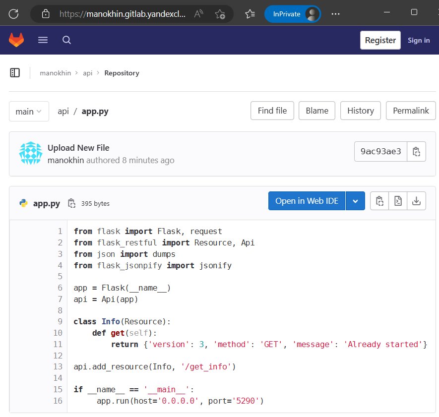
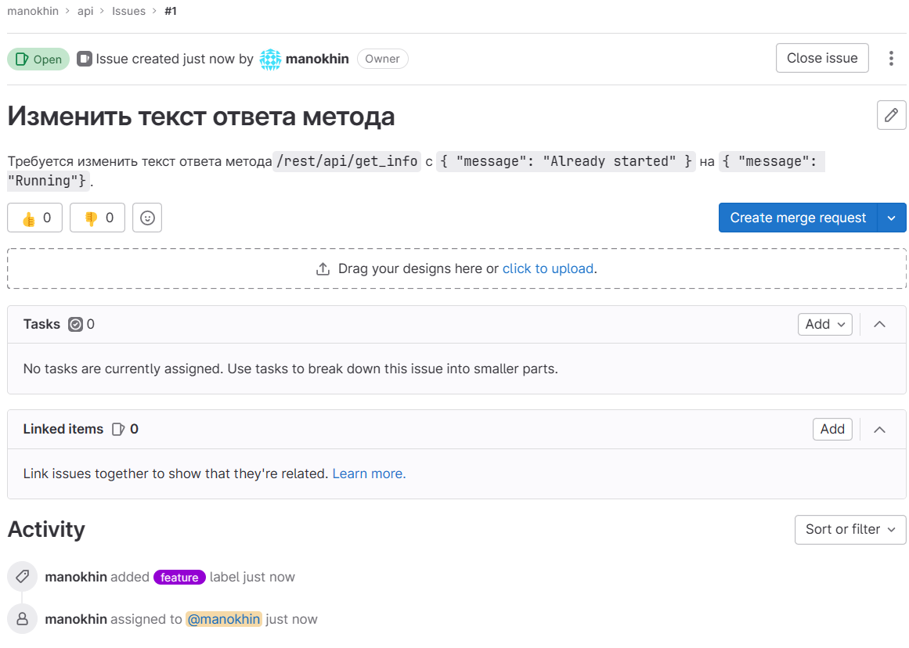
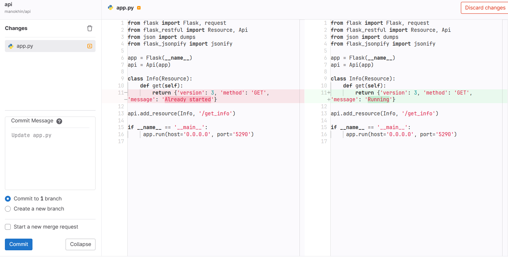
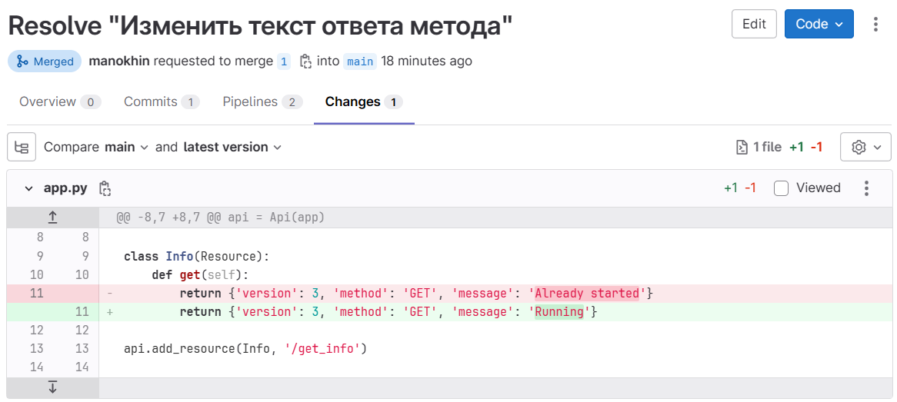
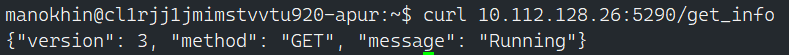

# Домашнее задание по теме: "GitLab"

## Подготовка к выполнению

1. Подготовьте к работе GitLab [по инструкции](https://cloud.yandex.ru/docs/tutorials/infrastructure-management/gitlab-containers).
2. Создайте свой новый проект.
3. Создайте новый репозиторий в GitLab, наполните его [файлами](./repository).
4. Проект должен быть публичным, остальные настройки по желанию.

#### Результат:

Container Registry:
```bash
[manokhin@laptop:~()]> yc container registry list
+----------------------+----------+----------------------+
|          ID          |   NAME   |      FOLDER ID       |
+----------------------+----------+----------------------+
| crp6atogbsup38onrgcu | registry | b1g51tksi3aq7j9inm1k |
+----------------------+----------+----------------------+
```

Kubernates:
```bash
[manokhin@laptop:~()]> yc managed-kubernetes cluster list
+----------------------+------+---------------------+---------+---------+------------------------+---------------------+
|          ID          | NAME |     CREATED AT      | HEALTH  | STATUS  |   EXTERNAL ENDPOINT    |  INTERNAL ENDPOINT  |
+----------------------+------+---------------------+---------+---------+------------------------+---------------------+
| catn3vad8r9alqb959cp | k8s  | 2023-04-03 08:26:08 | HEALTHY | RUNNING | https://158.160.37.253 | https://10.128.0.27 |
+----------------------+------+---------------------+---------+---------+------------------------+---------------------+

[manokhin@laptop:~()]> kubectl get pods -n default | grep gitlab-runner
gitlab-runner-8477548fb-7brb2   1/1     Running   0          24s
```

GitLab:



## Основная часть

### DevOps

В репозитории содержится код проекта на Python. Проект — RESTful API сервис. Ваша задача — автоматизировать сборку образа с выполнением python-скрипта:

1. Образ собирается на основе [centos:7](https://hub.docker.com/_/centos?tab=tags&page=1&ordering=last_updated).
2. Python версии не ниже 3.7.
3. Установлены зависимости: `flask` `flask-jsonpify` `flask-restful`.
4. Создана директория `/python_api`.
5. Скрипт из репозитория размещён в /python_api.
6. Точка вызова: запуск скрипта.
7. Если сборка происходит на ветке `master`: должен подняться pod kubernetes на основе образа `python-api`, иначе этот шаг нужно пропустить.

#### Результат:

* [app.py](./app.py)
* [Dockerfile](./Dockerfile)
* [requirements.txt](./requirements.txt)
* [.gitlab-ci.yml](./.gitlab-ci.yml) (для пункта 7 использовал ветку **main**, а не **master**)
* [k8s.yml](./k8s.yml)


<details>
    <summary>Build Stage Log</summary>

```bash
Running with gitlab-runner 15.10.1 (dcfb4b66)
  on gitlab-runner-8477548fb-7brb2 UpCrcEYe, system ID: r_HeB2h5RVAFIs
Preparing the "kubernetes" executor
00:00
Using Kubernetes namespace: default
Using Kubernetes executor with image cr.yandex/yc/metadata-token-docker-helper:0.2 ...
Using attach strategy to execute scripts...
Preparing environment
00:04
Waiting for pod default/runner-upcrceye-project-4-concurrent-0d8qqx to be running, status is Pending
Running on runner-upcrceye-project-4-concurrent-0d8qqx via gitlab-runner-8477548fb-7brb2...
Getting source from Git repository
00:01
Fetching changes with git depth set to 20...
Initialized empty Git repository in /builds/manokhin/api/.git/
Created fresh repository.
Checking out 4bd840ad as detached HEAD (ref is main)...
Skipping Git submodules setup
Executing "step_script" stage of the job script
$ docker build . -t cr.yandex/crp6atogbsup38onrgcu/api:gitlab-$CI_COMMIT_SHORT_SHA
Step 1/11 : FROM centos:7
7: Pulling from library/centos
2d473b07cdd5: Pulling fs layer
2d473b07cdd5: Verifying Checksum
2d473b07cdd5: Download complete
2d473b07cdd5: Pull complete
Digest: sha256:be65f488b7764ad3638f236b7b515b3678369a5124c47b8d32916d6487418ea4
Status: Downloaded newer image for centos:7
 ---> eeb6ee3f44bd
Step 2/11 : ARG PYTHON_VERSION=3.9.16
 ---> Running in f27a35fd27f3
Removing intermediate container f27a35fd27f3
 ---> e010fe1ee329
Step 3/11 : RUN yum update -y     && yum install -y        gcc        openssl-devel        bzip2-devel        libffi-devel        zlib-devel        wget        make     && yum clean all     && rm -rf /var/cache
 ---> Running in 7080361e4dda
Loaded plugins: fastestmirror, ovl
Determining fastest mirrors
 * base: mirror.yandex.ru
 * extras: mirror.sale-dedic.com
 * updates: mirror.sale-dedic.com
Resolving Dependencies
--> Running transaction check
---> Package bash.x86_64 0:4.2.46-34.el7 will be updated
---> Package bash.x86_64 0:4.2.46-35.el7_9 will be an update
---> Package bind-license.noarch 32:9.11.4-26.P2.el7 will be updated
---> Package bind-license.noarch 32:9.11.4-26.P2.el7_9.13 will be an update
---> Package binutils.x86_64 0:2.27-44.base.el7 will be updated
---> Package binutils.x86_64 0:2.27-44.base.el7_9.1 will be an update
---> Package ca-certificates.noarch 0:2020.2.41-70.0.el7_8 will be updated
---> Package ca-certificates.noarch 0:2022.2.54-74.el7_9 will be an update
---> Package centos-release.x86_64 0:7-9.2009.0.el7.centos will be updated
---> Package centos-release.x86_64 0:7-9.2009.1.el7.centos will be an update
---> Package coreutils.x86_64 0:8.22-24.el7 will be updated
---> Package coreutils.x86_64 0:8.22-24.el7_9.2 will be an update
---> Package curl.x86_64 0:7.29.0-59.el7 will be updated
---> Package curl.x86_64 0:7.29.0-59.el7_9.1 will be an update
---> Package cyrus-sasl-lib.x86_64 0:2.1.26-23.el7 will be updated
---> Package cyrus-sasl-lib.x86_64 0:2.1.26-24.el7_9 will be an update
---> Package device-mapper.x86_64 7:1.02.170-6.el7 will be updated
---> Package device-mapper.x86_64 7:1.02.170-6.el7_9.5 will be an update
---> Package device-mapper-libs.x86_64 7:1.02.170-6.el7 will be updated
---> Package device-mapper-libs.x86_64 7:1.02.170-6.el7_9.5 will be an update
---> Package diffutils.x86_64 0:3.3-5.el7 will be updated
---> Package diffutils.x86_64 0:3.3-6.el7_9 will be an update
---> Package expat.x86_64 0:2.1.0-12.el7 will be updated
---> Package expat.x86_64 0:2.1.0-15.el7_9 will be an update
---> Package glib2.x86_64 0:2.56.1-7.el7 will be updated
---> Package glib2.x86_64 0:2.56.1-9.el7_9 will be an update
---> Package glibc.x86_64 0:2.17-317.el7 will be updated
---> Package glibc.x86_64 0:2.17-326.el7_9 will be an update
---> Package glibc-common.x86_64 0:2.17-317.el7 will be updated
---> Package glibc-common.x86_64 0:2.17-326.el7_9 will be an update
---> Package gzip.x86_64 0:1.5-10.el7 will be updated
---> Package gzip.x86_64 0:1.5-11.el7_9 will be an update
---> Package kpartx.x86_64 0:0.4.9-133.el7 will be updated
---> Package kpartx.x86_64 0:0.4.9-136.el7_9 will be an update
---> Package krb5-libs.x86_64 0:1.15.1-50.el7 will be updated
---> Package krb5-libs.x86_64 0:1.15.1-55.el7_9 will be an update
---> Package libblkid.x86_64 0:2.23.2-65.el7 will be updated
---> Package libblkid.x86_64 0:2.23.2-65.el7_9.1 will be an update
---> Package libcurl.x86_64 0:7.29.0-59.el7 will be updated
---> Package libcurl.x86_64 0:7.29.0-59.el7_9.1 will be an update
---> Package libmount.x86_64 0:2.23.2-65.el7 will be updated
---> Package libmount.x86_64 0:2.23.2-65.el7_9.1 will be an update
---> Package libsmartcols.x86_64 0:2.23.2-65.el7 will be updated
---> Package libsmartcols.x86_64 0:2.23.2-65.el7_9.1 will be an update
---> Package libuuid.x86_64 0:2.23.2-65.el7 will be updated
---> Package libuuid.x86_64 0:2.23.2-65.el7_9.1 will be an update
---> Package libxml2.x86_64 0:2.9.1-6.el7.5 will be updated
---> Package libxml2.x86_64 0:2.9.1-6.el7_9.6 will be an update
---> Package libxml2-python.x86_64 0:2.9.1-6.el7.5 will be updated
---> Package libxml2-python.x86_64 0:2.9.1-6.el7_9.6 will be an update
---> Package nspr.x86_64 0:4.25.0-2.el7_9 will be updated
---> Package nspr.x86_64 0:4.34.0-3.1.el7_9 will be an update
---> Package nss.x86_64 0:3.53.1-3.el7_9 will be updated
---> Package nss.x86_64 0:3.79.0-5.el7_9 will be an update
---> Package nss-softokn.x86_64 0:3.53.1-6.el7_9 will be updated
---> Package nss-softokn.x86_64 0:3.79.0-4.el7_9 will be an update
---> Package nss-softokn-freebl.x86_64 0:3.53.1-6.el7_9 will be updated
---> Package nss-softokn-freebl.x86_64 0:3.79.0-4.el7_9 will be an update
---> Package nss-sysinit.x86_64 0:3.53.1-3.el7_9 will be updated
---> Package nss-sysinit.x86_64 0:3.79.0-5.el7_9 will be an update
---> Package nss-tools.x86_64 0:3.53.1-3.el7_9 will be updated
---> Package nss-tools.x86_64 0:3.79.0-5.el7_9 will be an update
---> Package nss-util.x86_64 0:3.53.1-1.el7_9 will be updated
---> Package nss-util.x86_64 0:3.79.0-1.el7_9 will be an update
---> Package openldap.x86_64 0:2.4.44-22.el7 will be updated
---> Package openldap.x86_64 0:2.4.44-25.el7_9 will be an update
---> Package openssl-libs.x86_64 1:1.0.2k-19.el7 will be updated
---> Package openssl-libs.x86_64 1:1.0.2k-26.el7_9 will be an update
---> Package python.x86_64 0:2.7.5-89.el7 will be updated
---> Package python.x86_64 0:2.7.5-92.el7_9 will be an update
---> Package python-libs.x86_64 0:2.7.5-89.el7 will be updated
---> Package python-libs.x86_64 0:2.7.5-92.el7_9 will be an update
---> Package rpm.x86_64 0:4.11.3-45.el7 will be updated
---> Package rpm.x86_64 0:4.11.3-48.el7_9 will be an update
---> Package rpm-build-libs.x86_64 0:4.11.3-45.el7 will be updated
---> Package rpm-build-libs.x86_64 0:4.11.3-48.el7_9 will be an update
---> Package rpm-libs.x86_64 0:4.11.3-45.el7 will be updated
---> Package rpm-libs.x86_64 0:4.11.3-48.el7_9 will be an update
---> Package rpm-python.x86_64 0:4.11.3-45.el7 will be updated
---> Package rpm-python.x86_64 0:4.11.3-48.el7_9 will be an update
---> Package systemd.x86_64 0:219-78.el7 will be updated
---> Package systemd.x86_64 0:219-78.el7_9.7 will be an update
---> Package systemd-libs.x86_64 0:219-78.el7 will be updated
---> Package systemd-libs.x86_64 0:219-78.el7_9.7 will be an update
---> Package tzdata.noarch 0:2020d-2.el7 will be updated
---> Package tzdata.noarch 0:2022g-1.el7 will be an update
---> Package util-linux.x86_64 0:2.23.2-65.el7 will be updated
---> Package util-linux.x86_64 0:2.23.2-65.el7_9.1 will be an update
---> Package vim-minimal.x86_64 2:7.4.629-7.el7 will be updated
---> Package vim-minimal.x86_64 2:7.4.629-8.el7_9 will be an update
---> Package xz.x86_64 0:5.2.2-1.el7 will be updated
---> Package xz.x86_64 0:5.2.2-2.el7_9 will be an update
---> Package xz-libs.x86_64 0:5.2.2-1.el7 will be updated
---> Package xz-libs.x86_64 0:5.2.2-2.el7_9 will be an update
---> Package zlib.x86_64 0:1.2.7-18.el7 will be updated
---> Package zlib.x86_64 0:1.2.7-21.el7_9 will be an update
--> Finished Dependency Resolution
Dependencies Resolved
================================================================================
 Package               Arch      Version                       Repository  Size
================================================================================
Updating:
 bash                  x86_64    4.2.46-35.el7_9               updates    1.0 M
 bind-license          noarch    32:9.11.4-26.P2.el7_9.13      updates     92 k
 binutils              x86_64    2.27-44.base.el7_9.1          updates    5.9 M
 ca-certificates       noarch    2022.2.54-74.el7_9            updates    911 k
 centos-release        x86_64    7-9.2009.1.el7.centos         updates     27 k
 coreutils             x86_64    8.22-24.el7_9.2               updates    3.3 M
 curl                  x86_64    7.29.0-59.el7_9.1             updates    271 k
 cyrus-sasl-lib        x86_64    2.1.26-24.el7_9               updates    156 k
 device-mapper         x86_64    7:1.02.170-6.el7_9.5          updates    297 k
 device-mapper-libs    x86_64    7:1.02.170-6.el7_9.5          updates    325 k
 diffutils             x86_64    3.3-6.el7_9                   updates    322 k
 expat                 x86_64    2.1.0-15.el7_9                updates     83 k
 glib2                 x86_64    2.56.1-9.el7_9                updates    2.5 M
 glibc                 x86_64    2.17-326.el7_9                updates    3.6 M
 glibc-common          x86_64    2.17-326.el7_9                updates     12 M
 gzip                  x86_64    1.5-11.el7_9                  updates    130 k
 kpartx                x86_64    0.4.9-136.el7_9               updates     81 k
 krb5-libs             x86_64    1.15.1-55.el7_9               updates    810 k
 libblkid              x86_64    2.23.2-65.el7_9.1             updates    183 k
 libcurl               x86_64    7.29.0-59.el7_9.1             updates    223 k
 libmount              x86_64    2.23.2-65.el7_9.1             updates    185 k
 libsmartcols          x86_64    2.23.2-65.el7_9.1             updates    143 k
 libuuid               x86_64    2.23.2-65.el7_9.1             updates     84 k
 libxml2               x86_64    2.9.1-6.el7_9.6               updates    668 k
 libxml2-python        x86_64    2.9.1-6.el7_9.6               updates    247 k
 nspr                  x86_64    4.34.0-3.1.el7_9              updates    128 k
 nss                   x86_64    3.79.0-5.el7_9                updates    895 k
 nss-softokn           x86_64    3.79.0-4.el7_9                updates    379 k
 nss-softokn-freebl    x86_64    3.79.0-4.el7_9                updates    337 k
 nss-sysinit           x86_64    3.79.0-5.el7_9                updates     66 k
 nss-tools             x86_64    3.79.0-5.el7_9                updates    555 k
 nss-util              x86_64    3.79.0-1.el7_9                updates     80 k
 openldap              x86_64    2.4.44-25.el7_9               updates    356 k
 openssl-libs          x86_64    1:1.0.2k-26.el7_9             updates    1.2 M
 python                x86_64    2.7.5-92.el7_9                updates     96 k
 python-libs           x86_64    2.7.5-92.el7_9                updates    5.6 M
 rpm                   x86_64    4.11.3-48.el7_9               updates    1.2 M
 rpm-build-libs        x86_64    4.11.3-48.el7_9               updates    108 k
 rpm-libs              x86_64    4.11.3-48.el7_9               updates    279 k
 rpm-python            x86_64    4.11.3-48.el7_9               updates     84 k
 systemd               x86_64    219-78.el7_9.7                updates    5.1 M
 systemd-libs          x86_64    219-78.el7_9.7                updates    419 k
 tzdata                noarch    2022g-1.el7                   updates    490 k
 util-linux            x86_64    2.23.2-65.el7_9.1             updates    2.0 M
 vim-minimal           x86_64    2:7.4.629-8.el7_9             updates    443 k
 xz                    x86_64    5.2.2-2.el7_9                 updates    229 k
 xz-libs               x86_64    5.2.2-2.el7_9                 updates    103 k
 zlib                  x86_64    1.2.7-21.el7_9                updates     90 k
Transaction Summary
================================================================================
Upgrade  48 Packages
Total download size: 53 M
Downloading packages:
Delta RPMs disabled because /usr/bin/applydeltarpm not installed.
warning: /var/cache/yum/x86_64/7/updates/packages/bind-license-9.11.4-26.P2.el7_9.13.noarch.rpm: Header V3 RSA/SHA256 Signature, key ID f4a80eb5: NOKEY
Public key for bind-license-9.11.4-26.P2.el7_9.13.noarch.rpm is not installed
--------------------------------------------------------------------------------
Total                                               99 MB/s |  53 MB  00:00     
Retrieving key from file:///etc/pki/rpm-gpg/RPM-GPG-KEY-CentOS-7
Importing GPG key 0xF4A80EB5:
 Userid     : "CentOS-7 Key (CentOS 7 Official Signing Key) <security@centos.org>"
 Fingerprint: 6341 ab27 53d7 8a78 a7c2 7bb1 24c6 a8a7 f4a8 0eb5
 Package    : centos-release-7-9.2009.0.el7.centos.x86_64 (@CentOS)
 From       : /etc/pki/rpm-gpg/RPM-GPG-KEY-CentOS-7
Running transaction check
Running transaction test
Transaction test succeeded
Running transaction
  Updating   : tzdata-2022g-1.el7.noarch                                   1/96
 
  Updating   : bash-4.2.46-35.el7_9.x86_64                                 2/96 
  Updating   : nss-softokn-freebl-3.79.0-4.el7_9.x86_64                    3/96
 
  Updating   : glibc-common-2.17-326.el7_9.x86_64                          4/96
 
  Updating   : glibc-2.17-326.el7_9.x86_64                                 5/96
 
  Updating   : nspr-4.34.0-3.1.el7_9.x86_64                                6/96 
  Updating   : nss-util-3.79.0-1.el7_9.x86_64                              7/96
 
  Updating   : zlib-1.2.7-21.el7_9.x86_64                                  8/96 
  Updating   : xz-libs-5.2.2-2.el7_9.x86_64                                9/96 
  Updating   : systemd-libs-219-78.el7_9.7.x86_64                         10/96
 
  Updating   : libuuid-2.23.2-65.el7_9.1.x86_64                           11/96 
  Updating   : nss-softokn-3.79.0-4.el7_9.x86_64                          12/96
 
  Updating   : libxml2-2.9.1-6.el7_9.6.x86_64                             13/96 
  Updating   : libsmartcols-2.23.2-65.el7_9.1.x86_64                      14/96 
  Updating   : expat-2.1.0-15.el7_9.x86_64                                15/96
 
  Updating   : diffutils-3.3-6.el7_9.x86_64                               16/96 
install-info: No such file or directory for /usr/share/info/diffutils.info
  Updating   : ca-certificates-2022.2.54-74.el7_9.noarch                  17/96
 
  Updating   : coreutils-8.22-24.el7_9.2.x86_64                           18/96
 
  Updating   : 1:openssl-libs-1.0.2k-26.el7_9.x86_64                      19/96
 
  Updating   : krb5-libs-1.15.1-55.el7_9.x86_64                           20/96
 
  Updating   : python-libs-2.7.5-92.el7_9.x86_64                          21/96 
  Updating   : libblkid-2.23.2-65.el7_9.1.x86_64                          22/96
 
  Updating   : libmount-2.23.2-65.el7_9.1.x86_64                          23/96 
  Updating   : python-2.7.5-92.el7_9.x86_64                               24/96
 
  Updating   : util-linux-2.23.2-65.el7_9.1.x86_64                        25/96 
  Updating   : cyrus-sasl-lib-2.1.26-24.el7_9.x86_64                      26/96
 
  Updating   : nss-sysinit-3.79.0-5.el7_9.x86_64                          27/96 
  Updating   : nss-3.79.0-5.el7_9.x86_64                                  28/96 
  Updating   : nss-tools-3.79.0-5.el7_9.x86_64                            29/96 
  Updating   : libcurl-7.29.0-59.el7_9.1.x86_64                           30/96
 
  Updating   : curl-7.29.0-59.el7_9.1.x86_64                              31/96 
  Updating   : rpm-libs-4.11.3-48.el7_9.x86_64                            32/96 
  Updating   : rpm-4.11.3-48.el7_9.x86_64                                 33/96
 
  Updating   : openldap-2.4.44-25.el7_9.x86_64                            34/96 
  Updating   : rpm-build-libs-4.11.3-48.el7_9.x86_64                      35/96 
  Updating   : centos-release-7-9.2009.1.el7.centos.x86_64                36/96
 
  Updating   : systemd-219-78.el7_9.7.x86_64                              37/96
 
Failed to get D-Bus connection: Operation not permitted
  Updating   : 7:device-mapper-libs-1.02.170-6.el7_9.5.x86_64             38/96
 
  Updating   : 7:device-mapper-1.02.170-6.el7_9.5.x86_64                  39/96 
  Updating   : kpartx-0.4.9-136.el7_9.x86_64                              40/96 
  Updating   : rpm-python-4.11.3-48.el7_9.x86_64                          41/96 
  Updating   : libxml2-python-2.9.1-6.el7_9.6.x86_64                      42/96
 
  Updating   : glib2-2.56.1-9.el7_9.x86_64                                43/96
 
  Updating   : binutils-2.27-44.base.el7_9.1.x86_64                       44/96 
install-info: No such file or directory for /usr/share/info/as.info.gz
install-info: No such file or directory for /usr/share/info/binutils.info.gz
install-info: No such file or directory for /usr/share/info/gprof.info.gz
install-info: No such file or directory for /usr/share/info/ld.info.gz
install-info: No such file or directory for /usr/share/info/standards.info.gz
  Updating   : gzip-1.5-11.el7_9.x86_64                                   45/96 
  Updating   : xz-5.2.2-2.el7_9.x86_64                                    46/96
 
  Updating   : 2:vim-minimal-7.4.629-8.el7_9.x86_64                       47/96 
  Updating   : 32:bind-license-9.11.4-26.P2.el7_9.13.noarch               48/96 
  Cleanup    : rpm-python-4.11.3-45.el7.x86_64                            49/96 
  Cleanup    : libxml2-python-2.9.1-6.el7.5.x86_64                        50/96 
  Cleanup    : rpm-build-libs-4.11.3-45.el7.x86_64                        51/96 
  Cleanup    : glib2-2.56.1-7.el7.x86_64                                  52/96
 
  Cleanup    : python-2.7.5-89.el7.x86_64                                 53/96 
  Cleanup    : python-libs-2.7.5-89.el7.x86_64                            54/96 
  Cleanup    : libxml2-2.9.1-6.el7.5.x86_64                               55/96
 
  Cleanup    : xz-5.2.2-1.el7.x86_64                                      56/96 
  Cleanup    : binutils-2.27-44.base.el7.x86_64                           57/96 
  Cleanup    : 32:bind-license-9.11.4-26.P2.el7.noarch                    58/96
 
  Cleanup    : gzip-1.5-10.el7.x86_64                                     59/96 
  Cleanup    : kpartx-0.4.9-133.el7.x86_64                                60/96 
  Cleanup    : 7:device-mapper-libs-1.02.170-6.el7.x86_64                 61/96
 
  Cleanup    : 7:device-mapper-1.02.170-6.el7.x86_64                      62/96 
  Cleanup    : systemd-219-78.el7.x86_64                                  63/96 
  Cleanup    : util-linux-2.23.2-65.el7.x86_64                            64/96
 
  Cleanup    : curl-7.29.0-59.el7.x86_64                                  65/96 
  Cleanup    : libcurl-7.29.0-59.el7.x86_64                               66/96 
  Cleanup    : openldap-2.4.44-22.el7.x86_64                              67/96 
  Cleanup    : rpm-libs-4.11.3-45.el7.x86_64                              68/96
 
  Cleanup    : rpm-4.11.3-45.el7.x86_64                                   69/96 
  Cleanup    : nss-tools-3.53.1-3.el7_9.x86_64                            70/96 
  Cleanup    : nss-sysinit-3.53.1-3.el7_9.x86_64                          71/96 
  Cleanup    : nss-3.53.1-3.el7_9.x86_64                                  72/96 
  Cleanup    : nss-softokn-3.53.1-6.el7_9.x86_64                          73/96
 
  Cleanup    : libmount-2.23.2-65.el7.x86_64                              74/96 
  Cleanup    : libblkid-2.23.2-65.el7.x86_64                              75/96
 
  Cleanup    : cyrus-sasl-lib-2.1.26-23.el7.x86_64                        76/96 
  Cleanup    : krb5-libs-1.15.1-50.el7.x86_64                             77/96
 
  Cleanup    : coreutils-8.22-24.el7.x86_64                               78/96 
  Cleanup    : 1:openssl-libs-1.0.2k-19.el7.x86_64                        79/96 
  Cleanup    : systemd-libs-219-78.el7.x86_64                             80/96
 
  Cleanup    : diffutils-3.3-5.el7.x86_64                                 81/96 
  Cleanup    : ca-certificates-2020.2.41-70.0.el7_8.noarch                82/96 
  Cleanup    : xz-libs-5.2.2-1.el7.x86_64                                 83/96
 
  Cleanup    : zlib-1.2.7-18.el7.x86_64                                   84/96 
  Cleanup    : libuuid-2.23.2-65.el7.x86_64                               85/96 
  Cleanup    : libsmartcols-2.23.2-65.el7.x86_64                          86/96
 
  Cleanup    : expat-2.1.0-12.el7.x86_64                                  87/96 
  Cleanup    : 2:vim-minimal-7.4.629-7.el7.x86_64                         88/96 
  Cleanup    : centos-release-7-9.2009.0.el7.centos.x86_64                89/96 
  Cleanup    : glibc-common-2.17-317.el7.x86_64                           90/96 
  Cleanup    : bash-4.2.46-34.el7.x86_64                                  91/96
 
  Cleanup    : nspr-4.25.0-2.el7_9.x86_64                                 92/96 
  Cleanup    : nss-util-3.53.1-1.el7_9.x86_64                             93/96 
  Cleanup    : nss-softokn-freebl-3.53.1-6.el7_9.x86_64                   94/96 
  Cleanup    : glibc-2.17-317.el7.x86_64                                  95/96
 
  Cleanup    : tzdata-2020d-2.el7.noarch                                  96/96 
  Verifying  : libblkid-2.23.2-65.el7_9.1.x86_64                           1/96 
  Verifying  : centos-release-7-9.2009.1.el7.centos.x86_64                 2/96 
  Verifying  : python-2.7.5-92.el7_9.x86_64                                3/96 
  Verifying  : libsmartcols-2.23.2-65.el7_9.1.x86_64                       4/96
 
  Verifying  : libcurl-7.29.0-59.el7_9.1.x86_64                            5/96 
  Verifying  : tzdata-2022g-1.el7.noarch                                   6/96 
  Verifying  : openldap-2.4.44-25.el7_9.x86_64                             7/96 
  Verifying  : libxml2-python-2.9.1-6.el7_9.6.x86_64                       8/96 
  Verifying  : 7:device-mapper-1.02.170-6.el7_9.5.x86_64                   9/96 
  Verifying  : systemd-libs-219-78.el7_9.7.x86_64                         10/96 
  Verifying  : libxml2-2.9.1-6.el7_9.6.x86_64                             11/96 
  Verifying  : glibc-2.17-326.el7_9.x86_64                                12/96 
  Verifying  : systemd-219-78.el7_9.7.x86_64                              13/96 
  Verifying  : libmount-2.23.2-65.el7_9.1.x86_64                          14/96 
  Verifying  : zlib-1.2.7-21.el7_9.x86_64                                 15/96 
  Verifying  : 1:openssl-libs-1.0.2k-26.el7_9.x86_64                      16/96 
  Verifying  : util-linux-2.23.2-65.el7_9.1.x86_64                        17/96 
  Verifying  : binutils-2.27-44.base.el7_9.1.x86_64                       18/96 
  Verifying  : bash-4.2.46-35.el7_9.x86_64                                19/96 
  Verifying  : curl-7.29.0-59.el7_9.1.x86_64                              20/96 
  Verifying  : 32:bind-license-9.11.4-26.P2.el7_9.13.noarch               21/96 
  Verifying  : 2:vim-minimal-7.4.629-8.el7_9.x86_64                       22/96 
  Verifying  : cyrus-sasl-lib-2.1.26-24.el7_9.x86_64                      23/96 
  Verifying  : nss-tools-3.79.0-5.el7_9.x86_64                            24/96 
  Verifying  : nss-softokn-3.79.0-4.el7_9.x86_64                          25/96
 
  Verifying  : 7:device-mapper-libs-1.02.170-6.el7_9.5.x86_64             26/96 
  Verifying  : kpartx-0.4.9-136.el7_9.x86_64                              27/96 
  Verifying  : nss-util-3.79.0-1.el7_9.x86_64                             28/96 
  Verifying  : coreutils-8.22-24.el7_9.2.x86_64                           29/96 
  Verifying  : expat-2.1.0-15.el7_9.x86_64                                30/96 
  Verifying  : rpm-libs-4.11.3-48.el7_9.x86_64                            31/96 
  Verifying  : nspr-4.34.0-3.1.el7_9.x86_64                               32/96 
  Verifying  : ca-certificates-2022.2.54-74.el7_9.noarch                  33/96 
  Verifying  : libuuid-2.23.2-65.el7_9.1.x86_64                           34/96 
  Verifying  : xz-libs-5.2.2-2.el7_9.x86_64                               35/96 
  Verifying  : nss-softokn-freebl-3.79.0-4.el7_9.x86_64                   36/96 
  Verifying  : diffutils-3.3-6.el7_9.x86_64                               37/96 
  Verifying  : nss-sysinit-3.79.0-5.el7_9.x86_64                          38/96 
  Verifying  : python-libs-2.7.5-92.el7_9.x86_64                          39/96 
  Verifying  : rpm-4.11.3-48.el7_9.x86_64                                 40/96 
  Verifying  : glib2-2.56.1-9.el7_9.x86_64                                41/96 
  Verifying  : krb5-libs-1.15.1-55.el7_9.x86_64                           42/96 
  Verifying  : nss-3.79.0-5.el7_9.x86_64                                  43/96 
  Verifying  : gzip-1.5-11.el7_9.x86_64                                   44/96 
  Verifying  : glibc-common-2.17-326.el7_9.x86_64                         45/96 
  Verifying  : rpm-python-4.11.3-48.el7_9.x86_64                          46/96 
  Verifying  : xz-5.2.2-2.el7_9.x86_64                                    47/96
 
  Verifying  : rpm-build-libs-4.11.3-48.el7_9.x86_64                      48/96 
  Verifying  : rpm-4.11.3-45.el7.x86_64                                   49/96 
  Verifying  : nss-tools-3.53.1-3.el7_9.x86_64                            50/96 
  Verifying  : glibc-common-2.17-317.el7.x86_64                           51/96 
  Verifying  : ca-certificates-2020.2.41-70.0.el7_8.noarch                52/96 
  Verifying  : nss-softokn-3.53.1-6.el7_9.x86_64                          53/96 
  Verifying  : nss-util-3.53.1-1.el7_9.x86_64                             54/96 
  Verifying  : glib2-2.56.1-7.el7.x86_64                                  55/96 
  Verifying  : nspr-4.25.0-2.el7_9.x86_64                                 56/96 
  Verifying  : systemd-219-78.el7.x86_64                                  57/96 
  Verifying  : 7:device-mapper-1.02.170-6.el7.x86_64                      58/96 
  Verifying  : libblkid-2.23.2-65.el7.x86_64                              59/96 
  Verifying  : python-libs-2.7.5-89.el7.x86_64                            60/96 
  Verifying  : rpm-libs-4.11.3-45.el7.x86_64                              61/96 
  Verifying  : 1:openssl-libs-1.0.2k-19.el7.x86_64                        62/96 
  Verifying  : libxml2-python-2.9.1-6.el7.5.x86_64                        63/96 
  Verifying  : tzdata-2020d-2.el7.noarch                                  64/96 
  Verifying  : libuuid-2.23.2-65.el7.x86_64                               65/96 
  Verifying  : 2:vim-minimal-7.4.629-7.el7.x86_64                         66/96 
  Verifying  : nss-sysinit-3.53.1-3.el7_9.x86_64                          67/96 
  Verifying  : nss-softokn-freebl-3.53.1-6.el7_9.x86_64                   68/96 
  Verifying  : rpm-python-4.11.3-45.el7.x86_64                            69/96 
  Verifying  : coreutils-8.22-24.el7.x86_64                               70/96 
  Verifying  : libcurl-7.29.0-59.el7.x86_64                               71/96 
  Verifying  : curl-7.29.0-59.el7.x86_64                                  72/96 
  Verifying  : krb5-libs-1.15.1-50.el7.x86_64                             73/96 
  Verifying  : rpm-build-libs-4.11.3-45.el7.x86_64                        74/96 
  Verifying  : gzip-1.5-10.el7.x86_64                                     75/96 
  Verifying  : binutils-2.27-44.base.el7.x86_64                           76/96 
  Verifying  : nss-3.53.1-3.el7_9.x86_64                                  77/96 
  Verifying  : zlib-1.2.7-18.el7.x86_64                                   78/96 
  Verifying  : libxml2-2.9.1-6.el7.5.x86_64                               79/96 
  Verifying  : centos-release-7-9.2009.0.el7.centos.x86_64                80/96 
  Verifying  : systemd-libs-219-78.el7.x86_64                             81/96 
  Verifying  : diffutils-3.3-5.el7.x86_64                                 82/96 
  Verifying  : openldap-2.4.44-22.el7.x86_64                              83/96 
  Verifying  : 7:device-mapper-libs-1.02.170-6.el7.x86_64                 84/96 
  Verifying  : util-linux-2.23.2-65.el7.x86_64                            85/96 
  Verifying  : xz-libs-5.2.2-1.el7.x86_64                                 86/96 
  Verifying  : python-2.7.5-89.el7.x86_64                                 87/96 
  Verifying  : expat-2.1.0-12.el7.x86_64                                  88/96 
  Verifying  : glibc-2.17-317.el7.x86_64                                  89/96 
  Verifying  : bash-4.2.46-34.el7.x86_64                                  90/96 
  Verifying  : kpartx-0.4.9-133.el7.x86_64                                91/96 
  Verifying  : 32:bind-license-9.11.4-26.P2.el7.noarch                    92/96 
  Verifying  : xz-5.2.2-1.el7.x86_64                                      93/96 
  Verifying  : libsmartcols-2.23.2-65.el7.x86_64                          94/96 
  Verifying  : cyrus-sasl-lib-2.1.26-23.el7.x86_64                        95/96 
  Verifying  : libmount-2.23.2-65.el7.x86_64                              96/96 
Updated:
  bash.x86_64 0:4.2.46-35.el7_9                                                 
  bind-license.noarch 32:9.11.4-26.P2.el7_9.13                                  
  binutils.x86_64 0:2.27-44.base.el7_9.1                                        
  ca-certificates.noarch 0:2022.2.54-74.el7_9                                   
  centos-release.x86_64 0:7-9.2009.1.el7.centos                                 
  coreutils.x86_64 0:8.22-24.el7_9.2                                            
  curl.x86_64 0:7.29.0-59.el7_9.1                                               
  cyrus-sasl-lib.x86_64 0:2.1.26-24.el7_9                                       
  device-mapper.x86_64 7:1.02.170-6.el7_9.5                                     
  device-mapper-libs.x86_64 7:1.02.170-6.el7_9.5                                
  diffutils.x86_64 0:3.3-6.el7_9                                                
  expat.x86_64 0:2.1.0-15.el7_9                                                 
  glib2.x86_64 0:2.56.1-9.el7_9                                                 
  glibc.x86_64 0:2.17-326.el7_9                                                 
  glibc-common.x86_64 0:2.17-326.el7_9                                          
  gzip.x86_64 0:1.5-11.el7_9                                                    
  kpartx.x86_64 0:0.4.9-136.el7_9                                               
  krb5-libs.x86_64 0:1.15.1-55.el7_9                                            
  libblkid.x86_64 0:2.23.2-65.el7_9.1                                           
  libcurl.x86_64 0:7.29.0-59.el7_9.1                                            
  libmount.x86_64 0:2.23.2-65.el7_9.1                                           
  libsmartcols.x86_64 0:2.23.2-65.el7_9.1                                       
  libuuid.x86_64 0:2.23.2-65.el7_9.1                                            
  libxml2.x86_64 0:2.9.1-6.el7_9.6                                              
  libxml2-python.x86_64 0:2.9.1-6.el7_9.6                                       
  nspr.x86_64 0:4.34.0-3.1.el7_9                                                
  nss.x86_64 0:3.79.0-5.el7_9                                                   
  nss-softokn.x86_64 0:3.79.0-4.el7_9                                           
  nss-softokn-freebl.x86_64 0:3.79.0-4.el7_9                                    
  nss-sysinit.x86_64 0:3.79.0-5.el7_9                                           
  nss-tools.x86_64 0:3.79.0-5.el7_9                                             
  nss-util.x86_64 0:3.79.0-1.el7_9                                              
  openldap.x86_64 0:2.4.44-25.el7_9                                             
  openssl-libs.x86_64 1:1.0.2k-26.el7_9                                         
  python.x86_64 0:2.7.5-92.el7_9                                                
  python-libs.x86_64 0:2.7.5-92.el7_9                                           
  rpm.x86_64 0:4.11.3-48.el7_9                                                  
  rpm-build-libs.x86_64 0:4.11.3-48.el7_9                                       
  rpm-libs.x86_64 0:4.11.3-48.el7_9                                             
  rpm-python.x86_64 0:4.11.3-48.el7_9                                           
  systemd.x86_64 0:219-78.el7_9.7                                               
  systemd-libs.x86_64 0:219-78.el7_9.7                                          
  tzdata.noarch 0:2022g-1.el7                                                   
  util-linux.x86_64 0:2.23.2-65.el7_9.1                                         
  vim-minimal.x86_64 2:7.4.629-8.el7_9                                          
  xz.x86_64 0:5.2.2-2.el7_9                                                     
  xz-libs.x86_64 0:5.2.2-2.el7_9                                                
  zlib.x86_64 0:1.2.7-21.el7_9                                                  
Complete!
Loaded plugins: fastestmirror, ovl
Loading mirror speeds from cached hostfile
 * base: mirror.yandex.ru
 * extras: mirror.sale-dedic.com
 * updates: mirror.sale-dedic.com

[REDACTED]

Collecting click>=8.0
  Downloading click-8.1.3-py3-none-any.whl (96 kB)
     ━━━━━━━━━━━━━━━━━━━━━━━━━━━━━━━━━━━━━━━━ 96.6/96.6 KB 9.6 MB/s eta 0:00:00
Collecting itsdangerous>=2.0
  Downloading itsdangerous-2.1.2-py3-none-any.whl (15 kB)
Collecting Jinja2>=3.0
  Downloading Jinja2-3.1.2-py3-none-any.whl (133 kB)
     ━━━━━━━━━━━━━━━━━━━━━━━━━━━━━━━━━━━━━━ 133.1/133.1 KB 14.2 MB/s eta 0:00:00
Collecting importlib-metadata>=3.6.0
  Downloading importlib_metadata-6.1.0-py3-none-any.whl (21 kB)
Collecting Werkzeug>=2.2.2
  Downloading Werkzeug-2.2.3-py3-none-any.whl (233 kB)
     ━━━━━━━━━━━━━━━━━━━━━━━━━━━━━━━━━━━━━━ 233.6/233.6 KB 20.4 MB/s eta 0:00:00
Collecting aniso8601>=0.82
  Downloading aniso8601-9.0.1-py2.py3-none-any.whl (52 kB)
     ━━━━━━━━━━━━━━━━━━━━━━━━━━━━━━━━━━━━━━━━ 52.8/52.8 KB 4.3 MB/s eta 0:00:00
Collecting six>=1.3.0
  Downloading six-1.16.0-py2.py3-none-any.whl (11 kB)
Collecting pytz
  Downloading pytz-2023.3-py2.py3-none-any.whl (502 kB)
     ━━━━━━━━━━━━━━━━━━━━━━━━━━━━━━━━━━━━━━ 502.3/502.3 KB 19.3 MB/s eta 0:00:00
Collecting zipp>=0.5
  Downloading zipp-3.15.0-py3-none-any.whl (6.8 kB)
Collecting MarkupSafe>=2.0
  Downloading MarkupSafe-2.1.2-cp39-cp39-manylinux_2_17_x86_64.manylinux2014_x86_64.whl (25 kB)
Using legacy 'setup.py install' for flask_jsonpify, since package 'wheel' is not installed.
Installing collected packages: pytz, aniso8601, zipp, six, MarkupSafe, itsdangerous, click, Werkzeug, Jinja2, importlib-metadata, flask, flask_restful, flask_jsonpify
  Running setup.py install for flask_jsonpify: started
  Running setup.py install for flask_jsonpify: finished with status 'done'
Successfully installed Jinja2-3.1.2 MarkupSafe-2.1.2 Werkzeug-2.2.3 aniso8601-9.0.1 click-8.1.3 flask-2.2.3 flask_jsonpify-1.5.0 flask_restful-0.3.9 importlib-metadata-6.1.0 itsdangerous-2.1.2 pytz-2023.3 six-1.16.0 zipp-3.15.0
WARNING: Running pip as the 'root' user can result in broken permissions and conflicting behaviour with the system package manager. It is recommended to use a virtual environment instead: https://pip.pypa.io/warnings/venv
WARNING: You are using pip version 22.0.4; however, version 23.0.1 is available.
You should consider upgrading via the '/usr/local/bin/python3.9 -m pip install --upgrade pip' command.
Removing intermediate container d1dac957770f
 ---> 6a0c8b84ae09
Step 7/11 : RUN mkdir /python-api
 ---> Running in b185ffbb6c6b
Removing intermediate container b185ffbb6c6b
 ---> 5d816b3a0998
Step 8/11 : WORKDIR /python-api
 ---> Running in 3c6e8e012313
Removing intermediate container 3c6e8e012313
 ---> 55b5fbc15fd5
Step 9/11 : COPY app.py app.py
 ---> 25e61cc1c98b
Step 10/11 : EXPOSE 5290
 ---> Running in c6d090f4ba74
Removing intermediate container c6d090f4ba74
 ---> 48aa78bf3761
Step 11/11 : CMD ["python3", "app.py"]
 ---> Running in 559efa0771d1
Removing intermediate container 559efa0771d1
 ---> 43a1c4988d7b
Successfully built 43a1c4988d7b
Successfully tagged cr.yandex/crp6atogbsup38onrgcu/api:gitlab-4bd840ad
$ docker push cr.yandex/crp6atogbsup38onrgcu/api:gitlab-$CI_COMMIT_SHORT_SHA
The push refers to repository [cr.yandex/crp6atogbsup38onrgcu/api]
d5cd4bdc1b8d: Preparing
43206ebfcba9: Preparing
2de7aab09157: Preparing
71f2c157fbd8: Preparing
9c7b3caa1653: Preparing
eb5c7e636c40: Preparing
174f56854903: Preparing
eb5c7e636c40: Waiting
174f56854903: Waiting
43206ebfcba9: Pushed
d5cd4bdc1b8d: Pushed
174f56854903: Layer already exists
71f2c157fbd8: Pushed
2de7aab09157: Pushed
9c7b3caa1653: Pushed
eb5c7e636c40: Pushed
gitlab-4bd840ad: digest: sha256:3746fa83eb022a186d700eb4226a0f249fbc060b161998aadae4b48fcba5e427 size: 1785
Cleaning up project directory and file based variables
00:00
Job succeeded
Job succeeded
```
</details>

<details>
    <summary>Deploy Stage Log</summary>

```bash
Running with gitlab-runner 15.10.1 (dcfb4b66)
  on gitlab-runner-8477548fb-7brb2 UpCrcEYe, system ID: r_HeB2h5RVAFIs
Preparing the "kubernetes" executor
00:00
Using Kubernetes namespace: default
Using Kubernetes executor with image gcr.io/cloud-builders/kubectl:latest ...
Using attach strategy to execute scripts...
Preparing environment
00:07
Waiting for pod default/runner-upcrceye-project-4-concurrent-0wlxvj to be running, status is Pending
Waiting for pod default/runner-upcrceye-project-4-concurrent-0wlxvj to be running, status is Pending
    ContainersNotReady: "containers with unready status: [build helper]"
    ContainersNotReady: "containers with unready status: [build helper]"
Running on runner-upcrceye-project-4-concurrent-0wlxvj via gitlab-runner-8477548fb-7brb2...
Getting source from Git repository
00:00
Fetching changes with git depth set to 20...
Initialized empty Git repository in /builds/manokhin/api/.git/
Created fresh repository.
Checking out 4bd840ad as detached HEAD (ref is main)...
Skipping Git submodules setup
Executing "step_script" stage of the job script
00:03
$ kubectl config set-cluster k8s --server="$KUBE_URL" --insecure-skip-tls-verify=true
Cluster "k8s" set.
$ kubectl config set-credentials admin --token="$KUBE_TOKEN"
User "admin" set.
$ kubectl config set-context default --cluster=k8s --user=admin
Context "default" created.
$ kubectl config use-context default
Switched to context "default".
$ sed -i "s/__VERSION__/gitlab-$CI_COMMIT_SHORT_SHA/" k8s.yml
$ kubectl apply -f k8s.yml
namespace/api unchanged
deployment.apps/api-deployment configured
Cleaning up project directory and file based variables
00:00
Job succeeded
```
</details>

### Product Owner

Вашему проекту нужна бизнесовая доработка: нужно поменять JSON ответа на вызов метода GET `/rest/api/get_info`, необходимо создать Issue в котором указать:

1. Какой метод необходимо исправить.
2. Текст с `{ "message": "Already started" }` на `{ "message": "Running"}`.
3. Issue поставить label: feature.

#### Результат:



### Developer

Пришёл новый Issue на доработку, вам нужно:

1. Создать отдельную ветку, связанную с этим Issue.
2. Внести изменения по тексту из задания.
3. Подготовить Merge Request, влить необходимые изменения в `master`, проверить, что сборка прошла успешно.

#### Результат:







### Tester

Разработчики выполнили новый Issue, необходимо проверить валидность изменений:

1. Поднять докер-контейнер с образом `python-api:latest` и проверить возврат метода на корректность.
2. Закрыть Issue с комментарием об успешности прохождения, указав желаемый результат и фактически достигнутый.

#### Результат:





## Итог

В качестве ответа пришлите подробные скриншоты по каждому пункту задания:

- файл gitlab-ci.yml;
- Dockerfile; 
- лог успешного выполнения пайплайна;
- решённый Issue.

#### Результат:

*Результаты добавлены в каждой задаче.*

## Необязательная часть

Автомазируйте работу тестировщика — пусть у вас будет отдельный конвейер, который автоматически поднимает контейнер и выполняет проверку, например, при помощи curl. На основе вывода будет приниматься решение об успешности прохождения тестирования.

#### Результат:

Добавлен дополнительный stage с ручным запуском:
```yaml
test:
  image: cr.yandex/yc/metadata-token-docker-helper:0.2
  stage: test
  variables:
    DOCKER_DRIVER: overlay2
    DOCKER_TLS_CERTDIR: ""
    DOCKER_HOST: tcp://localhost:2375/
    CONTAINER_NAME: api
  when: manual
  services:
    - docker:19.03.1-dind
  script: |
    apk add jq
    docker pull cr.yandex/crp6atogbsup38onrgcu/api:gitlab-$CI_COMMIT_SHORT_SHA
    docker run -d -p 5290:5290 --name "$CONTAINER_NAME" cr.yandex/crp6atogbsup38onrgcu/api:gitlab-$CI_COMMIT_SHORT_SHA
    RESPONSE=$(curl http://127.0.0.1:5290/get_info | jq -r '.message')
    docker stop "$CONTAINER_NAME"
    docker rm -f "$CONTAINER_NAME"
    if [[ "$RESPONSE" != "Running" ]]; then echo "Error: API is not running"; exit 1; fi
```


<details>
    <summary>Test Stage Log</summary>

```bash
Running with gitlab-runner 15.10.1 (dcfb4b66)
  on gitlab-runner-8477548fb-7brb2 UpCrcEYe, system ID: r_HeB2h5RVAFIs
Preparing the "kubernetes" executor
00:00
Using Kubernetes namespace: default
Using Kubernetes executor with image cr.yandex/yc/metadata-token-docker-helper:0.2 ...
Using attach strategy to execute scripts...
Preparing environment
00:04
Waiting for pod default/runner-upcrceye-project-4-concurrent-04zj8h to be running, status is Pending
Running on runner-upcrceye-project-4-concurrent-04zj8h via gitlab-runner-8477548fb-7brb2...
Getting source from Git repository
00:00
Fetching changes with git depth set to 20...
Initialized empty Git repository in /builds/manokhin/api/.git/
Created fresh repository.
Checking out ef522b01 as detached HEAD (ref is main)...
Skipping Git submodules setup
Executing "step_script" stage of the job script
00:35
$ apk add jq # collapsed multi-line command
fetch http://dl-cdn.alpinelinux.org/alpine/v3.10/main/x86_64/APKINDEX.tar.gz
fetch http://dl-cdn.alpinelinux.org/alpine/v3.10/community/x86_64/APKINDEX.tar.gz
(1/2) Installing oniguruma (6.9.4-r1)
(2/2) Installing jq (1.6-r0)
Executing busybox-1.30.1-r2.trigger
OK: 8 MiB in 20 packages
gitlab-ef522b01: Pulling from crp6atogbsup38onrgcu/api
2d473b07cdd5: Pulling fs layer
2616fb8488da: Pulling fs layer
7cba15efe38c: Pulling fs layer
10c85fb1b371: Pulling fs layer
73f896e6ecdf: Pulling fs layer
e1d5bd4cb8d2: Pulling fs layer
08b30fb947eb: Pulling fs layer
10c85fb1b371: Waiting
e1d5bd4cb8d2: Waiting
08b30fb947eb: Waiting
73f896e6ecdf: Waiting
7cba15efe38c: Verifying Checksum
7cba15efe38c: Download complete
2d473b07cdd5: Verifying Checksum
2d473b07cdd5: Download complete
10c85fb1b371: Verifying Checksum
10c85fb1b371: Download complete
2616fb8488da: Verifying Checksum
2616fb8488da: Download complete
e1d5bd4cb8d2: Verifying Checksum
e1d5bd4cb8d2: Download complete
73f896e6ecdf: Verifying Checksum
08b30fb947eb: Verifying Checksum
08b30fb947eb: Download complete
2d473b07cdd5: Pull complete
2616fb8488da: Pull complete
7cba15efe38c: Pull complete
10c85fb1b371: Pull complete
73f896e6ecdf: Pull complete
e1d5bd4cb8d2: Pull complete
08b30fb947eb: Pull complete
Digest: sha256:5255ef7cb3ed5b19954a7811cb456f1a6ef73695d39707264095cdc3a242c421
Status: Downloaded newer image for cr.yandex/crp6atogbsup38onrgcu/api:gitlab-ef522b01
cr.yandex/crp6atogbsup38onrgcu/api:gitlab-ef522b01
a3ea72aae715a77fb7b3f1d01c9f63f9be825d72c5de77dda07a596fdde9641b
  % Total    % Received % Xferd  Average Speed   Time    Time     Time  Current
                                 Dload  Upload   Total   Spent    Left  Speed
100    54  100    54    0     0   9000      0 --:--:-- --:--:-- --:--:--  9000
api
api
Cleaning up project directory and file based variables
00:01
Job succeeded
```
</details>