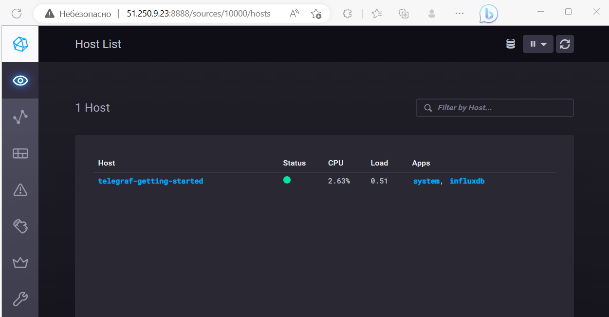

# Домашнее задание по теме: "Системы мониторинга"

## Обязательные задания

1. Вас пригласили настроить мониторинг на проект. На онбординге вам рассказали, что проект представляет из себя 
платформу для вычислений с выдачей текстовых отчетов, которые сохраняются на диск. Взаимодействие с платформой 
осуществляется по протоколу http. Также вам отметили, что вычисления загружают ЦПУ. Какой минимальный набор метрик вы
выведите в мониторинг и почему?

    #### Ответ
    
    * Метрики нагрузки на CPU (load average)
    * Метрики по оперативной памяти/swap-разделу (свободная, занятая)
    * Метрики дискового пространства (FS), дисковые операции (IOPS) + метрики по индексных дескрипторов (inodes)
    * Метрика количества HTTP-запросов с разделением по HTTP-кодам (2xx/3xx/4xx/5xx).

#
2. Менеджер продукта посмотрев на ваши метрики сказал, что ему непонятно что такое RAM/inodes/CPUla. Также он сказал, 
что хочет понимать, насколько мы выполняем свои обязанности перед клиентами и какое качество обслуживания. Что вы 
можете ему предложить?

    #### Ответ
    
    Это технические метрики, как минимум я бы постарался вкратце объяснить, что это такое, т.к. менеджер который занимается сопровождением IT-продукта, хотя бы на базовом уровне должен разбираться в терминах и определениях IT-инфраструктуры.
    
    Но фактически менеджеру гораздо важнее бизнес метрики, такие как: скорость формирования отчетов, ошибки при их формировании, время доступности системы и т.д.
    Для их определения необходимо сформировать SLO/SLA/SLI.

#
3. Вашей DevOps команде в этом году не выделили финансирование на построение системы сбора логов. Разработчики в свою 
очередь хотят видеть все ошибки, которые выдают их приложения. Какое решение вы можете предпринять в этой ситуации, 
чтобы разработчики получали ошибки приложения?

    #### Ответ

    Предложил бы использовать перехватчик ошибок (Sentry).

#
4. Вы, как опытный SRE, сделали мониторинг, куда вывели отображения выполнения SLA=99% по http кодам ответов. 
Вычисляете этот параметр по следующей формуле: summ_2xx_requests/summ_all_requests. Данный параметр не поднимается выше 
70%, но при этом в вашей системе нет кодов ответа 5xx и 4xx. Где у вас ошибка?

    #### Ответ

     Для верного вычисления данной метрики необходимо дополнительно учитывать 3xx HTTP-коды. Проверить их.
     Формулу изменить на `summ_2xx_requests+summ_3xx_requests/summ_all_requests`.

#
5. Опишите основные плюсы и минусы pull и push систем мониторинга.

    #### Ответ

    Плюсы Push модели:
    * низкая нагрузка на сервер мониторинга (т.к. ему не приходится опрашивать источники)
    * использование нескольких эндпоинтов для отправки метрик (упрощение репликации)
    * гибкая настройка каждого источника (таймауты, частота отправки)
    * использования UDP протокола (снижение нагрузки на сеть)

    Минусы Push модели:
    * при использовании UDP нет гарантии доставки метрик до сервера мониторинга
    * требуется настройка каждого источника

    Плюсы Pull модели:
    * централизованное управление
    * использование proxy с TLS
    * упрощенная отладка

    Минусы Pull модели:
    * более высокие конфигурационные требования к серверу мониторинга
    * повышенная нагрузка на сеть

#
6. Какие из ниже перечисленных систем относятся к push модели, а какие к pull? А может есть гибридные?

    - Prometheus 
    - TICK
    - Zabbix
    - VictoriaMetrics
    - Nagios

    #### Ответ

    Pull: `Prometheus`, `VictoriaMetrics`, `Nagios`

    Push: `TICK`

    Гибридные: `Zabbix`

#
7. Склонируйте себе [репозиторий](https://github.com/influxdata/sandbox/tree/master) и запустите TICK-стэк, 
используя технологии docker и docker-compose.

    В виде решения на это упражнение приведите скриншот веб-интерфейса ПО chronograf (`http://localhost:8888`). 

    P.S.: если при запуске некоторые контейнеры будут падать с ошибкой - проставьте им режим `Z`, например `./data:/var/lib:Z`


    #### Результат

    

#
8. Перейдите в веб-интерфейс Chronograf (`http://localhost:8888`) и откройте вкладку `Data explorer`.

    - Нажмите на кнопку `Add a query`
    - Изучите вывод интерфейса и выберите БД `telegraf.autogen`
    - В `measurments` выберите mem->host->telegraf_container_id , а в `fields` выберите used_percent. 
    Внизу появится график утилизации оперативной памяти в контейнере telegraf.
    - Вверху вы можете увидеть запрос, аналогичный SQL-синтаксису. 
    Поэкспериментируйте с запросом, попробуйте изменить группировку и интервал наблюдений.

    Для выполнения задания приведите скриншот с отображением метрик утилизации места на диске 
    (disk->host->telegraf_container_id) из веб-интерфейса.

    #### Результат

    В файл `telegraf.conf` добавил `[[inputs.mem]]` и `[[inputs.disk]]`

    

#
9. Изучите список [telegraf inputs](https://github.com/influxdata/telegraf/tree/master/plugins/inputs). 
Добавьте в конфигурацию telegraf следующий плагин - [docker](https://github.com/influxdata/telegraf/tree/master/plugins/inputs/docker):
    ```
    [[inputs.docker]]
      endpoint = "unix:///var/run/docker.sock"
    ```
    
    Дополнительно вам может потребоваться донастройка контейнера telegraf в `docker-compose.yml` дополнительного volume и 
    режима privileged:
    ```
      telegraf:
        image: telegraf:1.4.0
        privileged: true
        volumes:
          - ./etc/telegraf.conf:/etc/telegraf/telegraf.conf:Z
          - /var/run/docker.sock:/var/run/docker.sock:Z
        links:
          - influxdb
        ports:
          - "8092:8092/udp"
          - "8094:8094"
          - "8125:8125/udp"
    ```
    
    После настройке перезапустите telegraf, обновите веб интерфейс и приведите скриншотом список `measurments` в 
    веб-интерфейсе базы telegraf.autogen . Там должны появиться метрики, связанные с docker.
    
    Факультативно можете изучить какие метрики собирает telegraf после выполнения данного задания.


    #### Результат

    Конфигурация для docker была активированна в стандартной поставке :)

    

## Дополнительное задание (со звездочкой*) - необязательно к выполнению

1. Вы устроились на работу в стартап. На данный момент у вас нет возможности развернуть полноценную систему 
мониторинга, и вы решили самостоятельно написать простой python3-скрипт для сбора основных метрик сервера. Вы, как 
опытный системный-администратор, знаете, что системная информация сервера лежит в директории `/proc`. 
Также, вы знаете, что в системе Linux есть  планировщик задач cron, который может запускать задачи по расписанию.

    Суммировав все, вы спроектировали приложение, которое:
    - является python3 скриптом
    - собирает метрики из папки `/proc`
    - складывает метрики в файл 'YY-MM-DD-awesome-monitoring.log' в директорию /var/log 
    (YY - год, MM - месяц, DD - день)
    - каждый сбор метрик складывается в виде json-строки, в виде:
      + timestamp (временная метка, int, unixtimestamp)
      + metric_1 (метрика 1)
      + metric_2 (метрика 2)
      
         ...
         
      + metric_N (метрика N)
      
    - сбор метрик происходит каждую 1 минуту по cron-расписанию
    
    Для успешного выполнения задания нужно привести:
    
    а) работающий код python3-скрипта,
    
    б) конфигурацию cron-расписания,
    
    в) пример верно сформированного 'YY-MM-DD-awesome-monitoring.log', имеющий не менее 5 записей,
    
    P.S.: количество собираемых метрик должно быть не менее 4-х.
    P.P.S.: по желанию можно себя не ограничивать только сбором метрик из `/proc`.

    #### Результат

    Скрипт: [monitor.py](./monitor.py)

    Скрипт сохраняет данные по `load average`, `ram`, `disk`, `netowrk`

    CRON:
    ```bash
    * * * * * /usr/bin/python3 /opt/monitor.py
    ```

    Полученные json'ы (файл `23-04-12-awesome-monitoring.log`):
    ```json
    {"timestamp": 1681309801, "loadavg": {"1": 0.0, "5": 0.0, "15": 0.0}, "ram": {"total": 4016644, "free": 3261748, "available": 3539104, "buffers": 25648, "cached": 450920, "swap_total": 0, "swap_free": 0}, "disk": {"vda": {"reads": 8848, "writes": 3389, "read_sectors": 788670, "write_sectors": 126178}, "vda1": {"reads": 221, "writes": 0, "read_sectors": 1768, "write_sectors": 0}, "vda2": {"reads": 8523, "writes": 3389, "read_sectors": 783142, "write_sectors": 126178}}, "network": {"eth0": {"rx_bytes": 552937, "rx_packets": 7094, "rx_errors": 0, "rx_dropped": 0, "tx_bytes": 9110120, "tx_packets": 8551, "tx_errors": 0, "tx_dropped": 0}, "docker0": {"rx_bytes": 0, "rx_packets": 0, "rx_errors": 0, "rx_dropped": 0, "tx_bytes": 0, "tx_packets": 0, "tx_errors": 0, "tx_dropped": 0}, "br-195082f14e6a": {"rx_bytes": 0, "rx_packets": 0, "rx_errors": 0, "rx_dropped": 0, "tx_bytes": 0, "tx_packets": 0, "tx_errors": 0, "tx_dropped": 0}}}
    {"timestamp": 1681309861, "loadavg": {"1": 0.0, "5": 0.0, "15": 0.0}, "ram": {"total": 4016644, "free": 3260740, "available": 3538244, "buffers": 25664, "cached": 451052, "swap_total": 0, "swap_free": 0}, "disk": {"vda": {"reads": 8848, "writes": 3450, "read_sectors": 788670, "write_sectors": 126866}, "vda1": {"reads": 221, "writes": 0, "read_sectors": 1768, "write_sectors": 0}, "vda2": {"reads": 8523, "writes": 3450, "read_sectors": 783142, "write_sectors": 126866}}, "network": {"eth0": {"rx_bytes": 553795, "rx_packets": 7110, "rx_errors": 0, "rx_dropped": 0, "tx_bytes": 9110846, "tx_packets": 8566, "tx_errors": 0, "tx_dropped": 0}, "docker0": {"rx_bytes": 0, "rx_packets": 0, "rx_errors": 0, "rx_dropped": 0, "tx_bytes": 0, "tx_packets": 0, "tx_errors": 0, "tx_dropped": 0}, "br-195082f14e6a": {"rx_bytes": 0, "rx_packets": 0, "rx_errors": 0, "rx_dropped": 0, "tx_bytes": 0, "tx_packets": 0, "tx_errors": 0, "tx_dropped": 0}}}
    {"timestamp": 1681309921, "loadavg": {"1": 0.0, "5": 0.0, "15": 0.0}, "ram": {"total": 4016644, "free": 3260740, "available": 3538264, "buffers": 25680, "cached": 451052, "swap_total": 0, "swap_free": 0}, "disk": {"vda": {"reads": 8848, "writes": 3503, "read_sectors": 788670, "write_sectors": 127434}, "vda1": {"reads": 221, "writes": 0, "read_sectors": 1768, "write_sectors": 0}, "vda2": {"reads": 8523, "writes": 3503, "read_sectors": 783142, "write_sectors": 127434}}, "network": {"eth0": {"rx_bytes": 554883, "rx_packets": 7130, "rx_errors": 0, "rx_dropped": 0, "tx_bytes": 9111734, "tx_packets": 8584, "tx_errors": 0, "tx_dropped": 0}, "docker0": {"rx_bytes": 0, "rx_packets": 0, "rx_errors": 0, "rx_dropped": 0, "tx_bytes": 0, "tx_packets": 0, "tx_errors": 0, "tx_dropped": 0}, "br-195082f14e6a": {"rx_bytes": 0, "rx_packets": 0, "rx_errors": 0, "rx_dropped": 0, "tx_bytes": 0, "tx_packets": 0, "tx_errors": 0, "tx_dropped": 0}}}
    {"timestamp": 1681309981, "loadavg": {"1": 0.0, "5": 0.0, "15": 0.0}, "ram": {"total": 4016644, "free": 3260740, "available": 3538272, "buffers": 25688, "cached": 451052, "swap_total": 0, "swap_free": 0}, "disk": {"vda": {"reads": 8848, "writes": 3550, "read_sectors": 788670, "write_sectors": 127938}, "vda1": {"reads": 221, "writes": 0, "read_sectors": 1768, "write_sectors": 0}, "vda2": {"reads": 8523, "writes": 3550, "read_sectors": 783142, "write_sectors": 127938}}, "network": {"eth0": {"rx_bytes": 555835, "rx_packets": 7148, "rx_errors": 0, "rx_dropped": 0, "tx_bytes": 9112460, "tx_packets": 8599, "tx_errors": 0, "tx_dropped": 0}, "docker0": {"rx_bytes": 0, "rx_packets": 0, "rx_errors": 0, "rx_dropped": 0, "tx_bytes": 0, "tx_packets": 0, "tx_errors": 0, "tx_dropped": 0}, "br-195082f14e6a": {"rx_bytes": 0, "rx_packets": 0, "rx_errors": 0, "rx_dropped": 0, "tx_bytes": 0, "tx_packets": 0, "tx_errors": 0, "tx_dropped": 0}}}
    {"timestamp": 1681310041, "loadavg": {"1": 0.0, "5": 0.0, "15": 0.0}, "ram": {"total": 4016644, "free": 3260740, "available": 3538300, "buffers": 25712, "cached": 451056, "swap_total": 0, "swap_free": 0}, "disk": {"vda": {"reads": 8848, "writes": 3604, "read_sectors": 788670, "write_sectors": 128530}, "vda1": {"reads": 221, "writes": 0, "read_sectors": 1768, "write_sectors": 0}, "vda2": {"reads": 8523, "writes": 3604, "read_sectors": 783142, "write_sectors": 128530}}, "network": {"eth0": {"rx_bytes": 557542, "rx_packets": 7170, "rx_errors": 0, "rx_dropped": 0, "tx_bytes": 9113993, "tx_packets": 8619, "tx_errors": 0, "tx_dropped": 0}, "docker0": {"rx_bytes": 0, "rx_packets": 0, "rx_errors": 0, "rx_dropped": 0, "tx_bytes": 0, "tx_packets": 0, "tx_errors": 0, "tx_dropped": 0}, "br-195082f14e6a": {"rx_bytes": 0, "rx_packets": 0, "rx_errors": 0, "rx_dropped": 0, "tx_bytes": 0, "tx_packets": 0, "tx_errors": 0, "tx_dropped": 0}}}
    ```

2. В веб-интерфейсе откройте вкладку `Dashboards`. Попробуйте создать свой dashboard с отображением:

    - утилизации ЦПУ
    - количества использованного RAM
    - утилизации пространства на дисках
    - количество поднятых контейнеров
    - аптайм
    - ...
    - фантазируйте)

    #### Результат

    