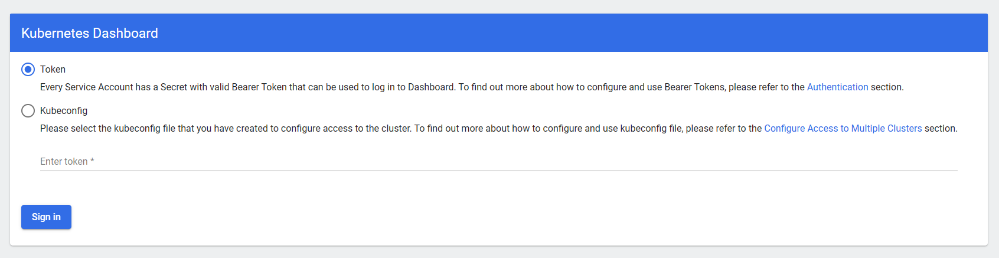
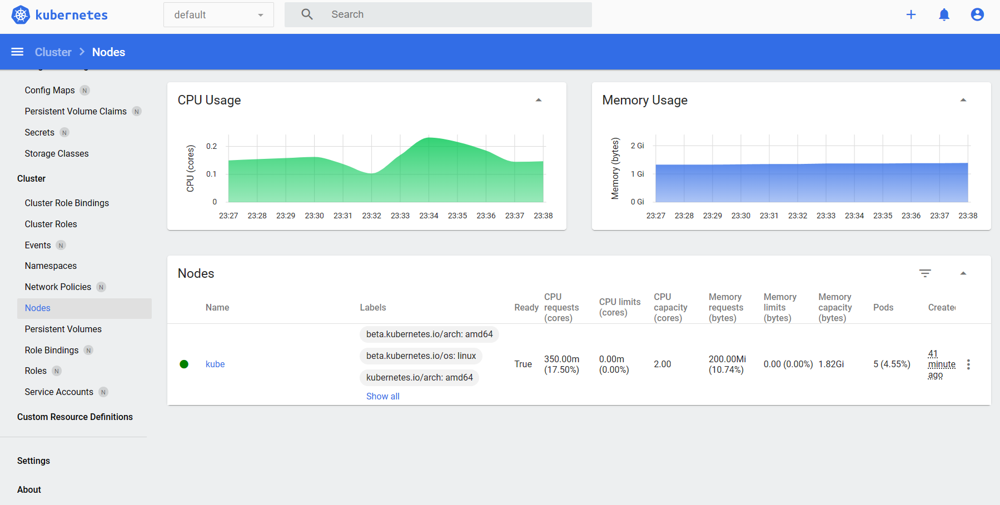

# Домашнее задание по теме: «Kubernetes. Причины появления. Команда kubectl»

## Цель задания

Для экспериментов и валидации ваших решений вам нужно подготовить тестовую среду для работы с Kubernetes. Оптимальное решение — развернуть на рабочей машине или на отдельной виртуальной машине MicroK8S.

## Задание 1. Установка MicroK8S

1. Установить MicroK8S на локальную машину или на удалённую виртуальную машину.
2. Установить dashboard.
3. Сгенерировать сертификат для подключения к внешнему ip-адресу.

## Результат

1. Установка MicroK8S
```bash
root@kube:~# snap install microk8s --classic
microk8s (1.28/stable) v1.28.3 from Canonical✓ installed

root@kube:~# microk8s status
microk8s is running
high-availability: no
  datastore master nodes: 127.0.0.1:19001
  datastore standby nodes: none
```

2. Установка Dashboard
```bash
root@kube:~# microk8s enable dashboard
Infer repository core for addon dashboard
Enabling Kubernetes Dashboard
Infer repository core for addon metrics-server
Enabling Metrics-Server
serviceaccount/metrics-server created
clusterrole.rbac.authorization.k8s.io/system:aggregated-metrics-reader created
clusterrole.rbac.authorization.k8s.io/system:metrics-server created
rolebinding.rbac.authorization.k8s.io/metrics-server-auth-reader created
clusterrolebinding.rbac.authorization.k8s.io/metrics-server:system:auth-delegator created
clusterrolebinding.rbac.authorization.k8s.io/system:metrics-server created
service/metrics-server created
deployment.apps/metrics-server created
apiservice.apiregistration.k8s.io/v1beta1.metrics.k8s.io created
clusterrolebinding.rbac.authorization.k8s.io/microk8s-admin created
Metrics-Server is enabled
Applying manifest
serviceaccount/kubernetes-dashboard created
service/kubernetes-dashboard created
secret/kubernetes-dashboard-certs created
secret/kubernetes-dashboard-csrf created
secret/kubernetes-dashboard-key-holder created
configmap/kubernetes-dashboard-settings created
role.rbac.authorization.k8s.io/kubernetes-dashboard created
clusterrole.rbac.authorization.k8s.io/kubernetes-dashboard created
rolebinding.rbac.authorization.k8s.io/kubernetes-dashboard created
clusterrolebinding.rbac.authorization.k8s.io/kubernetes-dashboard created
deployment.apps/kubernetes-dashboard created
service/dashboard-metrics-scraper created
deployment.apps/dashboard-metrics-scraper created
secret/microk8s-dashboard-token created

If RBAC is not enabled access the dashboard using the token retrieved with:

microk8s kubectl describe secret -n kube-system microk8s-dashboard-token

Use this token in the https login UI of the kubernetes-dashboard service.

In an RBAC enabled setup (microk8s enable RBAC) you need to create a user with restricted
permissions as shown in:
https://github.com/kubernetes/dashboard/blob/master/docs/user/access-control/creating-sample-user.md
```

3. Добавление внешнего адреса в template и генерация сертификата
```bash
# Добавляем свой адрес в шаблон /var/snap/microk8s/current/certs/csr.conf.template.

# Получаем конфигурацию
root@kube:~# microk8s config
apiVersion: v1
clusters:
- cluster:
    certificate-authority-data: LS0tLS1C[REDACTED]
    server: https://10.26.51.2:16443
  name: microk8s-cluster
contexts:
- context:
    cluster: microk8s-cluster
    user: admin
  name: microk8s
current-context: microk8s
kind: Config
preferences: {}
users:
- name: admin
  user:
    client-certificate-data: LS0tLS1C[REDACTED]
    client-key-data: LS0tLS1C[REDACTED]
```


## Задание 2. Установка и настройка локального kubectl
1. Установить на локальную машину kubectl.
2. Настроить локально подключение к кластеру.
3. Подключиться к дашборду с помощью port-forward.

## Результат

1. Установка kubectl
```bash
user@local:~/.kube$ sudo snap install kubectl --classic
kubectl 1.28.5 from Canonical✓ installed

user@local:~/.kube$ kubectl version
Client Version: v1.28.5
Kustomize Version: v5.0.4-0.20230601165947-6ce0bf390ce3
```

2. Настройка подключения к кластеру
```bash
# Добавляем в файл ~/.kube/config
# конфигурацию полученную на предыдущем этапе
# заменяя адрес в внешний адрес хоста. В нашем случае server: https://51.250.68.25:16443
``` 

3. Включение port-forward и подключение к dashboard
```bash
# пробрасываем порт
user@local:~/.kube$ kubectl port-forward -n kube-system service/kubernetes-dashboard 10443:443
Forwarding from 127.0.0.1:10443 -> 8443
Forwarding from [::1]:10443 -> 8443

# генерируем токен 
user@local:~/.kube$ kubectl create token default
```



