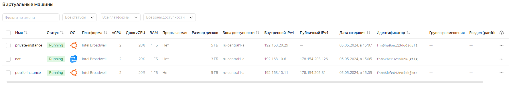

# Домашнее задание по теме: «Организация сети»

## Задание 1. Yandex Cloud 

1. Создать пустую VPC. Выбрать зону.
2. Публичная подсеть.
 - Создать в VPC subnet с названием public, сетью 192.168.10.0/24.
 - Создать в этой подсети NAT-инстанс, присвоив ему адрес 192.168.10.254. В качестве image_id использовать fd80mrhj8fl2oe87o4e1.
 - Создать в этой публичной подсети виртуалку с публичным IP, подключиться к ней и убедиться, что есть доступ к интернету.
3. Приватная подсеть.
 - Создать в VPC subnet с названием private, сетью 192.168.20.0/24.
 - Создать route table. Добавить статический маршрут, направляющий весь исходящий трафик private сети в NAT-инстанс.
 - Создать в этой приватной подсети виртуалку с внутренним IP, подключиться к ней через виртуалку, созданную ранее, и убедиться, что есть доступ к интернету.

## Результат

* [Terraform-манифесты](./terraform/main.tf)

* <details>
    <summary>Лог terraform</summary>
  
    ```bash
    /terraform(main)]> terraform apply
    data.yandex_compute_image.image: Reading...
    data.yandex_compute_image.image: Read complete after 1s [id=fd8cnj92ad0th7m7krqh]
    
    Terraform used the selected providers to generate the following execution plan. Resource actions are indicated with the following symbols:
      + create
    
    Terraform will perform the following actions:
    
      # yandex_compute_instance.nat will be created
      + resource "yandex_compute_instance" "nat" {
          + created_at                = (known after apply)
          + folder_id                 = (known after apply)
          + fqdn                      = (known after apply)
          + gpu_cluster_id            = (known after apply)
          + hostname                  = (known after apply)
          + id                        = (known after apply)
          + maintenance_grace_period  = (known after apply)
          + maintenance_policy        = (known after apply)
          + metadata                  = {
              + "ssh-keys" = <<-EOT
                    ubuntu:ssh-rsa AAAAB3NzaC1yc2EAAAADAQABAAABgQCQLO9Yo1Ws0JB1YWrUXaLNHfw69BNtZY/fGsC7klI3gAYqVyFr26JRa78d7h23YL/a3JcKRhiWdu0oo  +qj6aFRNsRvhCYa18NzFp04Q8zaEqvkaALpTTLMWWhlofNu1csA5brGjwERJkWuuaCxg0fTxhhXmOV1Pv8XF5gegFOrYpw7ZVtXGpdrlGMDbayI2CP78nfwQHgjrFRGrwO899xkBfQMfELO7cTiRuZ3Om58od9VXAirxz  nr3ZslZ27uSlSHI2B2MIeOryMMbHgZ7eidQAJC876GDu9gXPKYrH627p7x101DoBOBsL5V1aAqCUBS9nOff3JVFVKywx3MSGSBLL/7DSrTBC9LIK5PTzPM8PQ936DVPsaTJWSm  +8ET1tDJnxsnEkO1up6peBMVuRDVJcPB0kG0oGIH7a2k+6FkmLlxxo2w7H5myoP/n4WGZxAmQtzAXumENlpASukYmVABZjPpo/0yJRII/wueSxrogmXfdJ4Qpd1Nm3Op+7lkBbE= manokhin@elseya
                EOT
            }
          + name                      = "nat"
          + network_acceleration_type = "standard"
          + platform_id               = "standard-v1"
          + service_account_id        = (known after apply)
          + status                    = (known after apply)
          + zone                      = "ru-central1-a"
    
          + boot_disk {
              + auto_delete = true
              + device_name = (known after apply)
              + disk_id     = (known after apply)
              + mode        = (known after apply)
    
              + initialize_params {
                  + block_size  = (known after apply)
                  + description = (known after apply)
                  + image_id    = "fd80mrhj8fl2oe87o4e1"
                  + name        = (known after apply)
                  + size        = (known after apply)
                  + snapshot_id = (known after apply)
                  + type        = "network-hdd"
                }
            }
    
          + network_interface {
              + index              = (known after apply)
              + ip_address         = (known after apply)
              + ipv4               = true
              + ipv6               = (known after apply)
              + ipv6_address       = (known after apply)
              + mac_address        = (known after apply)
              + nat                = true
              + nat_ip_address     = (known after apply)
              + nat_ip_version     = (known after apply)
              + security_group_ids = (known after apply)
              + subnet_id          = (known after apply)
            }
    
          + resources {
              + core_fraction = 20
              + cores         = 2
              + memory        = 1
            }
        }
    
      # yandex_compute_instance.private_instance will be created
      + resource "yandex_compute_instance" "private_instance" {
          + created_at                = (known after apply)
          + folder_id                 = (known after apply)
          + fqdn                      = (known after apply)
          + gpu_cluster_id            = (known after apply)
          + hostname                  = (known after apply)
          + id                        = (known after apply)
          + maintenance_grace_period  = (known after apply)
          + maintenance_policy        = (known after apply)
          + metadata                  = {
              + "ssh-keys" = <<-EOT
                    ubuntu:ssh-rsa AAAAB3NzaC1yc2EAAAADAQABAAABgQCQLO9Yo1Ws0JB1YWrUXaLNHfw69BNtZY/fGsC7klI3gAYqVyFr26JRa78d7h23YL/a3JcKRhiWdu0oo  +qj6aFRNsRvhCYa18NzFp04Q8zaEqvkaALpTTLMWWhlofNu1csA5brGjwERJkWuuaCxg0fTxhhXmOV1Pv8XF5gegFOrYpw7ZVtXGpdrlGMDbayI2CP78nfwQHgjrFRGrwO899xkBfQMfELO7cTiRuZ3Om58od9VXAirxz  nr3ZslZ27uSlSHI2B2MIeOryMMbHgZ7eidQAJC876GDu9gXPKYrH627p7x101DoBOBsL5V1aAqCUBS9nOff3JVFVKywx3MSGSBLL/7DSrTBC9LIK5PTzPM8PQ936DVPsaTJWSm  +8ET1tDJnxsnEkO1up6peBMVuRDVJcPB0kG0oGIH7a2k+6FkmLlxxo2w7H5myoP/n4WGZxAmQtzAXumENlpASukYmVABZjPpo/0yJRII/wueSxrogmXfdJ4Qpd1Nm3Op+7lkBbE= manokhin@elseya
                EOT
            }
          + name                      = "private-instance"
          + network_acceleration_type = "standard"
          + platform_id               = "standard-v1"
          + service_account_id        = (known after apply)
          + status                    = (known after apply)
          + zone                      = "ru-central1-a"
    
          + boot_disk {
              + auto_delete = true
              + device_name = (known after apply)
              + disk_id     = (known after apply)
              + mode        = (known after apply)
    
              + initialize_params {
                  + block_size  = (known after apply)
                  + description = (known after apply)
                  + image_id    = "fd8cnj92ad0th7m7krqh"
                  + name        = (known after apply)
                  + size        = (known after apply)
                  + snapshot_id = (known after apply)
                  + type        = "network-hdd"
                }
            }
    
          + network_interface {
              + index              = (known after apply)
              + ip_address         = (known after apply)
              + ipv4               = true
              + ipv6               = (known after apply)
              + ipv6_address       = (known after apply)
              + mac_address        = (known after apply)
              + nat                = false
              + nat_ip_address     = (known after apply)
              + nat_ip_version     = (known after apply)
              + security_group_ids = (known after apply)
              + subnet_id          = (known after apply)
            }
    
          + resources {
              + core_fraction = 20
              + cores         = 2
              + memory        = 1
            }
        }
    
      # yandex_compute_instance.public_instance will be created
      + resource "yandex_compute_instance" "public_instance" {
          + created_at                = (known after apply)
          + folder_id                 = (known after apply)
          + fqdn                      = (known after apply)
          + gpu_cluster_id            = (known after apply)
          + hostname                  = (known after apply)
          + id                        = (known after apply)
          + maintenance_grace_period  = (known after apply)
          + maintenance_policy        = (known after apply)
          + metadata                  = {
              + "ssh-keys" = <<-EOT
                    ubuntu:ssh-rsa AAAAB3NzaC1yc2EAAAADAQABAAABgQCQLO9Yo1Ws0JB1YWrUXaLNHfw69BNtZY/fGsC7klI3gAYqVyFr26JRa78d7h23YL/a3JcKRhiWdu0oo  +qj6aFRNsRvhCYa18NzFp04Q8zaEqvkaALpTTLMWWhlofNu1csA5brGjwERJkWuuaCxg0fTxhhXmOV1Pv8XF5gegFOrYpw7ZVtXGpdrlGMDbayI2CP78nfwQHgjrFRGrwO899xkBfQMfELO7cTiRuZ3Om58od9VXAirxz  nr3ZslZ27uSlSHI2B2MIeOryMMbHgZ7eidQAJC876GDu9gXPKYrH627p7x101DoBOBsL5V1aAqCUBS9nOff3JVFVKywx3MSGSBLL/7DSrTBC9LIK5PTzPM8PQ936DVPsaTJWSm  +8ET1tDJnxsnEkO1up6peBMVuRDVJcPB0kG0oGIH7a2k+6FkmLlxxo2w7H5myoP/n4WGZxAmQtzAXumENlpASukYmVABZjPpo/0yJRII/wueSxrogmXfdJ4Qpd1Nm3Op+7lkBbE= manokhin@elseya
                EOT
            }
          + name                      = "public-instance"
          + network_acceleration_type = "standard"
          + platform_id               = "standard-v1"
          + service_account_id        = (known after apply)
          + status                    = (known after apply)
          + zone                      = "ru-central1-a"
    
          + boot_disk {
              + auto_delete = true
              + device_name = (known after apply)
              + disk_id     = (known after apply)
              + mode        = (known after apply)
    
              + initialize_params {
                  + block_size  = (known after apply)
                  + description = (known after apply)
                  + image_id    = "fd8cnj92ad0th7m7krqh"
                  + name        = (known after apply)
                  + size        = (known after apply)
                  + snapshot_id = (known after apply)
                  + type        = "network-hdd"
                }
            }
    
          + network_interface {
              + index              = (known after apply)
              + ip_address         = (known after apply)
              + ipv4               = true
              + ipv6               = (known after apply)
              + ipv6_address       = (known after apply)
              + mac_address        = (known after apply)
              + nat                = true
              + nat_ip_address     = (known after apply)
              + nat_ip_version     = (known after apply)
              + security_group_ids = (known after apply)
              + subnet_id          = (known after apply)
            }
    
          + resources {
              + core_fraction = 20
              + cores         = 2
              + memory        = 1
            }
        }
    
      # yandex_vpc_network.network will be created
      + resource "yandex_vpc_network" "network" {
          + created_at                = (known after apply)
          + default_security_group_id = (known after apply)
          + folder_id                 = (known after apply)
          + id                        = (known after apply)
          + labels                    = (known after apply)
          + name                      = "netology"
          + subnet_ids                = (known after apply)
        }
    
      # yandex_vpc_route_table.private_route_table will be created
      + resource "yandex_vpc_route_table" "private_route_table" {
          + created_at = (known after apply)
          + folder_id  = (known after apply)
          + id         = (known after apply)
          + labels     = (known after apply)
          + name       = "private"
          + network_id = (known after apply)
    
          + static_route {
              + destination_prefix = "0.0.0.0/0"
              + next_hop_address   = (known after apply)
                # (1 unchanged attribute hidden)
            }
        }
    
      # yandex_vpc_subnet.private_subnet will be created
      + resource "yandex_vpc_subnet" "private_subnet" {
          + created_at     = (known after apply)
          + folder_id      = (known after apply)
          + id             = (known after apply)
          + labels         = (known after apply)
          + name           = "private"
          + network_id     = (known after apply)
          + route_table_id = (known after apply)
          + v4_cidr_blocks = [
              + "192.168.20.0/24",
            ]
          + v6_cidr_blocks = (known after apply)
          + zone           = "ru-central1-a"
        }
    
      # yandex_vpc_subnet.public_subnet will be created
      + resource "yandex_vpc_subnet" "public_subnet" {
          + created_at     = (known after apply)
          + folder_id      = (known after apply)
          + id             = (known after apply)
          + labels         = (known after apply)
          + name           = "public"
          + network_id     = (known after apply)
          + v4_cidr_blocks = [
              + "192.168.10.0/24",
            ]
          + v6_cidr_blocks = (known after apply)
          + zone           = "ru-central1-a"
        }
    
    Plan: 7 to add, 0 to change, 0 to destroy.
    
    Do you want to perform these actions?
      Terraform will perform the actions described above.
      Only 'yes' will be accepted to approve.
    
      Enter a value: yes
    
    yandex_vpc_network.network: Creating...
    yandex_vpc_network.network: Creation complete after 2s [id=enpip6taf8mm09390ipm]
    yandex_vpc_subnet.public_subnet: Creating...
    yandex_vpc_subnet.public_subnet: Creation complete after 1s [id=e9b3rn74t5a78h4n7s2j]
    yandex_compute_instance.public_instance: Creating...
    yandex_compute_instance.nat: Creating...
    yandex_compute_instance.public_instance: Still creating... [10s elapsed]
    yandex_compute_instance.nat: Still creating... [10s elapsed]
    yandex_compute_instance.nat: Still creating... [20s elapsed]
    yandex_compute_instance.public_instance: Still creating... [20s elapsed]
    yandex_compute_instance.public_instance: Still creating... [30s elapsed]
    yandex_compute_instance.nat: Still creating... [30s elapsed]
    yandex_compute_instance.public_instance: Still creating... [40s elapsed]
    yandex_compute_instance.nat: Still creating... [40s elapsed]
    yandex_compute_instance.nat: Still creating... [50s elapsed]
    yandex_compute_instance.public_instance: Still creating... [50s elapsed]
    yandex_compute_instance.public_instance: Creation complete after 58s [id=fhmo8kfe642roisbjbmc]
    yandex_compute_instance.nat: Still creating... [1m0s elapsed]
    yandex_compute_instance.nat: Still creating... [1m10s elapsed]
    yandex_compute_instance.nat: Still creating... [1m20s elapsed]
    yandex_compute_instance.nat: Creation complete after 1m24s [id=fhmnrhee3c1vkrk6gflg]
    yandex_vpc_route_table.private_route_table: Creating...
    yandex_vpc_route_table.private_route_table: Creation complete after 1s [id=enpoe774cdc9t8ggpee6]
    yandex_vpc_subnet.private_subnet: Creating...
    yandex_vpc_subnet.private_subnet: Creation complete after 1s [id=e9btmd2e4lv0uq0911uk]
    yandex_compute_instance.private_instance: Creating...
    yandex_compute_instance.private_instance: Still creating... [10s elapsed]
    yandex_compute_instance.private_instance: Still creating... [20s elapsed]
    yandex_compute_instance.private_instance: Creation complete after 27s [id=fhm6hu8oni13do6idgf1]
    
    Apply complete! Resources: 7 added, 0 changed, 0 destroyed.
    ```
  </details>

* Созданные виртуальные машины:


* Подключение к ВМ находящейся в публичной сети и проверка доступности интернет ресурса:
  ```bash
  [manokhin@elseya:.../terraform(main)]> ssh ubuntu@178.154.205.81 -i ~/.ssh/id_rsa_yc 
  Welcome to Ubuntu 20.04.6 LTS (GNU/Linux 5.4.0-177-generic x86_64)
  
   * Documentation:  https://help.ubuntu.com
   * Management:     https://landscape.canonical.com
   * Support:        https://ubuntu.com/pro
  
  The programs included with the Ubuntu system are free software;
  the exact distribution terms for each program are described in the
  individual files in /usr/share/doc/*/copyright.
  
  Ubuntu comes with ABSOLUTELY NO WARRANTY, to the extent permitted by
  applicable law.
  
  To run a command as administrator (user "root"), use "sudo <command>".
  See "man sudo_root" for details.
  
  ubuntu@fhmo8kfe642roisbjbmc:~$ ping example.com -c 1
  PING example.com (93.184.215.14) 56(84) bytes of data.
  64 bytes from 93.184.215.14 (93.184.215.14): icmp_seq=1 ttl=51 time=109 ms
  
  --- example.com ping statistics ---
  1 packets transmitted, 1 received, 0% packet loss, time 0ms
  rtt min/avg/max/mdev = 108.922/108.922/108.922/0.000 ms
  ```

* Подключение к ВМ находящейся в приватной сети и проверка доступности интернет ресурса:
  ```bash
  ubuntu@fhmo8kfe642roisbjbmc:~$ nano .ssh/id_rsa
  ubuntu@fhmo8kfe642roisbjbmc:~$ chmod 0400 .ssh/id_rsa 
  ubuntu@fhmo8kfe642roisbjbmc:~$ ssh 192.168.20.29
  The authenticity of host '192.168.20.29 (192.168.20.29)' can't be established.
  ECDSA key fingerprint is SHA256:v4h13p/Z98wBvDhP/8kFtUQDuVLIUCwsVIDGw2d0uIc.
  Are you sure you want to continue connecting (yes/no/[fingerprint])? yes
  Warning: Permanently added '192.168.20.29' (ECDSA) to the list of known hosts.
  Welcome to Ubuntu 20.04.6 LTS (GNU/Linux 5.4.0-177-generic x86_64)
  
   * Documentation:  https://help.ubuntu.com
   * Management:     https://landscape.canonical.com
   * Support:        https://ubuntu.com/pro
  
  The programs included with the Ubuntu system are free software;
  the exact distribution terms for each program are described in the
  individual files in /usr/share/doc/*/copyright.
  
  Ubuntu comes with ABSOLUTELY NO WARRANTY, to the extent permitted by
  applicable law.
  
  To run a command as administrator (user "root"), use "sudo <command>".
  See "man sudo_root" for details.
  
  ubuntu@fhm6hu8oni13do6idgf1:~$ ping example.com -c 1
  PING example.com (93.184.215.14) 56(84) bytes of data.
  64 bytes from 93.184.215.14 (93.184.215.14): icmp_seq=1 ttl=47 time=110 ms
  
  --- example.com ping statistics ---
  1 packets transmitted, 1 received, 0% packet loss, time 0ms
  rtt min/avg/max/mdev = 110.044/110.044/110.044/0.000 ms
  ```
