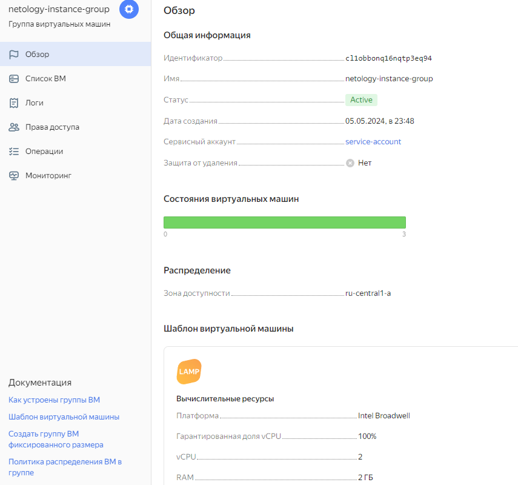
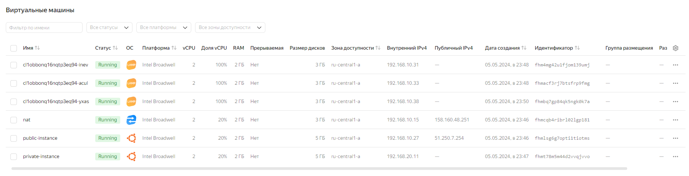
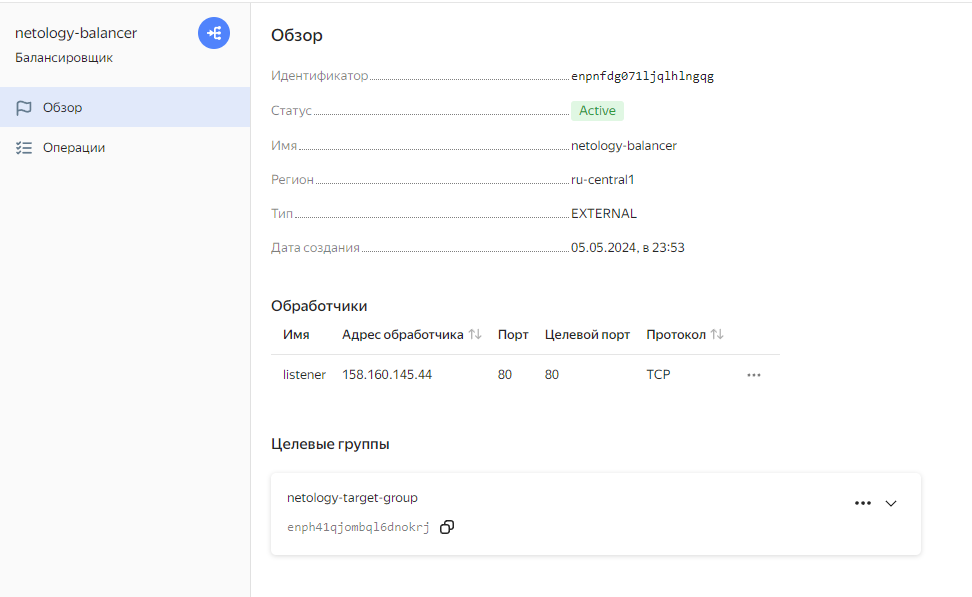

# Домашнее задание по теме: «Вычислительные мощности. Балансировщики нагрузки»

## Задание 1. Yandex Cloud 

1. Создать бакет Object Storage и разместить в нём файл с картинкой:

 - Создать бакет в Object Storage с произвольным именем (например, _имя_студента_дата_).
 - Положить в бакет файл с картинкой.
 - Сделать файл доступным из интернета.
 
2. Создать группу ВМ в public подсети фиксированного размера с шаблоном LAMP и веб-страницей, содержащей ссылку на картинку из бакета:

 - Создать Instance Group с тремя ВМ и шаблоном LAMP. Для LAMP рекомендуется использовать `image_id = fd827b91d99psvq5fjit`.
 - Для создания стартовой веб-страницы рекомендуется использовать раздел `user_data` в [meta_data](https://cloud.yandex.ru/docs/compute/concepts/vm-metadata).
 - Разместить в стартовой веб-странице шаблонной ВМ ссылку на картинку из бакета.
 - Настроить проверку состояния ВМ.
 
3. Подключить группу к сетевому балансировщику:

 - Создать сетевой балансировщик.
 - Проверить работоспособность, удалив одну или несколько ВМ.
 
4. (дополнительно)* Создать Application Load Balancer с использованием Instance group и проверкой состояния.

## Результат

* [Terraform-манифесты](./terraform/main.tf)

* <details>
    <summary>Лог terraform</summary>
  
    ```bash
    /terraform(main)]> terraform apply -auto-approve
    data.yandex_compute_image.image: Reading...
    data.yandex_compute_image.image: Read complete after 0s [id=fd8cnj92ad0th7m7krqh]
    
    Terraform used the selected providers to generate the following execution plan. Resource actions are indicated with the following symbols:
      + create
    
    Terraform will perform the following actions:
    
      # yandex_compute_instance.nat will be created
      + resource "yandex_compute_instance" "nat" {
          + created_at                = (known after apply)
          + folder_id                 = (known after apply)
          + fqdn                      = (known after apply)
          + gpu_cluster_id            = (known after apply)
          + hostname                  = (known after apply)
          + id                        = (known after apply)
          + maintenance_grace_period  = (known after apply)
          + maintenance_policy        = (known after apply)
          + metadata                  = {
              + "ssh-keys" = <<-EOT
                    ubuntu:ssh-rsa AAAAB3NzaC1yc2EAAAADAQABAAABgQCQLO9Yo1Ws0JB1YWrUXaLNHfw69BNtZY/fGsC7klI3gAYqVyFr26JRa78d7h23YL/a3JcKRhiWdu0oo+qj6aFRNsRvhCYa18NzFp04Q8zaEqvkaALpTTLMWWhlofNu1csA5brGjwERJkWuuaCxg0fTxhhXmOV1Pv8XF5gegFOrYpw7ZVtXGpdrlGMDbayI2CP78nfwQHgjrFRGrwO899xkBfQMfELO7cTiRuZ3Om58od9VXAirxznr3ZslZ27uSlSHI2B2MIeOryMMbHgZ7eidQAJC876GDu9gXPKYrH627p7x101DoBOBsL5V1aAqCUBS9nOff3JVFVKywx3MSGSBLL/7DSrTBC9LIK5PTzPM8PQ936DVPsaTJWSm+8ET1tDJnxsnEkO1up6peBMVuRDVJcPB0kG0oGIH7a2k+6FkmLlxxo2w7H5myoP/n4WGZxAmQtzAXumENlpASukYmVABZjPpo/0yJRII/wueSxrogmXfdJ4Qpd1Nm3Op+7lkBbE= manokhin@elseya
                EOT
            }
          + name                      = "nat"
          + network_acceleration_type = "standard"
          + platform_id               = "standard-v1"
          + service_account_id        = (known after apply)
          + status                    = (known after apply)
          + zone                      = "ru-central1-a"
    
          + boot_disk {
              + auto_delete = true
              + device_name = (known after apply)
              + disk_id     = (known after apply)
              + mode        = (known after apply)
    
              + initialize_params {
                  + block_size  = (known after apply)
                  + description = (known after apply)
                  + image_id    = "fd80mrhj8fl2oe87o4e1"
                  + name        = (known after apply)
                  + size        = (known after apply)
                  + snapshot_id = (known after apply)
                  + type        = "network-hdd"
                }
            }
    
          + network_interface {
              + index              = (known after apply)
              + ip_address         = (known after apply)
              + ipv4               = true
              + ipv6               = (known after apply)
              + ipv6_address       = (known after apply)
              + mac_address        = (known after apply)
              + nat                = true
              + nat_ip_address     = (known after apply)
              + nat_ip_version     = (known after apply)
              + security_group_ids = (known after apply)
              + subnet_id          = (known after apply)
            }
    
          + resources {
              + core_fraction = 20
              + cores         = 2
              + memory        = 2
            }
        }
    
      # yandex_compute_instance.private_instance will be created
      + resource "yandex_compute_instance" "private_instance" {
          + created_at                = (known after apply)
          + folder_id                 = (known after apply)
          + fqdn                      = (known after apply)
          + gpu_cluster_id            = (known after apply)
          + hostname                  = (known after apply)
          + id                        = (known after apply)
          + maintenance_grace_period  = (known after apply)
          + maintenance_policy        = (known after apply)
          + metadata                  = {
              + "ssh-keys" = <<-EOT
                    ubuntu:ssh-rsa AAAAB3NzaC1yc2EAAAADAQABAAABgQCQLO9Yo1Ws0JB1YWrUXaLNHfw69BNtZY/fGsC7klI3gAYqVyFr26JRa78d7h23YL/a3JcKRhiWdu0oo+qj6aFRNsRvhCYa18NzFp04Q8zaEqvkaALpTTLMWWhlofNu1csA5brGjwERJkWuuaCxg0fTxhhXmOV1Pv8XF5gegFOrYpw7ZVtXGpdrlGMDbayI2CP78nfwQHgjrFRGrwO899xkBfQMfELO7cTiRuZ3Om58od9VXAirxznr3ZslZ27uSlSHI2B2MIeOryMMbHgZ7eidQAJC876GDu9gXPKYrH627p7x101DoBOBsL5V1aAqCUBS9nOff3JVFVKywx3MSGSBLL/7DSrTBC9LIK5PTzPM8PQ936DVPsaTJWSm+8ET1tDJnxsnEkO1up6peBMVuRDVJcPB0kG0oGIH7a2k+6FkmLlxxo2w7H5myoP/n4WGZxAmQtzAXumENlpASukYmVABZjPpo/0yJRII/wueSxrogmXfdJ4Qpd1Nm3Op+7lkBbE= manokhin@elseya
                EOT
            }
          + name                      = "private-instance"
          + network_acceleration_type = "standard"
          + platform_id               = "standard-v1"
          + service_account_id        = (known after apply)
          + status                    = (known after apply)
          + zone                      = "ru-central1-a"
    
          + boot_disk {
              + auto_delete = true
              + device_name = (known after apply)
              + disk_id     = (known after apply)
              + mode        = (known after apply)
    
              + initialize_params {
                  + block_size  = (known after apply)
                  + description = (known after apply)
                  + image_id    = "fd8cnj92ad0th7m7krqh"
                  + name        = (known after apply)
                  + size        = (known after apply)
                  + snapshot_id = (known after apply)
                  + type        = "network-hdd"
                }
            }
    
          + network_interface {
              + index              = (known after apply)
              + ip_address         = (known after apply)
              + ipv4               = true
              + ipv6               = (known after apply)
              + ipv6_address       = (known after apply)
              + mac_address        = (known after apply)
              + nat                = false
              + nat_ip_address     = (known after apply)
              + nat_ip_version     = (known after apply)
              + security_group_ids = (known after apply)
              + subnet_id          = (known after apply)
            }
    
          + resources {
              + core_fraction = 20
              + cores         = 2
              + memory        = 2
            }
        }
    
      # yandex_compute_instance.public_instance will be created
      + resource "yandex_compute_instance" "public_instance" {
          + created_at                = (known after apply)
          + folder_id                 = (known after apply)
          + fqdn                      = (known after apply)
          + gpu_cluster_id            = (known after apply)
          + hostname                  = (known after apply)
          + id                        = (known after apply)
          + maintenance_grace_period  = (known after apply)
          + maintenance_policy        = (known after apply)
          + metadata                  = {
              + "ssh-keys" = <<-EOT
                    ubuntu:ssh-rsa AAAAB3NzaC1yc2EAAAADAQABAAABgQCQLO9Yo1Ws0JB1YWrUXaLNHfw69BNtZY/fGsC7klI3gAYqVyFr26JRa78d7h23YL/a3JcKRhiWdu0oo+qj6aFRNsRvhCYa18NzFp04Q8zaEqvkaALpTTLMWWhlofNu1csA5brGjwERJkWuuaCxg0fTxhhXmOV1Pv8XF5gegFOrYpw7ZVtXGpdrlGMDbayI2CP78nfwQHgjrFRGrwO899xkBfQMfELO7cTiRuZ3Om58od9VXAirxznr3ZslZ27uSlSHI2B2MIeOryMMbHgZ7eidQAJC876GDu9gXPKYrH627p7x101DoBOBsL5V1aAqCUBS9nOff3JVFVKywx3MSGSBLL/7DSrTBC9LIK5PTzPM8PQ936DVPsaTJWSm+8ET1tDJnxsnEkO1up6peBMVuRDVJcPB0kG0oGIH7a2k+6FkmLlxxo2w7H5myoP/n4WGZxAmQtzAXumENlpASukYmVABZjPpo/0yJRII/wueSxrogmXfdJ4Qpd1Nm3Op+7lkBbE= manokhin@elseya
                EOT
            }
          + name                      = "public-instance"
          + network_acceleration_type = "standard"
          + platform_id               = "standard-v1"
          + service_account_id        = (known after apply)
          + status                    = (known after apply)
          + zone                      = "ru-central1-a"
    
          + boot_disk {
              + auto_delete = true
              + device_name = (known after apply)
              + disk_id     = (known after apply)
              + mode        = (known after apply)
    
              + initialize_params {
                  + block_size  = (known after apply)
                  + description = (known after apply)
                  + image_id    = "fd8cnj92ad0th7m7krqh"
                  + name        = (known after apply)
                  + size        = (known after apply)
                  + snapshot_id = (known after apply)
                  + type        = "network-hdd"
                }
            }
    
          + network_interface {
              + index              = (known after apply)
              + ip_address         = (known after apply)
              + ipv4               = true
              + ipv6               = (known after apply)
              + ipv6_address       = (known after apply)
              + mac_address        = (known after apply)
              + nat                = true
              + nat_ip_address     = (known after apply)
              + nat_ip_version     = (known after apply)
              + security_group_ids = (known after apply)
              + subnet_id          = (known after apply)
            }
    
          + resources {
              + core_fraction = 20
              + cores         = 2
              + memory        = 2
            }
        }
    
      # yandex_compute_instance_group.instance_group will be created
      + resource "yandex_compute_instance_group" "instance_group" {
          + created_at          = (known after apply)
          + deletion_protection = false
          + folder_id           = "b1gpaps8mliqdiqb524c"
          + id                  = (known after apply)
          + instances           = (known after apply)
          + name                = "netology-instance-group"
          + service_account_id  = (known after apply)
          + status              = (known after apply)
    
          + allocation_policy {
              + zones = [
                  + "ru-central1-a",
                ]
            }
    
          + deploy_policy {
              + max_creating     = 2
              + max_deleting     = 2
              + max_expansion    = 2
              + max_unavailable  = 2
              + startup_duration = 0
              + strategy         = (known after apply)
            }
    
          + health_check {
              + healthy_threshold   = 2
              + unhealthy_threshold = 2
    
              + http_options {
                  + path = "/"
                  + port = 80
                }
            }
    
          + instance_template {
              + labels      = (known after apply)
              + metadata    = {
                  + "user-data" = <<-EOT
                        #cloud-config
                        runcmd:
                          - [ sh, -c, "echo '' > /var/www/html/index.html" ]
                    EOT
                }
              + platform_id = "standard-v1"
    
              + boot_disk {
                  + device_name = (known after apply)
                  + mode        = "READ_WRITE"
    
                  + initialize_params {
                      + image_id    = "fd827b91d99psvq5fjit"
                      + size        = 3
                      + snapshot_id = (known after apply)
                      + type        = "network-hdd"
                    }
                }
    
              + network_interface {
                  + ip_address   = (known after apply)
                  + ipv4         = true
                  + ipv6         = (known after apply)
                  + ipv6_address = (known after apply)
                  + nat          = (known after apply)
                  + subnet_ids   = (known after apply)
                }
    
              + resources {
                  + core_fraction = 100
                  + cores         = 2
                  + memory        = 2
                }
            }
    
          + scale_policy {
              + fixed_scale {
                  + size = 3
                }
            }
        }
    
      # yandex_iam_service_account.sa will be created
      + resource "yandex_iam_service_account" "sa" {
          + created_at = (known after apply)
          + folder_id  = "b1gpaps8mliqdiqb524c"
          + id         = (known after apply)
          + name       = "service-account"
        }
    
      # yandex_iam_service_account_static_access_key.sa-static-key will be created
      + resource "yandex_iam_service_account_static_access_key" "sa-static-key" {
          + access_key           = (known after apply)
          + created_at           = (known after apply)
          + encrypted_secret_key = (known after apply)
          + id                   = (known after apply)
          + key_fingerprint      = (known after apply)
          + secret_key           = (sensitive value)
          + service_account_id   = (known after apply)
        }
    
      # yandex_lb_network_load_balancer.balancer will be created
      + resource "yandex_lb_network_load_balancer" "balancer" {
          + created_at          = (known after apply)
          + deletion_protection = false
          + folder_id           = (known after apply)
          + id                  = (known after apply)
          + name                = "netology-balancer"
          + region_id           = (known after apply)
          + type                = "external"
    
          + attached_target_group {
              + target_group_id = (known after apply)
    
              + healthcheck {
                  + healthy_threshold   = 2
                  + interval            = 2
                  + name                = "http"
                  + timeout             = 1
                  + unhealthy_threshold = 2
    
                  + http_options {
                      + path = "/"
                      + port = 80
                    }
                }
            }
    
          + listener {
              + name        = "listener"
              + port        = 80
              + protocol    = (known after apply)
              + target_port = (known after apply)
    
              + external_address_spec {
                  + address    = (known after apply)
                  + ip_version = "ipv4"
                }
            }
        }
    
      # yandex_lb_target_group.target_group will be created
      + resource "yandex_lb_target_group" "target_group" {
          + created_at = (known after apply)
          + folder_id  = (known after apply)
          + id         = (known after apply)
          + name       = "netology-target-group"
          + region_id  = "ru-central1"
    
          + target {
              + address   = (known after apply)
              + subnet_id = (known after apply)
            }
          + target {
              + address   = (known after apply)
              + subnet_id = (known after apply)
            }
          + target {
              + address   = (known after apply)
              + subnet_id = (known after apply)
            }
        }
    
      # yandex_resourcemanager_folder_iam_member.admin will be created
      + resource "yandex_resourcemanager_folder_iam_member" "admin" {
          + folder_id = "b1gpaps8mliqdiqb524c"
          + id        = (known after apply)
          + member    = (known after apply)
          + role      = "admin"
        }
    
      # yandex_storage_bucket.bucket will be created
      + resource "yandex_storage_bucket" "bucket" {
          + access_key            = (known after apply)
          + acl                   = "public-read"
          + bucket                = "manokhin-20240505"
          + bucket_domain_name    = (known after apply)
          + default_storage_class = (known after apply)
          + folder_id             = (known after apply)
          + force_destroy         = false
          + id                    = (known after apply)
          + secret_key            = (sensitive value)
          + website_domain        = (known after apply)
          + website_endpoint      = (known after apply)
        }
    
      # yandex_storage_object.picture will be created
      + resource "yandex_storage_object" "picture" {
          + access_key   = (known after apply)
          + acl          = "private"
          + bucket       = "manokhin-20240505"
          + content_type = (known after apply)
          + id           = (known after apply)
          + key          = "frog.jpg"
          + secret_key   = (sensitive value)
          + source       = "./files/frog.jpg"
        }
    
      # yandex_vpc_network.network will be created
      + resource "yandex_vpc_network" "network" {
          + created_at                = (known after apply)
          + default_security_group_id = (known after apply)
          + folder_id                 = (known after apply)
          + id                        = (known after apply)
          + labels                    = (known after apply)
          + name                      = "netology"
          + subnet_ids                = (known after apply)
        }
    
      # yandex_vpc_route_table.private_route_table will be created
      + resource "yandex_vpc_route_table" "private_route_table" {
          + created_at = (known after apply)
          + folder_id  = (known after apply)
          + id         = (known after apply)
          + labels     = (known after apply)
          + name       = "private"
          + network_id = (known after apply)
    
          + static_route {
              + destination_prefix = "0.0.0.0/0"
              + next_hop_address   = (known after apply)
                # (1 unchanged attribute hidden)
            }
        }
    
      # yandex_vpc_subnet.private_subnet will be created
      + resource "yandex_vpc_subnet" "private_subnet" {
          + created_at     = (known after apply)
          + folder_id      = (known after apply)
          + id             = (known after apply)
          + labels         = (known after apply)
          + name           = "private"
          + network_id     = (known after apply)
          + route_table_id = (known after apply)
          + v4_cidr_blocks = [
              + "192.168.20.0/24",
            ]
          + v6_cidr_blocks = (known after apply)
          + zone           = "ru-central1-a"
        }
    
      # yandex_vpc_subnet.public_subnet will be created
      + resource "yandex_vpc_subnet" "public_subnet" {
          + created_at     = (known after apply)
          + folder_id      = (known after apply)
          + id             = (known after apply)
          + labels         = (known after apply)
          + name           = "public"
          + network_id     = (known after apply)
          + v4_cidr_blocks = [
              + "192.168.10.0/24",
            ]
          + v6_cidr_blocks = (known after apply)
          + zone           = "ru-central1-a"
        }
    
    Plan: 15 to add, 0 to change, 0 to destroy.
    yandex_vpc_network.network: Creating...
    yandex_iam_service_account.sa: Creating...
    yandex_vpc_network.network: Creation complete after 1s [id=enpp5s6rk2167r6gshkj]
    yandex_vpc_subnet.public_subnet: Creating...
    yandex_vpc_subnet.public_subnet: Creation complete after 1s [id=e9bvpmnfufgf3tib4orm]
    yandex_compute_instance.nat: Creating...
    yandex_compute_instance.public_instance: Creating...
    yandex_iam_service_account.sa: Creation complete after 2s [id=ajequ4rlhq83lngrevc5]
    yandex_resourcemanager_folder_iam_member.admin: Creating...
    yandex_iam_service_account_static_access_key.sa-static-key: Creating...
    yandex_compute_instance_group.instance_group: Creating...
    yandex_iam_service_account_static_access_key.sa-static-key: Creation complete after 2s [id=ajeo5nvtk5q3jt4qulbu]
    yandex_storage_bucket.bucket: Creating...
    yandex_resourcemanager_folder_iam_member.admin: Creation complete after 3s [id=b1gpaps8mliqdiqb524c/admin/serviceAccount:ajequ4rlhq83lngrevc5]
    yandex_storage_bucket.bucket: Creation complete after 3s [id=manokhin-20240505]
    yandex_storage_object.picture: Creating...
    yandex_storage_object.picture: Creation complete after 0s [id=frog.jpg]
    yandex_compute_instance.public_instance: Still creating... [10s elapsed]
    yandex_compute_instance.nat: Still creating... [10s elapsed]
    yandex_compute_instance.public_instance: Still creating... [20s elapsed]
    yandex_compute_instance.nat: Still creating... [20s elapsed]
    yandex_compute_instance.public_instance: Still creating... [30s elapsed]
    yandex_compute_instance.nat: Still creating... [30s elapsed]
    yandex_compute_instance.public_instance: Creation complete after 36s [id=fhmlsg6g7opti1tiotms]
    yandex_compute_instance.nat: Still creating... [40s elapsed]
    yandex_compute_instance.nat: Still creating... [50s elapsed]
    yandex_compute_instance.nat: Creation complete after 56s [id=fhmcqb4ribrl02lgp181]
    yandex_vpc_route_table.private_route_table: Creating...
    yandex_vpc_route_table.private_route_table: Creation complete after 1s [id=enp6c2c2emvgvhjj7nna]
    yandex_vpc_subnet.private_subnet: Creating...
    yandex_vpc_subnet.private_subnet: Creation complete after 1s [id=e9btq35icm3uqjemf9sp]
    yandex_compute_instance.private_instance: Creating...
    yandex_compute_instance.private_instance: Still creating... [10s elapsed]
    yandex_compute_instance.private_instance: Still creating... [20s elapsed]
    yandex_compute_instance.private_instance: Creation complete after 25s [id=fhmt78m5m44d2vvqjvvo]
    yandex_compute_instance_group.instance_group: Creating...
    yandex_compute_instance_group.instance_group: Still creating... [10s elapsed]
    yandex_compute_instance_group.instance_group: Still creating... [20s elapsed]
    yandex_compute_instance_group.instance_group: Still creating... [30s elapsed]
    yandex_compute_instance_group.instance_group: Still creating... [40s elapsed]
    yandex_compute_instance_group.instance_group: Still creating... [50s elapsed]
    yandex_compute_instance_group.instance_group: Still creating... [1m0s elapsed]
    yandex_compute_instance_group.instance_group: Still creating... [1m10s elapsed]
    yandex_compute_instance_group.instance_group: Still creating... [1m20s elapsed]
    yandex_compute_instance_group.instance_group: Still creating... [1m30s elapsed]
    yandex_compute_instance_group.instance_group: Still creating... [1m40s elapsed]
    yandex_compute_instance_group.instance_group: Still creating... [1m50s elapsed]
    yandex_compute_instance_group.instance_group: Still creating... [2m0s elapsed]
    yandex_compute_instance_group.instance_group: Still creating... [2m10s elapsed]
    yandex_compute_instance_group.instance_group: Still creating... [2m20s elapsed]
    yandex_compute_instance_group.instance_group: Still creating... [2m30s elapsed]
    yandex_compute_instance_group.instance_group: Still creating... [2m40s elapsed]
    yandex_compute_instance_group.instance_group: Still creating... [2m50s elapsed]
    yandex_compute_instance_group.instance_group: Still creating... [3m0s elapsed]
    yandex_compute_instance_group.instance_group: Still creating... [3m10s elapsed]
    yandex_compute_instance_group.instance_group: Still creating... [3m20s elapsed]
    yandex_compute_instance_group.instance_group: Still creating... [3m30s elapsed]
    yandex_compute_instance_group.instance_group: Still creating... [3m40s elapsed]
    yandex_compute_instance_group.instance_group: Still creating... [3m50s elapsed]
    yandex_compute_instance_group.instance_group: Still creating... [4m0s elapsed]
    yandex_compute_instance_group.instance_group: Still creating... [4m10s elapsed]
    yandex_compute_instance_group.instance_group: Still creating... [4m20s elapsed]
    yandex_compute_instance_group.instance_group: Still creating... [4m30s elapsed]
    yandex_compute_instance_group.instance_group: Still creating... [4m40s elapsed]
    yandex_compute_instance_group.instance_group: Still creating... [4m50s elapsed]
    yandex_compute_instance_group.instance_group: Still creating... [5m0s elapsed]
    yandex_compute_instance_group.instance_group: Creation complete after 5m7s [id=cl1obbonq16nqtp3eq94]
    yandex_lb_target_group.target_group: Creating...
    yandex_lb_target_group.target_group: Creation complete after 2s [id=enph41qjombql6dnokrj]
    yandex_lb_network_load_balancer.balancer: Creating...
    yandex_lb_network_load_balancer.balancer: Creation complete after 2s [id=enpnfdg071ljqlhlngqg]
    
    Apply complete! Resources: 12 added, 0 changed, 0 destroyed.
    ```
  </details>

* Созданный Bucket:


* Созданная Instance Group:




* Созданный Load Balancer:


* Доступ к картинке через IP-адрес Load Balancer'а

