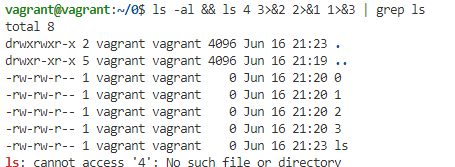
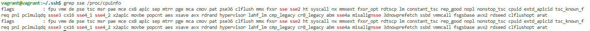

# Домашнее задание к занятию "3.1. Работа в терминале, лекция 2"

1. Какого типа команда `cd`? Попробуйте объяснить, почему она именно такого типа; опишите ход своих мыслей, если считаете что она могла бы быть другого типа.  
    **---**  
    Команда cd типа shell builtin. Такой тип из-за того, что перемещение по файловой структуре подразумевает не только абстрактное перемещение ну еще и средства отображения, работы и прочее. Работа с файлами бессмысленна без интерфейса взаимодействия, так же и тут на мой взгляд. Одно от другого неотделимо).  
2. Какая альтернатива без pipe команде `grep <some_string> <some_file> | wc -l`? `man grep` поможет в ответе на этот вопрос. Ознакомьтесь с [документом](http://www.smallo.ruhr.de/award.html) о других подобных некорректных вариантах использования pipe.  
    **---**  
    `grep -c "some_string" "some_file"`  
3. Какой процесс с PID `1` является родителем для всех процессов в вашей виртуальной машине Ubuntu 20.04?  
    **---**  
    Процесс PID 1 `systemd: /sbin/init` (символическая ссылка на `/lib/systemd/systemd`)  
4. Как будет выглядеть команда, которая перенаправит вывод stderr `ls` на другую сессию терминала?  
    **---**  
    ls 2>/dev/pts/(номер псевдотерминала)  
5. Получится ли одновременно передать команде файл на stdin и вывести ее stdout в другой файл? Приведите работающий пример.  
    **---**  
    Получиться: `cat <"file in" >"file out`  
6. Получится ли находясь в графическом режиме, вывести данные из PTY в какой-либо из эмуляторов TTY? Сможете ли вы наблюдать выводимые данные?  
    **---**  
    Получиться:  
    ```
    ls >/dev/tty/(номер tty)
    и переключиться CTRL + ALT + F*  
    ```
7. Выполните команду `bash 5>&1`. К чему она приведет? Что будет, если вы выполните `echo netology > /proc/$$/fd/5`? Почему так происходит?  
    **---**  
    Направит файловый дескриптор 5 в стандартный вывод, результат `echo netology` попадет в дескриптор 5, который перенаправлен в стандартный вывод, на экране получим `netology`.  
8. Получится ли в качестве входного потока для pipe использовать только stderr команды, не потеряв при этом отображение stdout на pty? Напоминаем: по умолчанию через pipe передается только stdout команды слева от `|` на stdin команды справа.
Это можно сделать, поменяв стандартные потоки местами через промежуточный новый дескриптор, который вы научились создавать в предыдущем вопросе.  
    **---**  
    Получилась такая конструкция: `ls -al && ls 4 3>&2 2>&1 1>&3 | grep ls`  
    Подсветился ls из потока ошибок  
    
9. Что выведет команда `cat /proc/$$/environ`? Как еще можно получить аналогичный по содержанию вывод?  
    Отображает переменные среды для текущего процесса, другой вариант: `cat /proc/$(cut -d ' ' -f 4 /proc/self/stat)/environ`.  
10. Используя `man`, опишите что доступно по адресам `/proc/<PID>/cmdline`, `/proc/<PID>/exe`.  
    **---**  
    read-only файл содержит информацию о процессе из командной строки, Если процесс является зомби-процессом, то файл пустой.  
    С Linux 2.2 и позже, этот файл - символическая ссылка, содержащая фактическое путь до выполненной команды.  
11. Узнайте, какую наиболее старшую версию набора инструкций SSE поддерживает ваш процессор с помощью /proc/cpuinfo.  
    **---**  
    `grep sse /proc/cpuinfo`  
    sse4_2  
      
12. *При открытии нового окна терминала и `vagrant ssh` создается новая сессия и выделяется pty. Это можно подтвердить командой `tty`, которая упоминалась в лекции 3.2. Однако:*
    ```bash
    vagrant@netology1:~$ ssh localhost 'tty'
    not a tty
    ```
    *Почитайте, почему так происходит, и как изменить поведение.*  
    **---**  
    Как я понял по умолчанию tty для удаленного сеанса не выделяется, изменить поведение можно через `ssh -t`,  я получил:
    ```
    vagrant@vagrant:~$ ssh -t localhost 'tty'
    /dev/pts/1
    Connection to localhost closed.
    ```
13. *Бывает, что есть необходимость переместить запущенный процесс из одной сессии в другую. Попробуйте сделать это, воспользовавшись `reptyr`. Например, так можно перенести в `screen` процесс, который вы запустили по ошибке в обычной SSH-сессии.*  
    **---**  
    Пришлось прописать это: `echo 0 > /proc/sys/kernel/yama/ptrace_scope`, в остальном запустил пинг в одном   терминале и через `reptyr -Ts $PID` получилось перевести его на другой терминал.  
14. *`sudo echo string > /root/new_file` не даст выполнить перенаправление под обычным пользователем, так как перенаправлением занимается процесс shell'а, который запущен без `sudo` под вашим пользователем. Для решения данной проблемы можно использовать конструкцию `echo string | sudo tee /root/new_file`. Узнайте что делает команда `tee` и почему в отличие от `sudo echo` команда с `sudo tee` будет работать.*  
**---**  
`tee` читает из стандартного ввода и записывает в стандартный вывод (либо файл, один или несколько). Используя с `sudo` она запускается под привилегированным пользователем (отдельный процесс) и получая на вход данные от непривилегированного пользователя может работать там где не хватает прав. Еще один вариант с `echo: sudo sh -c "echo 'string' >> /root/new_file"` В данном случае также запускается процесс в root-окружении.  
