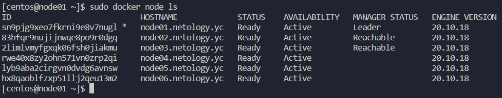
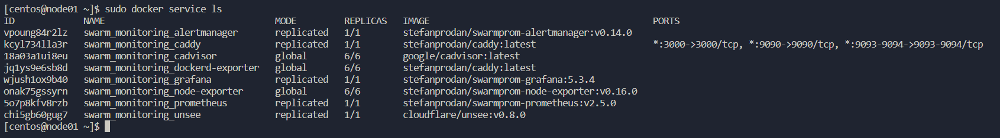
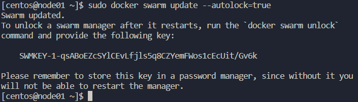

# Домашнее задание по теме: "Оркестрация кластером Docker контейнеров на примере Docker Swarm"

## Задача 1

Дайте письменные ответы на следующие вопросы:

- В чём отличие режимов работы сервисов в Docker Swarm кластере: replication и global?
- Какой алгоритм выбора лидера используется в Docker Swarm кластере?
- Что такое Overlay Network?

**Ответ:**

1. Режим replication позволяет запустить заданное количество экземпляров сервиса (распределение сервисов по узлам Swarm берет на себя, но можно влиять на процесс с помощью использования лейблов). Режим global запускает по экземпляру сервиса на каждом узле Swarm.
2. Используется алгоритм поддержания распределенного консенсуса - Raft. Менеджеры кластера получают сообщения от лидера, если сообщения перестают поступать, то ноды объявляют голосование за нового лидера (та нода которая первая зафиксировала отсутствие лидера инициирует голосование и отдает голос за себя, остальные ноды в данном случае также проголосуют за нее). Docker Swarm допускает выход из строя (N-1)/2 узлов кластера и требует большинства (или кворум из (N/2)+1) участников для полноценной работы кластера. В случае если кластер состоит из 5 узлов и 3 из них вышли из строя, кластер продолжит работу, но планирование задач (в том числе по распределению нагрузки) работать не будет.
3. Overlay сети используются в кластере Docker Swarm. Они связывают в одну сеть контейнеры на разных хостах. Для связи используется технология VXLAN, которая инкапсулирует L2-кадры в  UDP-пакеты.

## Задача 2

Создать ваш первый Docker Swarm кластер в Яндекс.Облаке

```
docker node ls
```

**Ответ:**


## Задача 3

Создать ваш первый, готовый к боевой эксплуатации кластер мониторинга, состоящий из стека микросервисов.

Для получения зачета, вам необходимо предоставить скриншот из терминала (консоли), с выводом команды:
```
docker service ls
```

**Ответ:**


## Задача 4 (*)

Выполнить на лидере Docker Swarm кластера команду (указанную ниже) и дать письменное описание её функционала, что она делает и зачем она нужна:
```
docker swarm update --autolock=true
```

**Ответ:**



Функция autolock включает блокировку менеджеров (если точнее - ключей TLS для обеспечение шифрованного канала между нодами Swarm и журналов Raft) при перезапуске демона Docker. При включении функции данные шифруются и для разблокировки требуется ввести команду docker swarm unlock и выданный в процессе инициализации функции ключ (SWMKEY-***).
